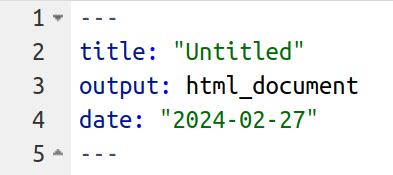

# Rmarkdown

```{block, type="info"}
*Note this is a placeholder page. This material hasn't been taught yet. I am adding notes online as I can, so these pages in particular may evolve quickly*
```

You need to be able to share you analysis. Comments are good for making code readable, but often you will want longer sections of text, mixed in with both the code you a running and the outputs of the code (e.g. the plots you are making with it). Do this with Rmarkdown.

A Rmarkdown file is a plain text file, like a R script, but with the extension ``.Rmd`` rather than ``.R``. You can make one now in RStudio by clicking File >  New File > R Markdown. Or by saving an existing .R script as ``filename.Rmd``.

RMarkdown is the system which marks how text should look after it has been converted into a webpage or PDF or other document. The name RMarkdown is kind of a joke, since RMarkdown is a verion of a "markup langauge". Markups are the opposite of the [WYSIWYG](https://en.wikipedia.org/wiki/WYSIWYG) systems (like MS word or Google Docs) which you are used to.

These pages are written in Rmarkdown. You can see this individual file [here in the online repositry](https://github.com/tomstafford/psy6422/blob/master/008-rmarkdown.Rmd). It will really help if you read the webpage alongside the file, so you can compare the file which generates the text, using the markdown, and the output (the webpage).

Rstudio magic (called "rendering" or "knitting") turns this file in to the webpage.

Compare the [file](https://github.com/tomstafford/psy6422/blob/master/008-rmarkdown.Rmd) and the [webpage](https://tomstafford.github.io/psy6422/rmarkdown.html). 

**In the webpage this line is in bold. Why?**

*In the webpage this line is in italic. Why?*

## And this line is a heading

Try now creating your own Rmarkdown file by clicking File > New File > Rmarkdown in RStudio. 

RMarkdown files have three components.

## First a heading

That looks like this, at the top of the file



This is called YAML and it is stuff meant to be read by the computer when the file is converted into a document to be read by humans. You can see that this is meant to be an "HTML" document (that's the kind on a webpage), so let's make it now. Click "knit" in RStudio (or "knit to HTML" if you are exploring the options menu).

After a brief pause you should get a new window open, containing something that some of the same words as your document. Notice how the YAML stuff has disappeared, and the new document now contains formatting (bold, italics, headings).

Part of the benefit of markdown is that you write the document once, and can convert it to a webpage, or a PDF, or a MS Word document. Try now. Click "Knit" and select "Knit to PDF". It will want you to save the output file as something (I suggest ``temp.pdf''), but once you've done that you get a nice PDF document, looking almost, but not entirely, like the webspage you made moments before. 


## Second, text

If you just write stuff in a ``.Rmd`` document you get text. This is the second kind of thing in a ``.Rmd`` document, like this.

It can contain formatting - *italics*, **bold**, etc - as well as stuff like lists and hyperlinks:

* See the formatting options in this [cheatsheet](https://github.com/rstudio/cheatsheets/raw/master/rmarkdown-2.0.pdf)
* Lists need a second options

But the real strength of Rmarkdown is you can mix text and code

## Third, code

This is the third ingredient. Like this:

``` {r}
print("Here is some R code")
a <- 6
b <- 2.3

print(a/b)
```


This called 

## Resources

* [RStudio intro to Rmarkdown](https://rmarkdown.rstudio.com/)
* [RStudio RMarkdown cheatsheet](https://github.com/rstudio/cheatsheets/raw/master/rmarkdown-2.0.pdf)


