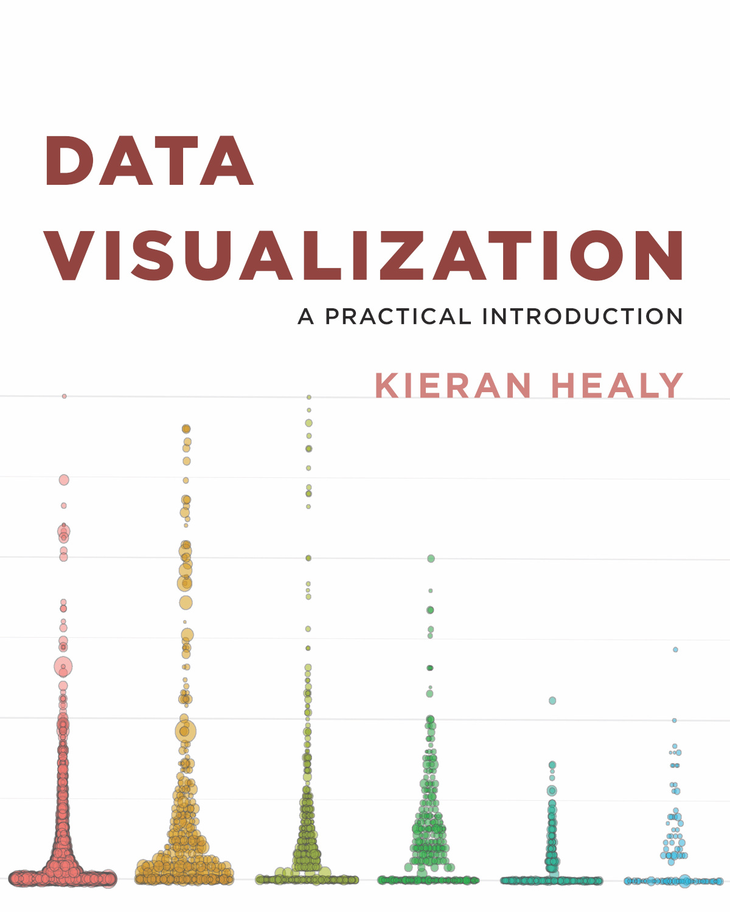

# R & R Studio

```{block, type="info"}
*Note this is a placeholder page. This material hasn't been taught yet. I am adding notes online as I can, so these pages in particular may evolve quickly*
```

## Class material

Videos from the class are in the PSY6422 [Google Drive](https://drive.google.com/drive/folders/1IbnGAO2Gn4u9T_qze5zhZyU9E8qNmdHh?usp=sharing) (UoS login required to access)

Slides : [slides format](https://docs.google.com/presentation/d/1F0Pk9pYKKKvZAFrP92MqmTgjGDQb9gNxmpCYKStWJ8s/edit?usp=sharing), [pdf format](https://drive.google.com/file/d/1xFe5S_ZOCr2TgeFY-3georQnhd_eh5_d/view?usp=sharing).

  
## Resources

Statistical computing using R, the open source programming language, and the [R Studio interface](https://rstudio.com/).



Healy, K. (2018). [Data visualization: a practical introduction](https://socviz.co/). Princeton University Press.

Guide: [How to install R and RStudio?](https://www.r-bloggers.com/2019/12/how-to-install-r-and-rstudio-2/)


## Exercises & Checklist

*To complete this class you should do the following :*

* install R on your computer

* identify the console
  * enter a command directly (e.g. "2 + 2")

* identify the file window
  * save a script as a .R file
  * run a single line of the script by pressing CTRL + ENTER
  * run the whole script

* identify the environment window

* identify the files/plots/etc window

* install the swirl package

* open this [script](https://tomstafford.github.io/psy6422/static/class2.R) 
  * review line by line