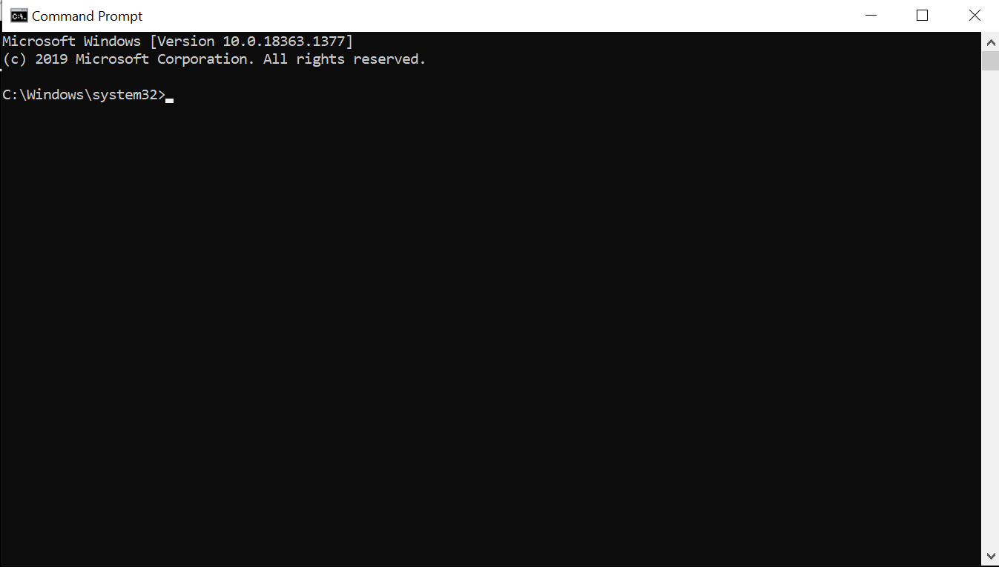
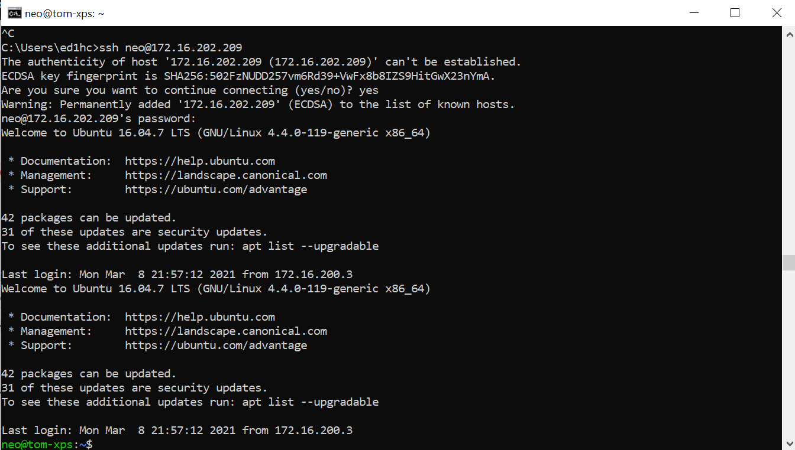

# ssh and the command line


```{block, type="info"}
Before this class please install the [University VPN](https://www.sheffield.ac.uk/it-services/vpn) and confirm it works [estimated time: 5-10 minutes]
```

In this class we will introduce the idea of the command line, running commands without the normal graphical user interface (GUI) and accessing remote computers using ssh (secure shell).

## Launching the Terminal

On Windows or iOS, either search 'Terminal'. You should see a small black box (called "Command Prompt" on Windows) with a cursor



Note that the cursor appears after some information that shows a file path and/or computer identity. Just as RStudio has a working directory, a location where it looks to load or save files, so with the command line. This is very important, since many command line instructions will only work if the are run *in the right place*

## Changing folders ('navigating the directory tree')

Get the contents of the current directory with `dir` (on Windows) or `ls` (on iOS).

You will get a list of contents, some of these things are folders, some are files. Can you identify which is which.

You can move into a subfolder, using `cd foldername`. You can move up/back the path using `cd ..`

You can get the current path `cd` (Windows) or `pwd` (iOS)

This way you can navigate all of the files stored on your computer. It is fiddly and annoying compared to the normal GUI method, but it is more fundamental to how computers work 'under the hood' and this way of interacting with computers is necessary in some situations (including, often, accessing remote computers).

Remeber, like in RStudio, you can use TAB to autocomplete commands. 

## Networking

Computers connected to a network have an address, called an [IP address](https://en.wikipedia.org/wiki/Internet_Protocol), which is always four numbers separated by dots. You are used to navigating the internet using domain names such as [sheffield.ac.uk](), but these names exist for human convenience. Like the command line for individual computers, IP addresses are closer to the metal of how computer networks actually work.

Copy this IP into your browser and see which website it take you to: [143.167.2.102](http://143.167.2.102).

You computer is also connected to the internet, so it has an IP address. You can find this out by typing `ipconfig` (Windows) or `ifconfig` (iOS) at the command line. (You can also google 'what is my ip' but that won't work for what we're about to do). This command should give you a bunch of information. Look for the IP addresses. If you are at home you may see one with the first two numbers `192.168.xxx.xxx`. If you are on campus you should see an IP of the form `172.xxx.xxx.xxx'. All computer on the University network have IPs which start with the same number.

Now launch the University VPN and look for your IP again. If you are off campus it should change, so you now have an IP which starts 172. Remember this number, we will use it later.

## Ping

Computers talk to each other in lots of different ways, but you are probably mostly familiar with webpages - the "world wide web" (www) served via the [http protocol](https://en.wikipedia.org/wiki/Hypertext_Transfer_Protocol).

One of the very simplest ways for two computers to talk to each other is `ping` which is just a tool to check whether two computers can pass messages back and forth. The content of the message isn't important, it is just to check that they are both connected to the network

You can ping an IP or a website. Try it at the command line

`ping shef.ac.uk`

You should get back a bunch of lines will tell you how long, in milliseconds, your computer took to get a message to and from that website. Try it with somewhere further away.

`ping wapo.com` (the East coast of the USA), or `ping globaltimes.cn` (mainland China)

But we can also ping individual machines. "sharc" is one of the [high performance computing](https://docs.hpc.shef.ac.uk/en/latest/) (HPC) clusters at Sheffield. You can only talk to it if you are inside the University network (i.e. you need to be on campus or turn your VPN on). Try

`ping sharc.shef.ac.uk`

## Remote access using SSH

If two computers are connected, you may be able to remotely access one from the other using a command called ssh. This takes the form

`ssh use@machine_ip`

Tom will set up a machine for you to try this in class. If successful you should see something like this



The terminal will look similar, but commands you run will now execute on this remote machine. You may also have also changed operating system, so you rather than the commands for iOS or Windows, you need to use the commands the work on the remote machine. Many HPC machines and webservers are linux machines.

## Find files, run files, copy files

*This section assumes you are working on a remote linux machine*

Let's use the command `find` to look on this remote computer for any R scripts. The use of * here is known as "a wildcard"

`find -name '*.R'`

We can run R on the remote computer, but not RStudio (because the terminal doesn't show graphics, only text). Sometimes this is known as running software "headless".

`R`

Will launch an interactive R console. Quit with `q()`

But we can also run the script without launching R (so the will run the script and then quit, leaving us back at the terminal. You can either navigate to the containing folder and run it.

`Rscript toyscript.R`

You can also feed the script to R by specifying the full path

`Rscript home/neo/Desktop/toyscript.R`

Find out how long the script takes to run by putting `time` in front

`time Rscript toyscript.R`

Now there's no point running a simple R script remotely, but when you have very large data it can be convenient to run your analysis on a remote machine which is more powerful (or on many remote machines, which allows parallel processing). 

Let's copy this script from the remote machine to our home machine. To do this you need the `scp` command and to know your username and ip address. The path to where you want the file saved comes after the colon:

`scp toyscript.R  user@your_ip:/path/to/Desktop/toyscript.R`

### switches

Often we feed additional options (sometimes called 'switches') to command line tools. So the command `espeak` speaks words aloud

`espeak "hello"`

We can read the [espeak documentation](https://linux.die.net/man/1/espeak) to see what the options are. Let's adjust the pitch and speed.

`espeak -p 80 "hello"`

`espeak -s 230 "hello my name is speedy"`


## Exercise

Find and run an mp3 file on a remote machine
  * You can run a mp3 file using `nvlc`


## Checklist

* Identify and launch a terminal window
* Navigate the directory tree using command line instructions
* find your ip address
* ping an ip or website
* find files, run programmes, on remote machines
  * feed options to command line tools using switches
* copy files to/from remote machines using scp 


## Resources

* [Five reasons why researchers should learn to love the command line](https://www.nature.com/articles/d41586-021-00263-0)
* [University of Sheffield VPN](https://www.sheffield.ac.uk/it-services/vpn)
* For historical interest: [In the Beginning... Was the Command Line](http://cristal.inria.fr/~weis/info/commandline.html) (1999) Neal Stephenson
* If you want to experiment with linux you may start with [Ubuntu Linux](https://ubuntu.com/download/desktop)