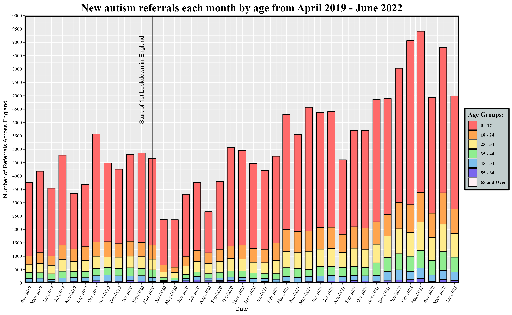
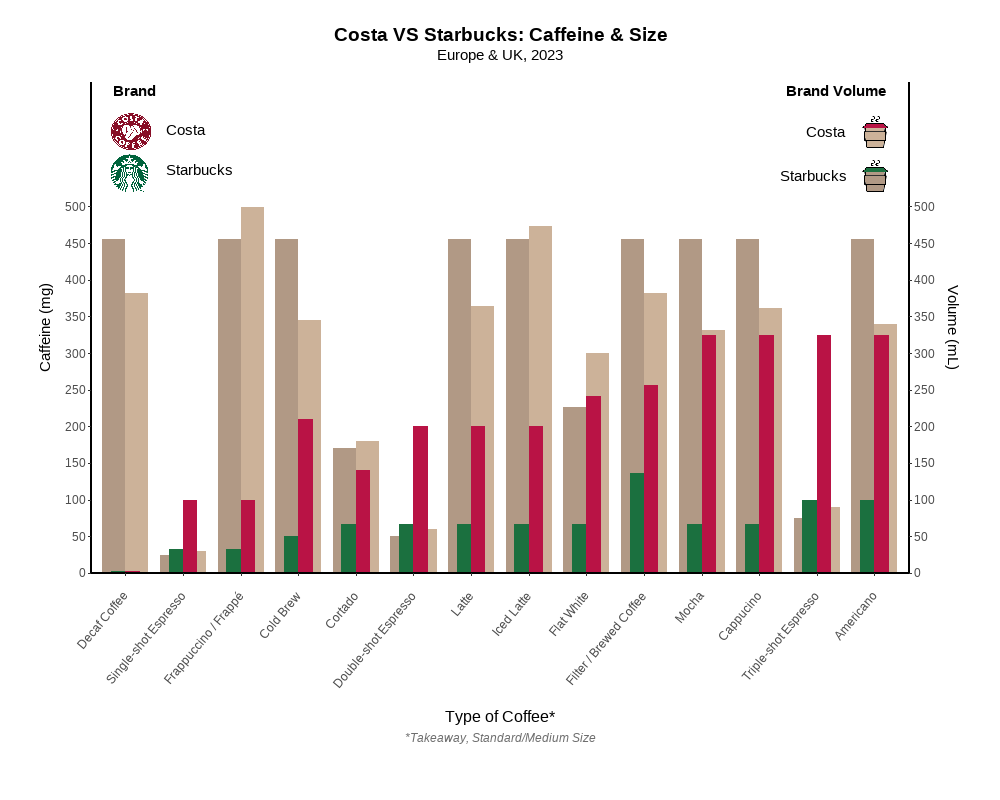
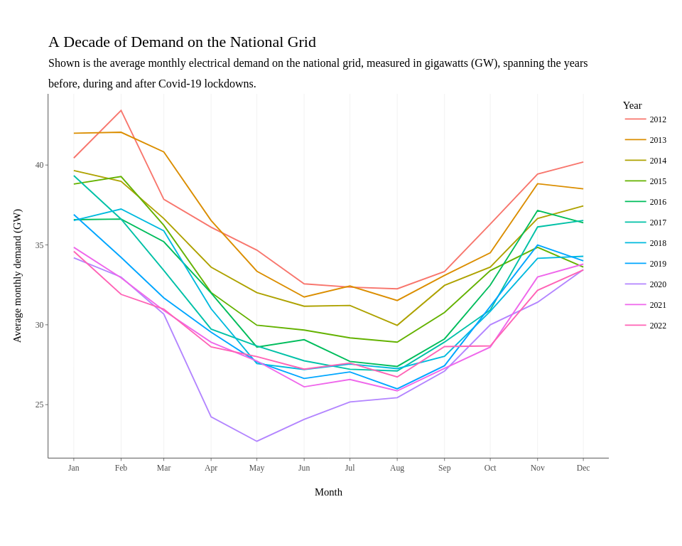
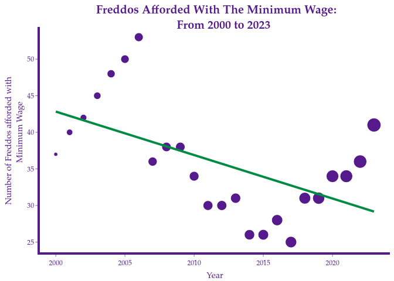
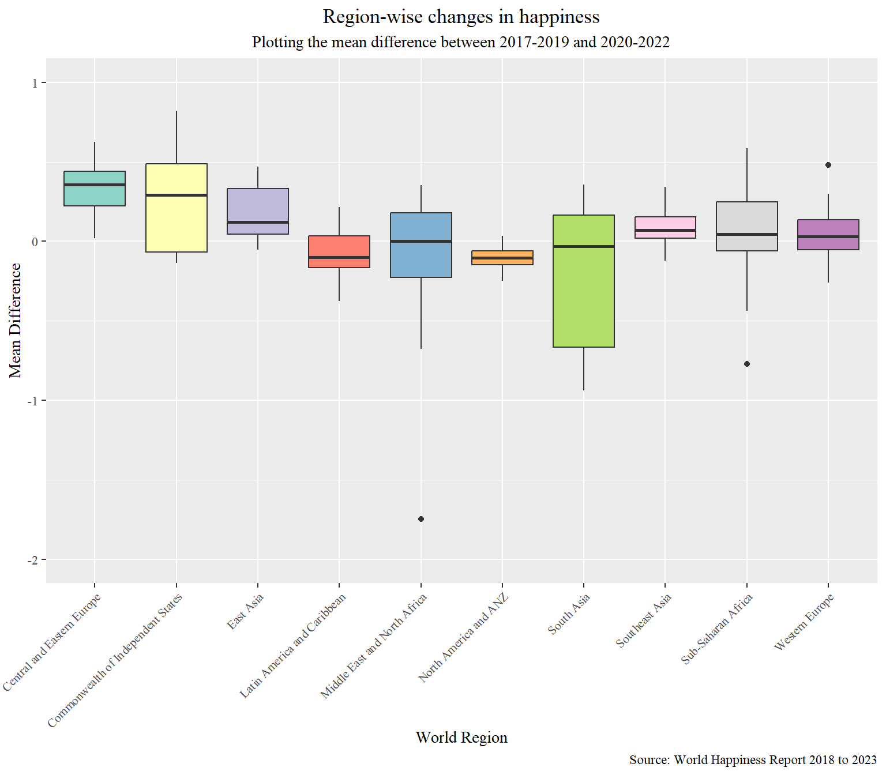
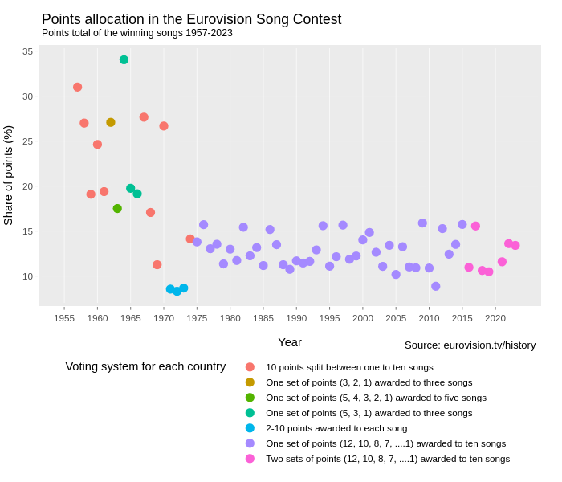
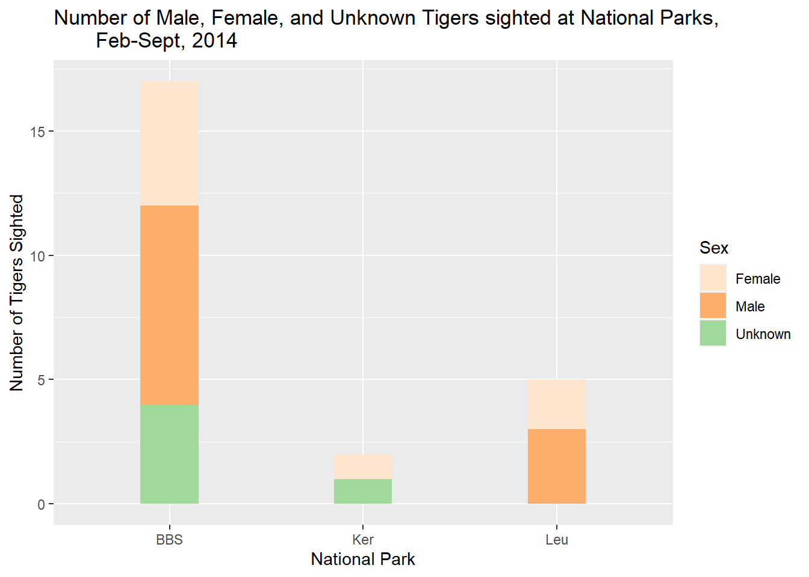
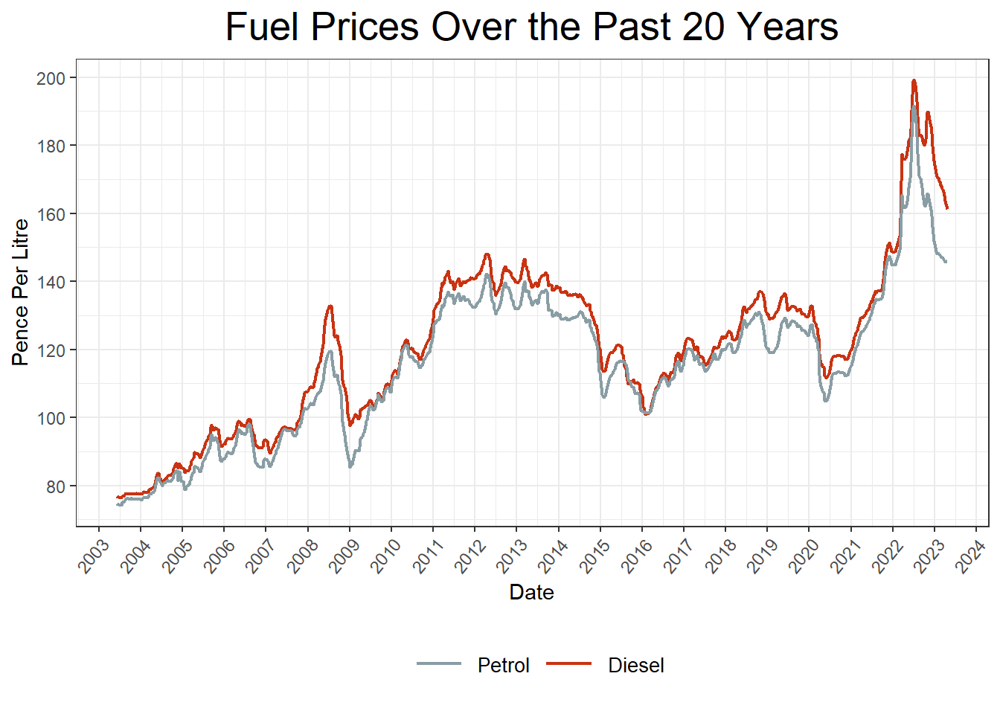

--- 
title: "PSY6422 Data Management and Visualisation"
author: '[Tom Stafford](http://tomstafford.staff.shef.ac.uk/)'
date: "2023-03-31"
output:
  html_document:
    df_print: paged
description: Notes on the course - constantly evolving!
documentclass: book
link-citations: yes
bibliography:
- book.bib
- packages.bib
site: bookdown::bookdown_site
biblio-style: apalike
papersize: a5
fontsize: 12pt
links-as-notes: true
---

# Module Overview {-}

Placeholder

## Motivation
## Course Aims
### The Module mini-project 
## Resources for current students

<!--chapter:end:index.Rmd-->

# Overview, assessment & module organisation

Placeholder

## Class material:
## Exercise 1 (assessed!)
### Marking criteria: 
### Submission
## Checklist:
## Resources
### Further reading on the motivation for a data management component of this course

<!--chapter:end:010-intro.Rmd-->

# R & R Studio

Placeholder

## Resources
## Exercises & Checklist

<!--chapter:end:020-r.Rmd-->

# Making Graphs

Placeholder

## Class material
## Resources
### Other resources 
## Post-class exercises
## Checklist

<!--chapter:end:030-graphs.Rmd-->

# Project Organisation

Placeholder

## Project folders
## Naming Things
## Research Data Management
## Include meta-data
## Backup and Sync
## Resources: 
## Exercises
### Warm up: Pair programming exercise
### Homework: Project 1
## Checklist

<!--chapter:end:040-projects.Rmd-->

# Module project {-}

Placeholder

## Project requirements {#requirements}
## Choosing your data
### Finding Data
### Suggestions for possible project data sets 
## Choose your graph
## Check list
## Answers to common questions
## Getting help
## Example Projects
## Stretch goals
## In class exercises

<!--chapter:end:045-moduleproject.Rmd-->

# Data Wrangling 

Placeholder

## Class material
## Exercises
## Checklist
## Resources

<!--chapter:end:050-data.Rmd-->

# Coding Principles

Placeholder

## Fundamental methods
### If statements {#if}
### Loops
### Functions
#### A note about scope
### Exercises 1
### More
## Fundamental principles of good code
### Readability Matters
### Avoid hard coded values
### Functionalise & Generalise
### Ask for help
### Exercises 2
### Checklist
### Resources

<!--chapter:end:060-coding.Rmd-->

# Rmarkdown

Placeholder

## And this line is a heading
## First a header
## Second, text
## Third, code
### Options for code chunks
### Include r in inline text
## Conclusion
## Exercises
## Advanced
## Checklist
## Resources

<!--chapter:end:070-rmarkdown.Rmd-->

# ssh and the command line

Placeholder

## Launching the Terminal
## Changing folders ('navigating the directory tree')
## Networking
## Ping
## Remote access using SSH
## Find files, run files, copy files
### switches
## Exercises
## Checklist
## Resources

<!--chapter:end:080-ssh.Rmd-->

# Git and Github

Placeholder

## Motivation
## Before the class
## Accessing git 
### Trouble shooting
#### for mac, you may need install homebrew to install git
#### To configure git with RStudio
#### For errors around ‘fatal: authentication failed’
## Essential terminology
## Checklist
## Resources

<!--chapter:end:090-git.Rmd-->

# Publishing 

Placeholder

## Sharing your Rmd files via Github pages
## Other sharing options
## Checklist
## Resources

<!--chapter:end:100-publishing.Rmd-->

# Advanced Topics {-}

Placeholder

## Machine Learning
## Miscellaneous topics/resources
## Reproducibility
## General righteousness

<!--chapter:end:110-better.Rmd-->

# - Interactive graphs with Shiny {-}

Placeholder

## Before class
## Exercises
## Resources
## Examples of interactive graphs which use different tech (Javascript!)

<!--chapter:end:120-shiny.Rmd-->

# - Animated plots with gganimate {-}

Placeholder

## Exercises

<!--chapter:end:130-gganimate.Rmd-->

# - Database queries: SQL {-}

Placeholder

## Context
## Key information
## Exercises
## Checklist
## Resources

<!--chapter:end:140-sql.Rmd-->

# - Python {-}

Placeholder

## Motivation
## A worked example
## Preparation
## In class
## After class

<!--chapter:end:150-python.Rmd-->

# (APPENDIX) Appendices {-}

<!--chapter:end:appendix-0.Rmd-->

# Class notes

## Ask me questions

Feel free to email me with questions about any aspect of the course, or problem you are having with the work, but you must include your current best answer to your own question, along with what you've tried so far (and why it didn't work).

It is easiest for me to help you with your project, either in person (see timetable) or by email if you provide a full project (e.g. the data and code as well as the output you have so far) as well as a project rationale stating what it is you are trying to do

This is helpful guidance on posing specific coding questions https://stackoverflow.com/help/how-to-ask

## Terminology: 'Raw data'

Data before any processing has been done. Usually these means that the individual responses which create the data are recorded

The opposite is cleaned data (once it has been processed) and then after that summary data (in which responses are collapsed across individuals or into groups)

##. What should I do if my visualisation uses a new library or package?

Ideally your code should specify all the libraries it uses. These are known as “dependencies”. If you use an usual library it may require specific downloading to your computer, meaning that your code won’t run on computers that don’t have it downloaded. There are ways of managing this, but we haven’t covered these in the course (google “docker” or “conda” or “reproducible computational environments”). As long as your code indicates what you have installed (e.g. it includes a line like 

  library(fancyplotslibrary)

at the beginning, don’t worry about it

<!--chapter:end:appendix-A.Rmd-->

# Extra Reading

Placeholder

## Visualisation (theory)
## The Reproducibility Crisis
## Better practice
## Project organisation
## Coding
## R
### Hints
### Courses / books
## Making graphs (practice)
## Presentations
## Statistics
## Advanced Reading, Background & Other Recommends
## Pedagogy

<!--chapter:end:appendix-B.Rmd-->

# Notes

Placeholder

## Credit
## Colophon
## Data Science @ Sheffield
## Careers
## Testimonials

<!--chapter:end:appendix-C.Rmd-->

# Class of 2020

Placeholder

## Feedback

<!--chapter:end:appendix-D.Rmd-->

# Class of 2021

Placeholder

## Feedback

<!--chapter:end:appendix-E.Rmd-->

# Class of 2022

Placeholder

## Module project showcase
## Advice for future students
## "one thing you have read and enjoyed or found useful"
### General Visualisation
### R specific advice
### Markdown
### Advanced R packages
### General coding / projects / reproducibility
## Feedback on the module

<!--chapter:end:appendix-F.Rmd-->

# Class of 2023

A showcase of some projects from the class of 2022-23. 

There were too many students on the module this year to show all projects, so here are a few highlights. Many creative, fun, interesting, challenging visualisation projects were produced but aren't shown here, but these few give a flavour of what student's got up to:

Gabriel's project looked at [the number of Autism referrals in England before, during, and after lockdown](https://gabrieltld.github.io/psy6422-modproj/)

[Repo](https://github.com/gabrieltld/psy6422-modproj/)

Vitally important information in Mathilde's visualisation of [the ammount of caffeine in different highstreet coffee brands](https://mathildedenmark.github.io/DAAV-Project/)

[Repo](https://github.com/MathildeDenmark/DAAV-Project)

I found Grace's plot of [A Decade of Demand on the National Grid"](https://graceesh.github.io/psy6422_energy_demand/) really informative - spot the lockdown months!

[Repo](https://github.com/GraceESH/psy6422_energy_demand)

Jennifer's project on the number of [Freddos Afforded With The Minimum Wage: From 2000 to 2023](https://jstandeven.github.io/PSY6422_Project/]) seems very relevant to the state of society, as well as illustrating [Simpson's Paradox](https://en.wikipedia.org/wiki/Simpson%27s_paradox) for across different points of time.

[Repo](https://github.com/jstandeven/PSY6422_Project)

Tanvi Ravi's project was [World Happiness: Resilience in the face of the COVID-19 Pandemic](https://tanvi-r.github.io/PSY6422_Module_Project/)

[Repo](https://github.com/tanvi-r/PSY6422_Module_Project)

Paul did a deep dive into the historical data on the [Eurovision song content winners](https://paulgering.github.io/PSY6422_project/).

 [Repo](https://github.com/paulgering/PSY6422_project)

Jade looked at [Sumatran Tigers](https://jholley23.github.io/Sumatran-Tiger-Project/)

[Repo](https://github.com/Jholley23/Sumatran-Tiger-Project)

Anna's interactive visualisation looked at [https://annskama.shinyapps.io/p_values/](reporting errors in psychology journals) ([Repo](https://github.com/annskama/p_values))

Emma's visualisation of [Fuel Prices From 2003 to 2023](https://starsk1.github.io/Fuel_Prices/) is elgantly simple yet effective

[Repo](https://github.com/Starsk1/Fuel_Prices)

<!--chapter:end:appendix-G.Rmd-->

