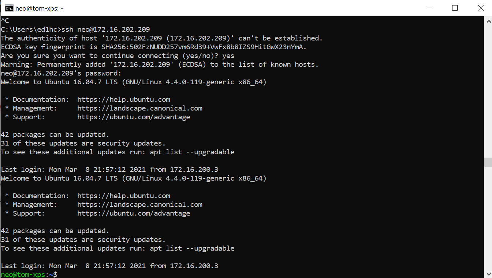
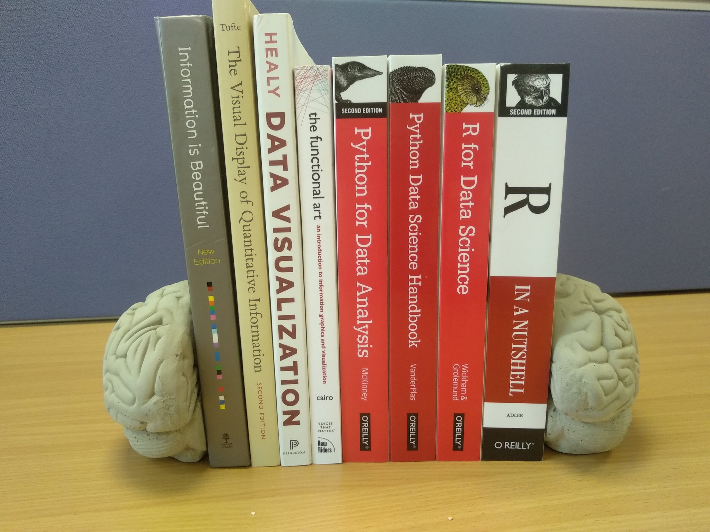
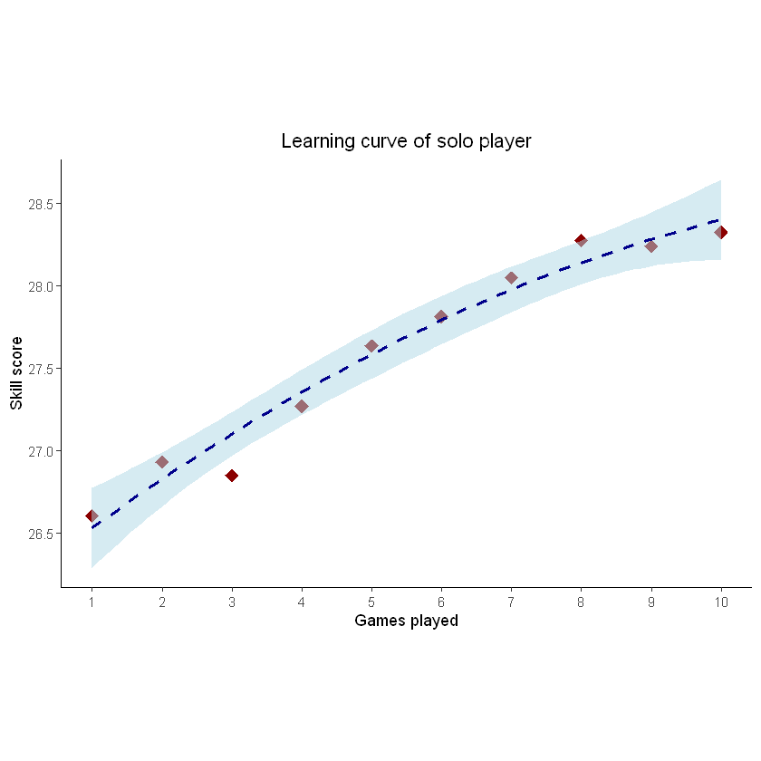
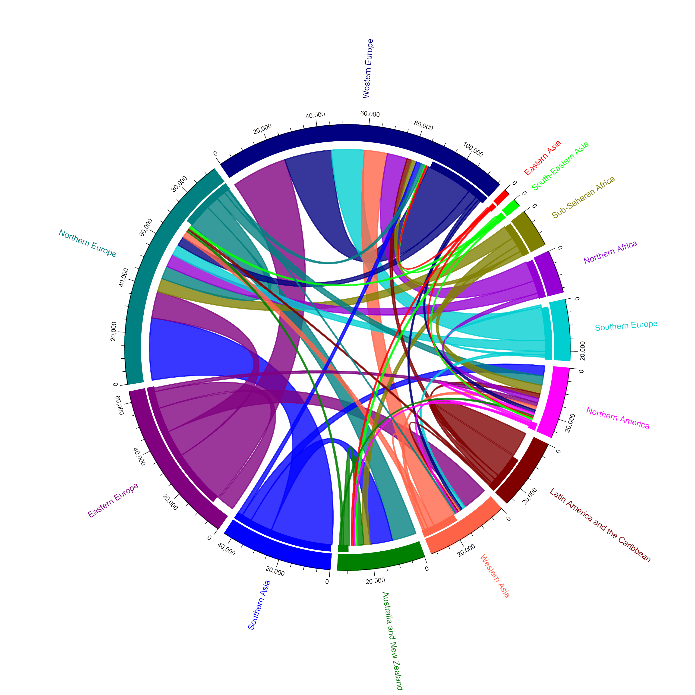

--- 
title: "PSY6422 Data Management and Visualisation"
author: '[Tom Stafford](http://tomstafford.staff.shef.ac.uk/)'
date: "2022-03-14"
output:
  html_document:
    df_print: paged
description: Notes on the course - rapidly evolving!
documentclass: book
link-citations: yes
bibliography:
- book.bib
- packages.bib
site: bookdown::bookdown_site
biblio-style: apalike
---


# Module Overview {-}

PSY6422 Data Management and Visualisation is part of the [MSc in Psychological Research Methods with Data Science](https://www.sheffield.ac.uk/psychology/prospectivepg/masters/data-science) taught at The University of Sheffield by [Tom Stafford](http://tomstafford.staff.shef.ac.uk/). See here for more on the different courses which offer [data science, at the University of Sheffield](notes.html#data-science-sheffield)

<div class="info">
<p><em>Spring 2022: These pages are evolving as I teach the course (in person rather than online this year!). If you find any inconsistencies please let me know. Check out the <a href="class-of-2021.html">class of 2021 showcase</a> from last academic year</em></p>
</div>
  
## Motivation

Psychological science is increasingly reliant on complex computational and statistical methods to make sense of rich behavioural data. This course aims to teach the skills which support creating robust and repoducibile analyses with such methods and data.

As well as supporting sophisticated data visualisation, we aim to train you in reproducible workflows - meaning that you can reliably re-create all steps of an analysis using scripts that automate all steps between raw data and the final visualisation.

As well as being *reproducible* (by you or other researchers) your work should be *legible* (to Future You, or other researchers) and *scalable* (it should work as well on 400,000 data points as on 40).

You will need help to do this. Therefore you will use Open Source solutions - these are analysis products which have a worldwide community of people using them, and the infrastructure which supports sharing advice and solutions. 

In practice, this means you are going to start by using R (you could use [Python](https://tomstafford.github.io/psy6422/appendices.html#python), but this module is based on R).

## Course Aims

The curriculum is updated each year, but you can get the general idea of the order the topics are covered from the leftbar. By the end of this course you will have:

  * Been trained in data project management -- including fundamentals of data storage, syncronisation and sharing -- and the importance of reproducible workflows
  * Used the statistical programming language R, and RStudio, for data management, analysis and visualisation
  * Been introduced to fundamental programming concepts
  * Prepared data project documentation using RMarkdown
  * Had an introduction to version control using git 
  * Published data projects to the web via github pages
  
There is also the opportunity to cover advanced topics, either in class or as part of your project. These could include

  * Interactive visualisation with Shiny apps
  * SQL
  * webscraping
  * animated / roll-over visualisation

You may particularly enjoy the [Reading list](extra-reading.html)
  
### The Module mini-project 

The bulk of the course assessment is to conduct and publish your own analysis project. By doing this you will have experience of combining all the skills taught on the course within a singe project. This will take a data visualisation from start to finish - from raw data, through data cleaning and documentation to sharing your code and the resulting visualisation on the web.

The intention with the assessment is to ensure that every student leaves the course with something they are proud to put in their portfolio of work, something which shows what they can do and which helps with future job or course applications.

See here for [more on the nature of your module project](module-project.html), see here for examples from previous years: [class of 2020](class-of-2020.html), [class of 2021](class-of-2021.html)..


## Resources for current students

[Google Drive](https://drive.google.com/drive/folders/1sDmbrTfKpiz2Y02R17ajLPkJV1XSxvJD?usp=sharing):

Includes slides and other resources, as well as these specific documents

* [Timetable](https://docs.google.com/spreadsheets/d/1YBbaaFursDBg-aGvJ32WJd-IinPM7oml-tPMnVZIEA0/edit?usp=sharing)
* [Assessment Criteria](https://docs.google.com/spreadsheets/d/1oTJKI675ijCs14jUoT9d_8yPH2i_S2AfQG507jN8aVY/edit?usp=sharing)

FAQ document which I am adding to as questions come in

* [FAQ for PSY6422 (including on module project)](https://docs.google.com/document/d/11OQs5bTnqth_cxwjHbQNeJTWZdp-wSTUcCQ2Uoz5rFw/edit?usp=sharing)

Most information is on these pages (hosted on github, no login required)


<!--chapter:end:index.Rmd-->

# Overview, assessment & module organisation

## Class material:
  
Materials from the class are in the PSY6422 [Google Drive](https://drive.google.com/drive/folders/1sDmbrTfKpiz2Y02R17ajLPkJV1XSxvJD?usp=sharing) (UoS login required to access). Slides : [slides format](https://docs.google.com/presentation/d/15RlRzRGL3fa1SckE8YUWhJxiuWf5GH5pssIcG2zStKM/edit?usp=sharing).

## Exercise 1 (assessed!)

The exercise for this class is an initial self-assessment, which comprises part of your final grade. The deadline is in two weeks - see the timetable.

Submit using the form link provided by Tom [check your email] a document of no more than one A4 page (i.e. less than 500 words):

Aim 1: tell me what you know already  

 * review course webpages, write ~50 words on your experience with computers and coding

Aim 2: start thinking about data to visualise  

 * describe a dataset you have access to and what you’ll do with it OR  
 * describe the kind of topic you'd like to identify relevant data to do a project on

Aim 3: set some targets for what you’d like to learn next  

 * describe 1 or 2 ambitions; techniques, technologies or tools you'd like to acquire

### Marking criteria: 

See the assessment document

The purpose of this assessment is to ensure you are engaging with the course and to start a conversation between us about the final assessment. I want to give you 100%, all you have to do to achieve this is follow the instructions above.


### Submission

You submit using them form link supplied by me, as an attachment with a filename containing your surname and registration number, of the form:

|     surname_000000000.pdf

(file format does not need to be pdf)


## Checklist:

*To complete this class you should do the following :*

* Review these webpages
  * identify topics covered
  * locate timetable
  * note assessment deadlines

* Complete initial self-assessment by deadline

* Check you have received email from Tom
  * Used the link to join the slack group
  

## Resources

### Further reading on the motivation for a data management component of this course

* Russ Poldrack's [Advice for learning to code from scratch ](http://www.russpoldrack.org/2016/05/advice-for-learning-to-code-from-scratch.html)
* Neuroskeptic on a [true story of data analysis error](http://neuroskeptic.blogspot.com/2011/04/tufnel-effect.html) (and how you can avoid it) "if you're doing something which involves 100 steps, it only takes 1 mistake to render the other 99 irrelevant."
* [Data Sharing and Management Snafu in 3 Short Acts](https://www.youtube.com/watch?v=66oNv_DJuPc)


<!--chapter:end:010-intro.Rmd-->

# R & R Studio

## Resources

Statistical computing using R, the open source programming language, and the [R Studio interface](https://rstudio.com/).

Guide: [How to install R and RStudio?](https://www.r-bloggers.com/2019/12/how-to-install-r-and-rstudio-2/)

[https://swirlstats.com/](https://swirlstats.com/students.html)


## Exercises & Checklist

*To complete this class you should do the following :*

* install R on your computer

* identify the console
  * enter a command directly (e.g. "2 + 2")

* identify the file window
  * save a script as a .R file
  * run a single line of the script by pressing CTRL + ENTER
  * run the whole script

* identify the environment window

* identify the files/plots/etc window

* know how to install and load a library of functions ("a package")
  * install the swirl package

* open this [script](static/class2.R) 
  * review line by line [as a pair exercise ideally]

<!--chapter:end:020-r.Rmd-->

# Making Graphs

## Class material

Note: most of this class talk in workshop style, so any recordings are short and the slides are brief

The live-coding demo used these files: [class3a.R](static/class3a.R) and [class3b.R](static/class3b.R). These are based on Healy (2018) chapters 2 and 3 respectively.
  
## Resources

This book is recommended for the course, and for this lecture in particular:


Healy, K. (2018). [Data visualization: a practical introduction](https://socviz.co/). Princeton University Press. 

* The whole book is available online via the link  
* There are supporting materials here: https://github.com/kjhealy/socviz  
 
 
### Other resources 

* We are going to be using the ggplot package for our visualisations: [ggplot2](https://ggplot2.tidyverse.org/)
* [Five Charts You’ve Never Used but Should](https://policyviz.com/2021/02/08/five-charts-youve-never-used-but-should/)
* guru99: [Scatter Plot in R using ggplot2 (with Example)](https://www.guru99.com/r-scatter-plot-ggplot2.html)
* ggplot2: Elegant Graphics for Data Analysis, the chapter on [Themes](https://ggplot2-book.org/polishing.html)
* Giulia Ruggeri, Better data communication with {ggplot2}[Styling a chart and improving the text using {forcats} and {ggtext} and {scales}](https://giulia-ruggeri.medium.com/better-data-communication-with-ggplot2-92fbcfea2c6e), [Better data communication with {ggplot2}, part 2](https://giulia-ruggeri.medium.com/better-data-communication-with-ggplot2-part-2-615a5180ccb)
* datanovia.com: [GGPlot Axis Ticks: Set and Rotate Text Labels](https://www.datanovia.com/en/blog/ggplot-axis-ticks-set-and-rotate-text-labels/)

## Exercises

Review the [introduction](https://socviz.co) and [Chapter 1 'Look At Data'](https://socviz.co/lookatdata.html) of Healy (2018)

Work through [Chapter 2 'Get Started'](https://socviz.co/gettingstarted.html) from 2.3 onwards ("Things to know about R"), we are ignoring the material on RMarkdown for now (we'll get there, see [here](https://tomstafford.github.io/psy6422/rmarkdown.html)).

Work through [Chapter 3 'Make a plot'](https://socviz.co/makeplot.html)

## Checklist

Completed the exercises  

 * especially section 3.8 'Where to go next' in [Chapter 3 'Make a plot'](https://socviz.co/makeplot.html)

Key concepts (chapter 2):  

* variables and functions
* variables are typed (e.g. can be numeric or character)
 * and how you detect what type a variable is
* indexing for variables and data frames

In the console, understood  

  * the shortcut keys for the assignment operator <- 
  * the use of tab for autocomplete
  * the use up arrow to cycle through previous commands

Key concepts (chapter 3):  

* Tidydata
  * [long vs wide data](https://en.wikipedia.org/wiki/Wide_and_narrow_data)
  * values and keys
  * data variables can be continuous or factors 
* plots have data, aesthetic mappings ('aes', 'mappings') and layers
* adding mappings, adding geoms, geom properties, other layers (e.g. labs)
* mappings are inherited by geom layers

<!--chapter:end:030-graphs.Rmd-->

# Project Organisation
  
## Project folders

You should organise all the documentation, files, data, code and outputs for a project in a single folder. Your aim is that when you come back to this project, or want to share it, everything you need is in one place and sensibly organised.

Create subfolders for 'data', 'graphs', 'notes'. [Michael Frank's onboarding guide](http://babieslearninglanguage.blogspot.co.uk/2017/01/onboarding.html) explains a bit more about the logic of this.

## Naming Things

Files come in different types. This is indicated by their name, not the content.Turn on the options which means you file viewers the extensions of files (so you can see the full filename is ``MyProject.Doc`` not just ``MyProject``). How to do this: [PC](https://www.howtogeek.com/205086/beginner-how-to-make-windows-show-file-extensions/), [Mac](https://support.apple.com/en-gb/guide/mac-help/mchlp2304/mac).

Because you will want to share this project use names that make sense to other people, as well as to you. ``MyProject.Doc`` is a bad name. ``joeblogs_psy64222.doc`` is better.

Computers sometimes care about capitalisation, which means you need to pay attention : ``MyFile.doc`` and ``myfile.doc`` may not get treated the same. Computers also sometimes care about spaces in filenames. You can include these in your filenames and wait until this messes things up later (maybe much later, maybe even never), or you can decide now to be careful about capitalisation and never use spaces in your files names. Replace spaces with underscores ``My File.doc`` becomes ``my_file.doc``

<div class="info">
<p>R/RStudio may not work well if you are using Windows and have Chinese characters in your username. You can avoid this by using the latin alphabet (thanks to 胡传鹏 for this tip)</p>
<p>“c:/users/chuanpeng” √√√</p>
<p>“c:/users/传鹏” ×××</p>
</div>

Never include special characters (e.g. &).

These rules also apply to variables in computer code.

Jenny Bryan has good thoughts on [Naming Things](http://www2.stat.duke.edu/~rcs46/lectures_2015/01-markdown-git/slides/naming-slides/naming-slides.pdf)
  
## Research Data Management

Everything recorded during an experiment, whether by you or the computer, is data. All log files. Everything.

Never delete *any* data.

Never edit the raw data files. They should exist is a folder called \raw or \data and only ever be opened, never modified in any way.

All data should be backed-up automatically, as soon as it is collected. For how to do this, see the next header


## Backup and Sync

Any back up process which requires you to remember to deploy it is fragile. Use a cloud synchronisation service. Many are available, like OneDrive or Dropbox, but since you are in the University of Sheffield you should install the [Google Drive Backup and Sync tool](https://www.google.com/drive/download/). 

As well as backing up your work to the cloud, this will allow you to work on multiple machines (because changes are automatically carried across from one to the other), as well as collaborate (because multiple people can add to the same shared folder and any changes are instantly available to the whole team).


## Resources: 

* Jenny Bryan's presentation on [Naming Things](http://www2.stat.duke.edu/~rcs46/lectures_2015/01-markdown-git/slides/naming-slides/naming-slides.pdf)
* [Michael Frank's onboarding guide](http://babieslearninglanguage.blogspot.co.uk/2017/01/onboarding.html)
* [Tidy Data organisation](http://vita.had.co.nz/papers/tidy-data.pdf) 
* [Habits and open data: Helping students develop a theory of scientific mind ](http://bayesfactor.blogspot.co.uk/2015/11/habits-and-open-data-helping-students.html)
* Broman & Woo (2017) [Data Organization in Spreadsheets](https://www.tandfonline.com/doi/full/10.1080/00031305.2017.1375989)
* [University of Sheffield pages on Research Data Management](https://www.sheffield.ac.uk/library/rdm/index)
* Arslan, R. C. (2019). [How to automatically document data with the codebook package to facilitate data reuse](https://journals.sagepub.com/doi/full/10.1177/2515245919838783). Advances in Methods and Practices in Psychological Science, 2(2), 169-187.
* Jenny Bryan: [I love the here package. Here's why.](https://github.com/jennybc/here_here)
* [Why should I use the here package when I'm already using projects?](https://malco.io/2018/11/05/why-should-i-use-the-here-package-when-i-m-already-using-projects/)
* rstats.wtf : [Project-oriented workflow](https://rstats.wtf/project-oriented-workflow.html)

## Exercises

### Warm up: Pair programming exercise

: Write a script to create and save a histogram of life expectancy by continent, using the gapminder data (see slides for more notes)

### Homework: Project 1

Create project containing script to generate plots from this data: [anscombe.csv](static/anscombe.csv) (template script [here](static/project1.R); find completed example on google drive) 

Share this project with another student on the course. [2022 see this file for who](https://docs.google.com/spreadsheets/d/1gDbF07ekkz19HshAiDpZ6iu_y5iOKWrpyXDQKElV794/edit?usp=sharing)

Run the project shared with you, complete [this checklist](https://docs.google.com/forms/d/e/1FAIpQLSdfOtUIUEs66W0nSqrHTHrMT-iubygdAhNFhUwbu0kOLZIMeA/viewform?usp=sf_link) 2022: deadline 0900 on 2nd of March.

Review the questions in the library [Research Data Management plan for postgraduate researchers](https://docs.google.com/document/d/1rHXl2LYhgv7zeuwc5fDRMyqSgE3OaLa8/edit?usp=sharing&ouid=109750001665912327637&rtpof=true&sd=true)

## Checklist

*in general*  
 * Be able to organise and share project work

*specifically*  
Understand & Use  
 * file extensions, file paths  
 * standard file naming conventions  
 * ISO 8601 date format  
 * standard folder organisation for projects  

Appreciate the need for a research data management plan

Map network drives / automate backups

You should be able to  
 * download a file to your Desktop (e.g. [this one](static/anscombe.csv)) and locate it on your hard drive  
 * report the full path of a file  
 * open a csv file as plain text  
 * share a project folder with someone else  


<!--chapter:end:040-projects.Rmd-->

# Module project {-}

<div class="info">
<p><em>These pages are about the final project, which comprises most of the module grade. There are many useful notes below, which you will want to refer to as you complete your project</em></p>
</div>
  
In this class we covered how to identify data for your final project for this module. We also discussed the project format and assessment criteria. Unlike other classes there is no checklist of learning outcomes.

The final project for the course contributes the bulk of your grade, as well as creating a portfolio piece for you to demonstrate what you learnt on the course. The final project is a chance to deploy all the skills taught on the course in a single complete data visualisations project, which takes us from raw data and a question through data preparation and exploration through to publishing a visualisation and the documentation which shares your findings with others. The ambition is that a project is complete and reproducible, i.e. it contains the input (the data), the output (like these max and min values, or a graph), documentation (explanation of what is what) and the whole is stitched together with an R code - the script that changes the input to the output. I should be able to run your script on my computer and produce the same output.

## Project requirements {#requirements}

A complete project, including raw data, analysis scripts, documentation and visualisations shared in a way that allows the visualisation to be reproduced and understood

In practice, this means you should upload a project to github, containing a Rmarkdown file which explains your visualisation, as taught in the module (although alternatives are acceptable if they meet the primary criteria).

Please include these headings, or something similar, in your project.

* Data Origins
  * Answering questions of where it comes from, how it was collected, what the variables mean, etc
  * show the first few rows of the raw data, if possible
* Research Questions
  * in plain english, a simple statement of what question(s) your visulisation will attempt to address
* Data Preparation
  * steps taken to clean the data, exclude outliers, create summary statistics, grouped variables, etc
  * show the first few rows of the processed data, if possible
  * showing the code which does this were relevant
* Visualisation(s)
  * graph or graphs
  * documentation explaining any motivation (although good graph labelling is better than explanation in the accompanying text)
  * code for producing them
* Summary
  * Brief thoughts on what you have learnt, what you might do next if you had more time / more data
  
<div class="info">
<p>The ultimate aim is to make something that looks good and shows off your abilities. You want to produce something you are proud to show people (including future employers and supervisors)</p>
</div>
  
## Choosing your data

The data is an excuse for the data visualisation, so don't agonise over this, and go for simple over complex if you have a choice. I recommend you find a data set with variables which you understand. 

### Finding Data

I will update these notes soon, but basically many papers are now published accommpanied by open data. Sometimes this is indicated by an Open Data Badge. For example, take a look at the [current table of contents for Psychological Science](https://journals.sagepub.com/toc/pss/current). The badges are an initiative of the Centre for Open Science https://cos.io/our-services/open-science-badges/

You can also search a preprint archive such as [psyarxiv](https://psyarxiv.com/). Many, but not all, papers published as preprints will have open data. You can also search [OSF.io](https://osf.io/) directly. 

Pick a topic and have a look at what is available

The other route is large publicly available resources:

* such as [Our World in Data](https://ourworldindata.org/). 
* Another good source of diverse, open and current data sets is the [Data Is Plural](http://tinyletter.com/data-is-plural/archive) newsletter
* Enjoy this crowdsourced list of [Open psychological datasets](https://docs.google.com/spreadsheets/d/1ejOJTNTL5ApCuGTUciV0REEEAqvhI2Rd2FCoj7afops/edit#gid=0)
* [Kaggle](https://www.kaggle.com/)
* [Journal of Open Psychology Data](https://openpsychologydata.metajnl.com/articles/)
* [Datasets APIs and open source projects related to Climate Change](https://github.com/KKulma/climate-change-data)

### Suggestions for possible project data sets 

These are examples of large, probably messy, real-world data sets which could make good starting points for projects:

* [freeCodeCamp.org survey of new programmers](https://github.com/freeCodeCamp?q=new-coder-survey)
* [StackOverFlow survey data](https://insights.stackoverflow.com/survey/)
* [BEHACOM - a dataset modelling users’ behaviour in computers](https://www.sciencedirect.com/science/article/pii/S2352340920306612)
* The [World Values Survey](http://www.worldvaluessurvey.org/wvs.jsp) “is the largest non-commercial, cross-national, time series investigation of human beliefs and values ever executed, currently including interviews with almost 400,000 respondents."
* [AnAge Database of Animal Ageing and Longevity](https://genomics.senescence.info/species/index.html)
* [The General Index](https://archive.org/details/GeneralIndex) - detailed linguistic data derived from 107,233,728 academic journal articles
* [components.one](https://components.one/datasets) - various tech & media datasets

## Choose your graph

You only need to draw one graph, but more are permitted.

The important thing is to show - either in the graph, or in text, or both - that you have thought about the logic of what you are visualising, *how* it shows the information and *why* this important

You may find this helpful, a guide to different kinds of graphs and when they are appropriate, made by journalists at the Financial Times: [A visual vocabulary](https://ft-interactive.github.io/visual-vocabulary/)


## Check list

Here are some questions to ask youself as you prepare your project

* do I care about this topic and/or data?
* do you have access to the raw data?
* can you load it?
  * if you can open it in a spreadsheet you will be definitely be able to open it in R, but you will still want to check if it is well formatted when you load it in R
    * for example, if different cells have different amounts of information in your data won't import nicely
    * or, if you important information is contained in cell colours then this won't be available when you import into R
* Do you understand it?
  * is there a code book?
  * do you know what the columns are?
  * do you understand the values?
  
  
## Answers to common questions
  
  1. it doesn't matter if you don't do the things you said you wanted to do in the initial self-assessment
  2. you can use the data from another course, for example the course project (psy6009)
  3. the data / data questions doesn't have to be something which expresses the relationship between two variables. Any visualisation which shows something non-trivial about the data is good.
  4. You don't need to do any statistical tests or model fitting. You don't need to have a set amount of data to meet statistical significance, just enough to be interesting when visualised.
  5. You don't need more than a brief introduction to the data - no literature review please.
  6. This is a visualisation project, not an analysis project, so you don't need to do statistical analysis. You will, however, find that a clear question or set of questions helps develop a good visualisation and/or that a good visualisation helps clarify an unclear question or set of questions.
  7. There is no word limit, but remember - for a project which has maximum impact short is sweet (i.e. try and show off quality of work without quantity of text)
  8. You can reuse someone else's data - this is not plagiarism. You can even redo someone else's analysis. What you **can't** do is copy and paste someone's code for your project
  9. Your project doesn't have to be on a psychology/neuroscience topic, but bear in mind that domain knowledge makes a better data visualisation project, and you - as psychology students - have domain knowledge about psychology.
  10. The data does not have to be very large or very complex. Better a simple, clear, project than a complex, sophisticated project which is harder to understand.
## Getting help

Simple questions should be posted on slack, ideally in the appropriate channel. This means that any advice you get (or give) is shared with the whole class, so everyone can benefit and we avoid needlessly repeating the same mistakes as individuals. During the semester I add answers to asked questions to the Q&A document (link [here](index.html)). At the end of the semester I will update the webpage so all the information you need is on these pages.

For more complex problems, you will want to share your whole project - this means not just the R or Rmd file you are working on, but the data file(s) as well, as well as an auxillary notes. 
Please create a folder, following the [project organisation scheme](project-organisation.html) we covered in week 2 with subfolders for the data, figures, etc and including the .Rmd file. Share this with me and I can help. 

You can either share a google drive folder or a [github repo](git-and-github.html). Doing this means I have all the parts required to reproduce your issue. It also means that if you  update your project in between contacting me and me looking at it then I see the very latest version, rather than working on an outdated problem.

Note that the deadline for assignments is the after the weekend, so I will not be answering questions in the days immediately before the deadline. If you want to ensure an answer to your question please ask it so here is at least one full working day before the deadline (i.e. if the deadline is after the Weekend, please ask by 5pm on the thursday).
  
## Example Projects

Here is an example small project which gives an idea of what I mean

* SuperTues: [Published](https://tomstafford.github.io/supertues/), [repo](https://github.com/tomstafford/supertues)
* [Class of 2020 projects](class-of-2020.html).
* [Class of 2021 projects](class-of-2021.html).

### Stretch goals

More ambitious projects, using more advanced techiques, are possible for students who are further along with coding. These include techniques like database (SQL) queries, use of APIs, web-scraping or interactive plots

An accessible way to build interactive data visualisations is using the [Shiny package](https://shiny.rstudio.com/) Here's one built for previous research project I worked on : [Power analyser](https://sheffield-university.shinyapps.io/decision_power/)


<!--chapter:end:045-moduleproject.Rmd-->

# Data Wrangling 

This class is about loading, cleaning, inspecting, merging and summarising data using the [Tidyverse](https://www.tidyverse.org/) library for data science. The majority of most data science projects is getting the data into the best form for plotting or analysis, what is called data cleaning, data munging or data wrangling.


## Class material

There are no slides for this class, it is taught entirely in workshop format.

## Exercises

Find the folder `/modelproject_asrs` in the google drive  

* review the project organisation and files
* open the file `datawrangle_exercises.R`
* complete the tasks described
  
## Checklist

You should leave being familiar with these concepts, and known where to look up how to implement them. Indented bullets are more advanced topics (not always covered in the exercise)
  
* Load data from CSV
  * load data from an excel file
  * load data from a TSV file (tab separated values)
  
* Recognise common tidyverse functions (below)
* Use the pipe operator `%>%`
* Mutate: new columns by combining old ones
  * Use string functions on column values (e.g. separate on characters, take substrings)
* Select: select columns
* Filter: select rows by values
* group_by and summarise
  * Understand this is a specific example of a general method of split-apply-combine
* rename: to change column names
* convert variable types, e.g. using as.numeric
* join: to merge data frames, requires a common key between data frames
  * understand inner joins, left and right joins

Almost any data wrangling task you can imagine can be done, you just need to find the right function or functions. So the final item for this classes checklist is

* practice searching for solutions to your data wrangling problems

## Resources
  
* Data Skills for Reproducible Science: [Data Wrangling](https://psyteachr.github.io/msc-data-skills/dplyr.html)
* Claudia A Engel: [Data Wrangling with R](https://cengel.github.io/R-data-wrangling/dplyr.html)
* R for Data Science: Part II [Wrangle](https://r4ds.had.co.nz/wrangle-intro.html), especially [Chapter 12 Tidy Data](https://r4ds.had.co.nz/tidy-data.html) and [Chapter 13 Relational Data](https://r4ds.had.co.nz/relational-data.html)
* datacarpentry.org [Data Wrangling with dplyr and tidyr](https://datacarpentry.org/r-socialsci/03-dplyr-tidyr/index.html)
* RStudio: [data wrangling cheatsheet](https://www.rstudio.com/wp-content/uploads/2015/02/data-wrangling-cheatsheet.pdf) (PDF)

<!--chapter:end:050-data.Rmd-->

# Coding Principles


This class is about two kinds of fundamental principles of coding. The first is fundamental methods of making code do what you want - if statement, loops, functions. The second is fundamental principles of good code. Although we are using R, all programming languages use similar methods (although the exact syntax differs), and the principles of good code will also apply across languages.

As well demonstrating these fundamentals, these pages also introduce the vocabulary used to discuss them. Knowing the vocabulary helps because it means you know what terms to use when searching for solutions to problems you have.

## Fundamental methods

1. [if statements](#if)
2. [loops](#loops)
3. [functions](#functions)


### If statements {#if}

So far we have written simple scripts that do things in order, top to bottom


```r
a <- 1 # define a variable
a <- a + 1 #add 1
print(a) # output the result
```

```
## [1] 2
```

The first block above is the code, the second block (the lines which start with `##`) is the output.

Changing which statements are run is called "flow control". An "If statement" is a fundamental way of doing this. It allows us to specify one set statements to run if a certain conditions is met. For example


```r
a <- 1 # define a variable
a <- a + 1 #add 1
if(a>4) # this is the condition which has to be met, the 'test expression'
  {print(a)} # this statement runs if the test expression is true
```

Notice there is no output. Copy the code to your own computer and run it. Now change the first line to `a <- 9` and run it again.

An If statement defines a branch in the flow of a script. The default can be nothing happening, but sometimes you want to define two alternatives. You can do this with an "If...else...statement"


```r
a <- 1 # define a variable
a <- a + 1 #add 1
if(a>4){ # this is the condition which has to be met, the 'test expression'
  print(paste(a," is more than 4")) # this statement runs if the test expression is true
} else {
  {print(paste(a," is equal or less than 4"))} # this statement runs if the test expression is false
}
```

```
## [1] "2  is equal or less than 4"
```

You can actually have as many branches as you like, defining a series of test_expressions, like this


```r
type_of_thing <- '' 
print("Is four a lot?")
if (type_of_thing=='Murders'){
  print("yes")
} else if (type_of_thing=='Dollars'){
  print("no")
} else {
  print("Depends on the context")
}
```

```
## [1] "Is four a lot?"
## [1] "Depends on the context"
```


### Loops

Loops repeat, either iterating over a set values, like this:
  
  
  ```r
  for (i in 1:5){
  print(i)
  }
  ```
  
  ```
  ## [1] 1
  ## [1] 2
  ## [1] 3
  ## [1] 4
  ## [1] 5
  ```

Or until some condition is met


```r
i <- 1 #need to initialise a starting value
while(i<6){
  print(i)
  i <- i + 1 # increment the value of the counter
}
```

```
## [1] 1
## [1] 2
## [1] 3
## [1] 4
## [1] 5
```
Note that this second version, a "while loop" uses a test expression just like an if statement

Loops are useful wherever you might want to repeat some operation.


```r
years <- 10 #how many years since you started saving
savings <-100 #how much you start with
interest <- 1.05 #rate of interest, ie 5% interest
#Calculate using a loop
for (year in 1:years){
  savings<-savings*interest
}
print(paste("After", years, "years you will have £", round(savings,2))) #save more, kids
```

```
## [1] "After 10 years you will have £ 162.89"
```

Lots of people advise against using loops because they are can be slow and it isn't always obvious what they are doing. Alternatives often exist, like vectorisation:
 

```r
years <- 20 #how many years since you started saving
savings <-100 #how much you start with
interest <- 1.05 #rate of interest, ie 5% interest
#Calculate using a vector
total_at_each_year=savings*interest**(1:years) #rather than a loop all the answer values are stored in a single vector
#plot(total_at_each_year,xlab="years") #bonus! We can plot, since we now have all the intervening values saved
```

The problem is, loops are the natural way to think about some problems. Often I first write my code with loops then, when I know what I really want to do I try and work out a way to do it with vectorisation. 


### Functions

Functions take in values (called "arguments"), do something with them, and give a value or values back in return. You have already used functions, for example the mean function


```r
my_nums <- c(78,12,32,24,03,89) #just a vector of some numbers
mean(my_nums) #use the mean function to find the average
```

```
## [1] 39.66667
```

Functions always do the same thing, but give different results depending on the inputs (depending on the "arguments you pass to the function").

You can write your own functions, and then use them ("call them") again and again. Here is the general form of a function


```r
myfunctionname <- function(input_value) {
# comment line helpfully explaining what the function does
output_value <- input_value #lines of code which do something to the input to produce the output
return(output_value)
}
```

Note a couple of things: when you run this code it does not produce any output, but a new object appears in the "global environment" window, top right. Like a variable, your function is now stored in the memory of the current R session.

You can call this function now. If you close R you'll need to define the function again by running the above code again (other functions are inbuilt, like `mean` and are loaded at startup, or when you use the `library` command to load a set of functions).

Now, when we call the function, we pass actual values. 


```r
myfunctionname(3)
```

```
## [1] 3
```

Let's make our function slightly more complicated


```r
outcheck <- function(val,threshold) {
# outlier checker
if(val<threshold){
  output_value <- val #if value is below theshold return that value
} else {
  output_value <- NA #otherwise, return NaN
}
return(output_value)
}
```

This function takes two input values, and returns a single value which depends on the relation between the two


```r
outcheck(3,5)
```

```
## [1] 3
```


```r
outcheck(7,5)
```

```
## [1] NA
```


#### A note about scope

Variables within functions are kept 'inside' the functions (within the "scope" of the function). Once you pass a value to a function is acquires the label set in the function definition. Variables defined within the function don't persist outside of it (they don't affect the "global environment")

So, for example, it doesn't matter if you have another variable called `threshold`, the threshold within the function is set by the second value passed it. Like this:
                                                                                                                                                                                                                                                                

```r
threshold <- 100
outcheck(7,5) #returns NA because 7 is higher than 5
```

```
## [1] NA
```


### Exercises 1

* Write an if...else statement that prints "ODD" if the number is odd, "EVEN" if the number is even (hint: you might use the remainder function %% (try 4%%2 to see how much is left when you divide 4 by 2)
* Write a loop which goes from 10 to 20 in steps of 3
* Write a function which prints "FIZZ" if a number is divisible by 3, and "BUZZ" if it is divisible by 5 and "FIZZBUZZ" if it is divisble by 3 *and* 5
* Write a loop which counts from 1 to 100 and applies the fizzbuzz function to each number

### More

* Lisa DeBruine, & Dale Barr. (2019, December 5). Data Skills for Reproducible Science (Version 1.0.0). Zenodo. http://doi.org/10.5281/zenodo.3564555: [Iterations & Functions](https://psyteachr.github.io/msc-data-skills/func.html)
* [datamentor.io on Flow control](https://www.datamentor.io/r-programming/if-else-statement/)


## Fundamental principles of good code

### Readability Matters

Your most important collaborator is you from six months ago, and they don't answer email.

Good code doesn't just work, it is easy to understand. This supports the code being checked for errors, modified and improved (by you as well as by other people).

To support this you should make your code readable. This means commenting your code, but also laying it out nicely, and using sensible names for variables and function. The aim is to make the code explain itself, as well as doing something. Someone who reads your code - a future you maybe, or a collaborator - needs to be able to run the code, yes, but they also need to know what you are doing and why you are doing. 
                                                                                                Look at this function, it hard to understand, right?


```r
pf <- function(n){ p=1 ; if (n>1){ i = 2; while( (i<(n/2+1)) & (p==1) ) {if (n%%i ==0) p=0; i=i+1 }  } else {p=0 }; return(p) }
```

This kind of code is very compressed. You can fit a lot in a few lines, but it is useless because nobody else will understand it, and probably the person who wrote it won't understand it when they come back to it (and that means they will miss any bugs, or will find it hard to improve or repurpose).

Readability is improved a lot by adding some spacing and tabs. Have another go at figuring out what the code does:


```r
pf <- function(n){
  p=1
  if (n>1){ 
    i = 2 
      while( (i<(n/2+1)) & (p==1) ) {
        if (n%%i ==0) {
          p=0
        }
        i=i+1
      }
  } else {
    p=0
  }
  return(p)
}
```

Now we make the variable and function names sensible:


```r
primecheck <- function(num){
  isprime=TRUE
  if (num>1){ 
    i = 2 
      while( (i<(num/2+1)) & (isprime==TRUE) ) {
        if (num%%i ==0) {
          isprime=FALSE
        }
        i=i+1
      }
  } else {
    isprime=FALSE
  }
  return(isprime)
}
```


Can you tell what it does yet? 

Now fully commented


```r
primecheck <- function(num){
  #check if a number is prime
  # - assumes the number provided is an integer
  # - works by working through all possible divisors up to half the test number, checking if the remainer is 0
  #
  isprime=TRUE # a flag, which tracks if we think the number is prime. We start out assuming our number *is* prime
  # first we only need to do the complicated method for numbers great than 1
  if (num>1){ 
    i = 2 #a counter, starting at 2 (because all numbers divide by 1)
      #use while loop to check all divisors until we've done them all or we find one (and confirm the number is not prime)
while( (i<(num/2+1)) & (isprime==TRUE) ) {
  if (num%%i ==0) {
    #if the number divides by another number with no remainder it can't be prime, so we change the flag
    isprime=FALSE
  }
  i=i+1 # increment the counter, so we work through all possible divisors
}

} else {
  # if the number is 1 or lower it can't be prime, so we change the flag
  isprime=FALSE
}
return(isprime) #return the flag as the output of the function, 0 -> not prime, 1 -> prime
}
```

It is possible to comment too much. The code above I commented so someone who wasn't an experienced programmer could read the comments and it would help them understand how the code worked (you can tell me if I succeeded). Usually a few fewer comments might make the code easier to read, with the assumption that anyone reading it has a bit of experience with the coding language. Like this


```r
primecheck <- function(num){
  #check if a number is prime
  # - assumes input is integer
  isprime=TRUE # a flag, start assuming our number *is* prime 
  # only check numbers > 1
  if (num>1){ 
    i = 2 #a counter
      #check all divisors until we've done them all or we find one 
while( (i<(num/2+1)) & (isprime==TRUE) ) {
  if (num%%i ==0) {
    #no remainder -> number isn't prime
    isprime=FALSE
  }
  i=i+1 # increment the counter
}

} else {
  # if the number is 1 or lower it can't be prime
  isprime=FALSE
}
return(isprime)
}
```

This version is 22 lines rather than 1, but I hope you agree it is easier to work with. There's no shortage of space in R scripts, so if in doubt, put some effort in to laying things out nicely, use sensible names for variable functions and add comments. You'll thank yourself when you come back to your code (which you will always have to).

### Avoid hard coded values

Say you were going to load some data, you could do this:
  

```r
mydata = read.csv('/home/tom/Desktop/psy6422/mydatafile.csv')
```

Now this happens to work on my computer, but it won't on yours. The reason it won't work isn't because there is a bug in how i'm loading data, just that you don't have a file in the same place as I do. Far better, for both readability and debugging if you seperate out values that might change from the commands that use them.

Like this:


```r
datafile = '/home/tom/Desktop/psy6422/mydatafile.csv'
mydata = read.csv(datafile)
```

Now the second line is easier to read, and you also have a variable which you can reuse. For example maybe later in your script you want to save the name of the raw data file somewhere. You can just use:


```r
label = paste('This plot generated using data from ', datafile)
```

And when you use the same script for different data, both the lines loading data and recording the data file are correct.

Another example, suppose you had two plots:


```r
graph1 <- ggplot(data = anscombe, mapping = aes(x = x1, y=y1))
graph1 + geom_point(color='blue',size=3) #change this line for different look
```


```r
graph2 <- ggplot(data = anscombe, mapping = aes(x = x2, y=y2))
graph2 + geom_point(color='blue',size=3) #change this line for different look
```


Adding variables means you only need to edit one line to change the look of both plots


```r
pointcolour='red'; pointsize=5 ; pointshape = 23 #change this line for different look

graph1 <- ggplot(data = anscombe, mapping = aes(x = x1, y=y1)) 
graph1 + geom_point(color=pointcolour,size=pointsize, shape = pointshape) # never change these lines
```


```r
graph2 <- ggplot(data = anscombe, mapping = aes(x = x2, y=y2))
graph2 + geom_point(color=pointcolour,size=pointsize, shape = pointshape) # never change these lines
```


This may seem minor, but as your code gets longer developing habits like this will save you time, and make your code easier to work with.

### Functionalise & Generalise

If you ever find yourself using very similar lines of code, you should think about making a function. Functions make your code shorter and easier to read (and write), and they make it *way* easier to update (because when you catch a bug you can just update the code in the function, rather than every time you repeated those lines).

Functions are also an opportunity to think to yourself "what is the most general purpose way of doing what I'm doing". Thinking like this will help you develop powerful, flexible, code which you can use to do multiple things.

Let's look at a toy example:


```r
mynumbers = c(2,3,4)

#double and add one to each number
mynumbers[1] <- mynumbers[1]*2+1 # line 1
mynumbers[2] <- mynumbers[2]*2+1 # line 2
mynumbers[3] <- mynumbers[3]*2+1 # line 3

print(mynumbers)
```

```
## [1] 5 7 9
```

This can be improved with a function


```r
myfunc <- function(num){
  #toy function, doubles and adds 1
  return(num*2+1)
  }  

mynumbers = c(2,3,4)

mynumbers <- myfunc(mynumbers) # all the work with 1 line!

print(mynumbers)
```

```
## [1] 5 7 9
```

This code is easier to read, easier to change, and you can write new code which uses this function again.


### Ask for help

Nobody finds this easy straight away. Learning how to find help a core programming skill (along with not giving up when it feels like you are completely stuck). 

Part of this is knowing how programming people talk about stuff so you can search effectively for solutions. 

If you get an error message, copy and paste it into your search.

If you are really stuck, just trying to describe you problem is a good way of indentifying exactly what you want to do, and why you can't. This often means creating a 'minimal reproducible example' - the smallest script possible generates the error you're trying to solve. Often the process of working on this helps you solve the problem yourself, but if it doesn't it means you have clear way of showing someone else what you're issue it. See this [How to make a great R reproducible example](https://stackoverflow.com/questions/5963269/how-to-make-a-great-r-reproducible-example) and this [How do I ask a good question?](https://stackoverflow.com/help/how-to-ask). Now you have your minimal reproducible example you can ask a friend, teacher, or post it to a forum.

If you're on this module you can do this by posting it to Slack, or if not try seeking out R groups in your city or institution. Shout out to [Rladies](https://rladies.org/)

### Exercises 2

* In pairs, take one person's code from a previous week's project and review for readability, using the __better code__ checklist below. Write an improved version together
* In pairs, try these '[Parsons Problems](https://github.com/tomstafford/parsonsproblems)' __only try the R problems__ not the python (`.py`) ones
* Review these articles on how to make a minimal reproducible example: [How to make a great R reproducible example](https://stackoverflow.com/questions/5963269/how-to-make-a-great-r-reproducible-example) & [How do I ask a good question?](https://stackoverflow.com/help/how-to-ask).
* Make and share on slack a minimal reproducible example of your next R problem

### Checklist

__control flow__

* if statements
  * if ...then statements
  * if ...then .. else statements
* for loops
* while loops
* functions
  * scope


__better code__  

* readable code
   * indents and whitespace
   * sensible variable names
   * comments
* hard coded values aid extension, efficiency and reproducibility
* functions make code easier to read, easier to modify, reduce the likelihood of bugs

__ask for help__  

* google the error message
* make a minimal reproducible example

 
### Resources

* [Function tips](https://debruine.github.io/posts/function-tips/)
* Vocabulary: [Names for common programming symbols](https://psyteachr.github.io/msc-data-skills/symbols.html)
* [Program better, for fun and for profit](https://inattentionalcoffee.wordpress.com/2017/01/13/program-better-for-fun-and-for-profit/)
* [Prime Hints For Running A Data Project In R](https://kkulma.github.io/2018-03-18-Prime-Hints-for-Running-a-data-project-in-R/)
* Software Carpentry: [Best Practices for Writing R Code](https://swcarpentry.github.io/r-novice-inflammation/06-best-practices-R/)
* Nice R code: [bad habits](https://nicercode.github.io/intro/bad-habits.html)
* [The Good Research Code Handbook](https://goodresearch.dev/) [python orientated]
* Barnes, N. (2010). [Publish your computer code: it is good enough](https://www.nature.com/articles/467753a). Nature, 467(7317), 753-753.
* Axelrod, V. (2014). [Minimizing bugs in cognitive neuroscience programming](https://www.frontiersin.org/articles/10.3389/fpsyg.2014.01435/full). Frontiers in psychology, 5, 1435.
* Wilson, G., Aruliah, D. A., Brown, C. T., Hong, N. P. C., Davis, M., Guy, R. T., ... & Waugh, B. (2014). [Best practices for scientific computing](http://journals.plos.org/plosbiology/article?id=10.1371/journal.pbio.1001745). PLoS biology] 12(1), e1001745.
* r-bloggers.com [Looping through variable names and generating plots](https://www.r-bloggers.com/2021/05/little-useless-useful-r-functions-looping-through-variable-names-and-generating-plots/)
* r-bloggers.com [Coding Principles: Updating and Maintaining Code](https://www.r-bloggers.com/2021/02/coding-principles-updating-and-maintaining-code/)
* Advanced R by Hadley Wickham: [Style guide](http://adv-r.had.co.nz/Style.html)

<!--chapter:end:060-coding.Rmd-->

---
title: "PSY6422 Data Management and Visualisation"
author: "Tom Stafford"
date: "2022-03-14"
output:
  html_document: default
---

# Rmarkdown

You need to be able to share your analysis. Comments are good for making code readable, but often you will want longer sections of text, mixed in with both the code you are running and the outputs of the code (e.g. the plots you are making with it). Do this with RMarkdown.

A RMarkdown file is a plain text file, like a R script, but with the extension ``.Rmd`` rather than ``.R``. You can make one now in RStudio by clicking File >  New File > R Markdown. Or by saving an existing .R script as ``filename.Rmd``.

RMarkdown is the system which marks how text should look after it has been converted into a webpage, or PDF, or some other kind of document. The name RMarkdown is kind of a joke, since RMarkdown is a version of a "markup langauge". Markups are the opposite of the [WYSIWYG](https://en.wikipedia.org/wiki/WYSIWYG) systems (like MS word or Google Docs) which you are used to.

These pages are written in Rmarkdown. You can see this individual file [here in the online repositry](https://github.com/tomstafford/psy6422/blob/master/070-rmarkdown.Rmd). It will really help if you read the webpage alongside the file, so you can compare the file which generates the text, using the markdown, and the output (the webpage).

Rstudio magic (called "rendering" or "knitting") turns this file in to the webpage.

<div class="info">
<p>Before you can turn your <code>.Rmd</code> files into PDF you need to install TeX on your machine: <a href="https://miktex.org/download">use this download link</a></p>
</div>


Compare the [file](https://github.com/tomstafford/psy6422/blob/master/070-rmarkdown.Rmd) and the [webpage](https://tomstafford.github.io/psy6422/rmarkdown.html). 

**In the webpage this line is in bold. Why?**

*In the webpage this line is in italic. Why?*

## And this line is a heading

Try now creating your own Rmarkdown file by clicking File > New File > Rmarkdown in RStudio. 

RMarkdown files have three components.

## First a header

Aka "header material". It looks like this, at the top of the file:


This is called YAML and it is stuff meant to be read by the computer when the file is converted into a document to be read by humans. You can see that this is meant to be an "HTML" document (that's the kind on a webpage), so let's make it now. Click "knit" in RStudio (or "knit to HTML" if you are exploring the options menu).

(you'll be prompted to give your ``.Rmd`` file a name first, if you haven't done this already).

After a brief pause you should get a new window open, containing something that has some of the same words as your document. Notice how the YAML stuff has disappeared, and the new document now contains formatting (bold, italics, headings, etc).

Part of the benefit of markdown is that you write the document once, and can convert it to a webpage, or a PDF, or a MS Word document. Try now. Click "Knit" and select "Knit to PDF". You get a nice PDF document, looking almost, but not entirely, like the webspage you made moments before. 


## Second, text

If you just write stuff in a ``.Rmd`` document you get text. This is the second kind of thing in a ``.Rmd`` document, like this.

It can contain formatting - *italics*, **bold**, etc - as well as stuff like lists and hyperlinks:

* See a long list of formatting options in this [cheatsheet](https://rstudio.com/wp-content/uploads/2015/02/rmarkdown-cheatsheet.pdf)
* The most common options here: [Markdown Basics](https://rmarkdown.rstudio.com/authoring_basics.html)
* This line just to demonstrate that this is a list

But the real strength of Rmarkdown is you can mix text and code

## Third, code

This is the third ingredient, code and any output it produces. Like this:


```r
print("Here is some R code")
a <- 6
b <- 2.3
print(a/b)
print("And the output it produces")
```

```
## [1] "Here is some R code"
## [1] 2.608696
## [1] "And the output it produces"
```

Here is another example


```r
#Code to make an example graph
library(tidyverse)

#load some data

#Methdod 1. Load from Tom's computer
#filename <- '/home/tom/Desktop/psy6422/mydatafile.csv'
#df <- read.csv(filename)

#Method 2. Load from URL https://rpubs.com/lokraj/github_csv
library (readr)
urlfile="https://raw.githubusercontent.com/tomstafford/psy6422/master/mydatafile.csv"
df <- read_csv(url(urlfile))
```

```
## Rows: 25 Columns: 4
## ── Column specification ────────────────────────────────────────────────────────
## Delimiter: ","
## dbl (4): Participant Number, Total ASRS Score, Inattention subscale, Hyperac...
## 
## ℹ Use `spec()` to retrieve the full column specification for this data.
## ℹ Specify the column types or set `show_col_types = FALSE` to quiet this message.
```

```r
#rename columns for easy labelling
df <- df %>% rename(ppt = "Participant Number",asrs = "Total ASRS Score")

#plot parameters
plottitle  <-  'ASRS values for each participant'
xlab  <-  'Participant number'
ylab  <-  'Total ASRS score'
pointsize  <-  7

#make plot
p1 <- ggplot(data=df,aes(x=ppt,y=asrs))
p1 + geom_point(size=pointsize) +
  ggtitle(plottitle) +
  xlab(xlab) +
  ylab(ylab)
```


You don't need to show the r code, but can still include it in the document and use it to generate figures etc. 

The scatterplot above uses participant number as one of the axes, which doesn't really make any sense. A histogram is a better way of visualising the spread of scores on a single variable, so here is one:


The code to make this plot is contained in the same ``.Rmd`` file as this text, but I've hidden it so only the output is shown. To do this I set ``echo = FALSE`` for the r chunk in the ``.Rmd`` file. You'll have to look at the [source file](https://github.com/tomstafford/psy6422/blob/master/070-rmarkdown.Rmd) to see this, because - obviously! - in the webpage you don't see any code.

### Options for code chunks

Other [options for code chunks include](https://rmarkdown.rstudio.com/lesson-3.html)

  * `include = FALSE` makes the code and results invisible, but the code still runs
  * `message = FALSE` hides messages generated by the code
  * `warning = FALSE` hides error messages and warnings (normally you want to pay attention to these, but they can make your final document untidy)
  * `fig.cap = "..."` puts a caption on any visualisation output
  
### Include r in inline text

You can also put single values in ongoing text using Rmarkdown

Imagine you have some data


```r
data = c(10,42,2,2,34,63)
```

You can then refer to it in the text. Like this: the mean of the data is 25.5

If you are viewing on the webpage you see the answer, but the file contains an instruction to calculate ``mean(data)``.

Neat, eh?


## Conclusion

Rmarkdown documents give you a powerful way to combine text, code and code outputs in one file. That means you don't lose track of how graphs are generated, or statistics are calculated. With RMarkdown your workflow is reproducible, so if you add new data you can update the final report with just one click. RMarkdown documents also encourage you to document fully and explain your code. You can export to different formats depending on your audience, all from the same file.

## Exercises

* Create a new RMarkdown document
* Describe in text the data you are thinking of using for your assignment. 
  * Use some highlights: bold, italics
  * Use headings
* Include an R chunk importing the data and showing the first few lines of the data (hint: use the `head` command)
* Include some more text describing the key variables you are interested in
* Show a graph of something (either a scatterplot, or a histogram perhaps)
* Include some inline text, reporting a mean value (as my last example above)
* Make PDF and a Word file by clicking "knit"
* Send the .Rmd file *and the PDF to me via a Slack direct message


<div class="info">
<p>Using RMarkdown is essential on this course. These exercises help you check you have mastered this material, as well as giving another opportunity for Tom to feed back on your project</p>
</div>

## Advanced

Set the [html output options](https://bookdown.org/yihui/rmarkdown/html-document.html) in the YAML to make your output look nicer

```yaml
---
title: "Habits"
output:
  df_print: 'paged'
  code_folding: 'show'
---
```


## Checklist

* Create RMarkdown documents
* Knit to HTML, Word and/or PDF
* Incorporate text formatting like bold, italics, headings and hyperlinks
* Incorporate inline R code (e.g. to report variable values)
* Incorporate code chunks
  * understand that these can be defined with names and/or options 
  * use the echo=FALSE to *not* show code chunks
* Incorporate graphical output

## Resources

* [RStudio intro to Rmarkdown](https://rmarkdown.rstudio.com/)
* Xie et al (2021): [R Markdown: The Definitive Guide](https://bookdown.org/yihui/rmarkdown/)
* [RStudio RMarkdown cheatsheet](https://github.com/rstudio/cheatsheets/raw/master/rmarkdown-2.0.pdf)
* [Getting started in R markdown](https://www.r-bloggers.com/2020/02/getting-started-in-r-markdown-2/)
* Helps with learning Markdown conventions: [markdownlivepreview.com](https://markdownlivepreview.com/)
* Making Word documents: [Happy collaboration with Rmd to docx](https://rmarkdown.rstudio.com/articles_docx.html)
* Install this to make PDFs work: [Getting MiKTeX](https://miktex.org/download)
* You can write beautifully APA formatted manuscripts in RMarkdown: [A minimal example of APA manuscript preparation, integrating text & analysis code, using Rmarkdown and papaja](https://github.com/tomstafford/rmarkdown_apa)


<!--chapter:end:070-rmarkdown.Rmd-->

# ssh and the command line

<p align="center">

</p>

<div class="info">
<p>Before this class please install the <a href="https://www.sheffield.ac.uk/it-services/vpn">University VPN</a> and confirm it works [estimated time: 5-10 minutes]</p>
</div>

In this class we will introduce the idea of the command line, running commands without the normal graphical user interface (GUI) and accessing remote computers using ssh (secure shell).

## Launching the Terminal

On Windows or Mac, search 'Terminal' in the launcher. You should see a small black box (called "Command Prompt" on Windows) with a cursor.

<p align="center">

</p>

Note that the cursor appears after some information that shows a file path and/or computer identity. Just as RStudio has a working directory, a location where it looks to load or save files, so with the command line. This is very important, since many command line instructions will only work if they are run *in the right place*.

## Changing folders ('navigating the directory tree')

Get the contents of the current directory with `dir` (on Windows) or `ls` (on Mac).

You will get a list of contents, some of these things are folders, some are files. Can you identify which is which?

You can move into a subfolder, using `cd foldername`. You can move up/back the path using `cd ..`

You can get the current path `cd` (Windows) or `pwd` (Mac)

This way you can navigate all of the files stored on your computer. It is fiddly and annoying compared to the normal GUI method, but it is more fundamental to how computers work 'under the hood' and this way of interacting with computers is necessary in some situations (including, often, accessing remote computers).

Remeber, like in RStudio, you can use TAB to autocomplete commands. 

## Networking

Computers connected to a network have an address, called an [IP address](https://en.wikipedia.org/wiki/Internet_Protocol), which is always four numbers separated by dots. You are used to navigating the internet using domain names such as [sheffield.ac.uk](), but these names exist for human convenience. Like the command line for individual computers, IP addresses are closer to the metal of how computer networks actually work.

Copy this IP into your browser and see which website it takes you to: [143.167.2.102](http://143.167.2.102).

You computer is also connected to the internet, so it has an IP address. You can find this out by typing `ipconfig` (Windows) or `ifconfig` (Mac) at the command line. (You can also google 'what is my ip' but that won't work for what we're about to do). This command should give you a bunch of information. Look for the IP addresses. If you are at home you may see one with the first two numbers `192.168.xxx.xxx`. If you are on campus you should see an IP of the form `172.xxx.xxx.xxx'. All computer on the University network have IPs which start with the same number.

Now launch the University VPN and look for your IP again. If you are off campus it should change, so you now have an IP which starts 172. Remember this number, we will use it later.

## Ping

Computers talk to each other in lots of different ways, but you are probably mostly familiar with webpages - the "world wide web" (www) served via the [http protocol](https://en.wikipedia.org/wiki/Hypertext_Transfer_Protocol).

One of the very simplest ways for two computers to talk to each other is `ping` which is just a tool to check whether two computers can pass messages back and forth. The content of the message isn't important, it is just to check that they are both connected to the network

You can ping an IP or a website. Try it at the command line

`ping shef.ac.uk`

You should get back a bunch of lines will tell you how long, in milliseconds, your computer took to get a message to and from that website. Try it with somewhere further away.

`ping wapo.com` (the East coast of the USA), or `ping globaltimes.cn` (mainland China)

But we can also ping individual machines. "sharc" is one of the [high performance computing](https://docs.hpc.shef.ac.uk/en/latest/) (HPC) clusters at Sheffield. You can only talk to it if you are inside the University network (i.e. you need to be on campus or turn your VPN on). Try

`ping sharc.shef.ac.uk`

If you've turned your VPN on correctly it will work.

## Remote access using SSH

If two computers are connected, you may be able to remotely access one from the other using a command called ssh. This takes the form

`ssh user@machine_ip`

Tom will set up a machine for you to try this in class. If successful you should see something like this

<p align="center">

</p>

The terminal will look similar, but commands you run will now execute on this remote machine. You may also have changed operating system, so you rather than the commands for Mac or Windows, you need to use the commands the work on the remote machine. Many HPC machines and webservers are linux machines (and so is the one we will connect to in class).

## Find files, run files, copy files

*This section assumes you are working on a remote linux machine*

Let's use the command `find` to look on this remote computer for any R scripts. The use of * here is known as "a wildcard"

`find -name '*.R'`

We can run R on the remote computer, but you can't run RStudio (because the terminal doesn't show graphics, only text). Running software without the GUI is known as running software "headless".

`R`

Will launch an interactive R console. Quit with `q()`

But we can also run the script without launching R (so the will run the script and then quit, leaving us back at the terminal. You can either navigate to the containing folder and run it.

`Rscript toyscript.R`

You can also feed the script to R by specifying the full path

`Rscript home/neo/Desktop/toyscript.R`

Find out how long the script takes to run by putting `time` in front

`time Rscript toyscript.R`

Now there's no point running a simple R script remotely, but when you have very large data it can be convenient to run your analysis on a remote machine which is more powerful (or on many remote machines, which allows parallel processing). 

Let's copy this script from the remote machine to our home machine. To do this you need the `scp` command and to know your username and ip address. The path to where you want the file saved comes after the colon:

`scp toyscript.R  user@your_ip:/path/to/Desktop/toyscript.R`

### switches

Often we feed additional options (sometimes called 'switches') to command line tools. So the command `espeak` speaks words aloud

`espeak "hello"`

We can read the [espeak documentation](https://linux.die.net/man/1/espeak) to see what the options are. Let's adjust the pitch and speed.

`espeak -p 8 "hello but with extra gravitas"`

`espeak -s 230 "hello my name is speedy"`


## Exercises

**These exercises will need to be done in the week after class, since the remote machine is not turned on permamently. See slack for the IP, username and password to use for remote access**

* Enter the remote IP in a browser - this shows a website served from the remote computer
* remote access it using ssh
* find the file index.html
  * hint: it is in /var
* copy to your local machine using scp
* edit using a text editor and save on your local machine
* copy back to 138.68.142.125
* look again at the IP in a browser to verify that you changed it (remember to press refresh/F5/clear your cache)


## Checklist

* Identify and launch a terminal window
* Navigate the directory tree using command line instructions
* find your ip address
* ping an ip or website
* find files, run programmes, on remote machines
  * feed options to command line tools using switches
* copy files to/from remote machines using scp 


## Resources

* [Five reasons why researchers should learn to love the command line](https://www.nature.com/articles/d41586-021-00263-0)
* [University of Sheffield VPN](https://www.sheffield.ac.uk/it-services/vpn)
* For historical interest: [In the Beginning... Was the Command Line](http://cristal.inria.fr/~weis/info/commandline.html) (1999) Neal Stephenson
* If you want to experiment with linux you may start with [Ubuntu Linux](https://ubuntu.com/download/desktop)

<!--chapter:end:080-ssh.Rmd-->

# Git and Github


With our guest lecturer, [Seb James](https://www.sheffield.ac.uk/psychology/people/research/sebastian-james-0)

## Motivation

Git is an incredible common tool among software developers and computer scientists. It has powerful functionality for coordinate code projects across many people. As a core data science tool I want everyone on the course to have had some exposure to it, and to recognise the key concepts (as well as the value it has). We will not be using the full functionality in the course.


## Before the class

Create an account on [github.com](https://github.com/), if you don't already have one.

Install git on your machine. 

  * On Windows: https://git-scm.com/download/win
  * On Mac: https://git-scm.com/download/mac
  
Until you do that you DON'T have the git features enabled in RStudio.


## Accessing git 

If you have RStudio you can access git using point and click (top right), or via the terinmal (the tab next to Console on the bottom right). 

Outside of RStudio:

 * Students using windows can install: https://gitforwindows.org/ Once installed they should be able to open a git bash window and type ``git --version``
 * Students on a Mac will have git if they install 'Xcode' and 'Command line tools for Xcode'.They can test by opening a terminal and typing ``git --version``


## Resources for the class

This week's class is taught by Seb James. Links to his materials are below


* Intro to git talk: https://github.com/ABRG-Models/GitTutorial
* PDF of slides: https://github.com/ABRG-Models/GitTutorial/blob/master/talk.pdf
* Software carpentry: http://sebjameswml.github.io/git-novice/

Examples of two published projects supported by Github repos

* https://github.com/ABRG-Models/AttractorScaffolding
* https://github.com/ABRG-Models/linetask2014
* https://github.com/ABRG-Models/BarrelEmerge/tree/eLife_submission1_full

## Checklist

Git and github are fundamental tools which will be relevant for collaborating on reliable computational projects, but it is not essential you master the full range of capabilities they offer for this module.

By the end of this class you should


* have a github account
* installed git on your local machine
* understand why git is useful for code projects
* recognise the essential terminology: repo/repository, remotes and local, clone, branches, commit, merge, rebase, push/pull

## Resources

Official documentation: [github pages](https://help.github.com/en/github/working-with-github-pages)

[Understanding Git Conceptually](https://www.sbf5.com/~cduan/technical/git/)

[git/github guide a minimal tutorial](https://kbroman.org/github_tutorial/)

Vuorre, M., & Curley, J. P. (2018). [Curating research assets: A tutorial on the git version control system](https://journals.sagepub.com/doi/full/10.1177/2515245918754826). Advances in Methods and Practices in Psychological Science, 1(2), 219-236.

<!--chapter:end:090-git.Rmd-->

# Publishing 

Git and github allows collaboration and version control on large software projects, but it also provides a convenient way of publishing data projects to the web. This is the way we will use to produce our [final projects](final-project.html) for this module.


## Sharing your Rmd files via Github pages

1. Create a new github repositry (a "repo")
  * click "initilise with README.md"
  
2. "clone" to your computer
  * Either use git to manage the files in the repo, (in which case you need to add, commit and push to the remote repositry)
  * OR upload the files to the repo via the github.com web interface. 
    
If you are making multiple changes to your files, using git on your computer is easier (see the class on [git and github](git-and-github.html))

3. Save your analysis in a file ``index.Rmd``

4. Add an .html file called index.html. This file can be created by clicking 'knit' in RStudio from your .Rmd file (see the class on [Rmarkdown](rmarkdown.html)
  * selecting 'knit to HTML' if you haven't specified this in the header

5. Upload or "Push" your files, most importantly the ``index.html`` file to a github repo, probably viewable at something like: ``https://github.com/username/myrepo/``
  * **NOTE**: To make the repository an archive of your project you can and should add all the other other files and folders, including the .Rmd file which you used to make the index.html file

6. Visit this link and, via the browser,
  * click "Settings" and scroll down to "Github Pages". Under "Source" select "Master branch".edit the settings for the repo and scroll down to 'Github Pages'. There change 'Source' to 'Master'
  * Find your pages, after a short moment, at [yourusername.github.io/yourreponame]()
  * Example: my repo is at [github.com/tomstafford/supertues](https://github.com/tomstafford/supertues), so the published pages are at [tomstafford.github.io/supertues](https://tomstafford.github.io/supertues/)


## Other sharing options

[The Open Science Framework](OSF.io) a platform which provides storage and sharing for all materials across the whole lifespan of a project. Incredibly useful for sharing, but doesn't look as nice as github pages, so we're not using it on psy6422.

[Jupyter notebooks](https://jupyter.org/). Another way of mixing description, code and outputs. More common for python code.
 
 * Example: [Light reanalysis of Čavojová et al (2018)](https://github.com/tomstafford/cavojova2018/blob/master/cavojava_reanalysis.ipynb)


## Checklist

* Publish website using github pages
* Understand that index.html is the default page for a website
* Use projects in RStudio
 
 
## Resources
 
* Cathy Gao: [How to publish project online?](https://rpubs.com/cathydatascience/518692)
* [Using git with RStudio](https://support.rstudio.com/hc/en-us/articles/200532077-Version-Control-with-Git-and-SVN)
* Publishing large projects [bookdown](https://www.bookdown.org/)


<!--chapter:end:100-publishing.Rmd-->

# Advanced Topics {-}

The first ten topics of this course represent the core that I want every student to take away from the course. With these topics you should be equipped to focus on your personal data project for which makes up the majority of the grade on the course.

The remaining time in the timetable is available for supervision on this data project, and to cover more advanced topics. For these topics, rather than provide a lecture, we will work in small groups to follow exercises and tutorials which exist outside of the course. The motivation for this is two-fold. First, because all your future work will be teamwork, I want students to graduate from this course with experience working together on technical projects. Whether you are more or less confident in the technical requirements, you will learn a lot from trying to share what you know or think you know with a group. Second, a key skill for ongoing development in data science is to teach yourself. There world is rich in useful advice, tutorials and examples. Only by discovering how you can use these will you maximise your potential after you have finished this module.


## 2022

Topics to be determined (see below)

## 2021

In 2021 we voted on the advanced topics to cover in class:

* [interactive plots with shiny](interactive-graphs-with-shiny.html)
* [animated plots with gganimate](animated-plots-with-gganimate.html)
* [SQL](database-queries-sql.html)
* [python](python.html)


## Other topics/resources

* regexone.com [Learn Regular Expressions with simple, interactive exercises.](https://regexone.com/)
* Performance tuning: [Code performance in R: Parallelization](https://www.r-bloggers.com/2021/06/code-performance-in-r-parallelization/)
* [Making Your First R Package](https://tinyheero.github.io/jekyll/update/2015/07/26/making-your-first-R-package.html)

## Reproducibility

Dependencies 

 * Package management 
    * https://groundhogr.com/
    * renv: https://github.com/rstudio/renv
    * e.g. https://luisdva.github.io/rstats/annotater/
 * Reproducible workflows
    * [Targets](https://books.ropensci.org/targets/) (was Drake)
 * Containers
    * e.g. [docker](https://www.docker.com/)

Code Review

 * Strand, J. F. (2021, March 31). [Error Tight: Exercises for Lab Groups to Prevent Research Mistakes.](https://psyarxiv.com/rsn5y) https://doi.org/10.31234/osf.io/rsn5y
 * [CODECHECK](https://codecheck.org.uk/)
 
 
## General righteousness

You should use a password manager. Really. [LastPass](https://www.lastpass.com) is recommended

You should know how to use a VPN

* Advice for Sheffield students here: [Working remotely - information for students](https://www.sheffield.ac.uk/it-services/remote/students)
* You can test by visiting [this page](https://journals.sagepub.com/doi/full/10.1177/0956797613511466). If you are in the University network (either on campus or via a VPN) it will offer you the chance to download the article PDF. Otherwise it will try and charge you $35 for the privilege.


<!--chapter:end:110-better.Rmd-->

# - Interactive graphs with Shiny {-}

## Before class

Please install shiny


```r
install.packages("shiny")
install.packages("shinyjs")
install.packages("shinydashboard")
```
    
Please visit [shinyapps.io](https://www.shinyapps.io/) and make an account (you may be able to activate an account associated with your TUoS account by clicking 'sign in with Google')


## Exercises

We are going to follow [Lisa DeBruine](https://debruine.github.io/)'s tutorial -  [First Shiny App](https://psyteachr.github.io/shiny-tutorials/01-first-app.html).

Additional challenges / exercises  

* Make scatterplot rather than histogram
* Make the app load data which you save in the project directory
* Deploy to the web with [shinyapps.io](https://www.shinyapps.io/)
  * This page may be helpful when combining exercises 2 and 3: [Why does my app work locally, but not on shinyapps.io](https://support.rstudio.com/hc/en-us/articles/229848967-Why-does-my-app-work-locally-but-not-on-shinyapps-io-)
* Look for and share additional resources on shiny apps


## Resources

* This is part of a set of [Shiny Tutorials](https://psyteachr.github.io/shiny-tutorials/index.html)
* RStudio: [Shiny User Showcase](https://shiny.rstudio.com/gallery/)
* Example: [Movie-explorer](https://shiny.rstudio.com/gallery/movie-explorer.html)
* Example: [Enhanced sensitivity to group differences with decision modelling](https://sheffield-university.shinyapps.io/decision_power/)
* [The Anatomy of a Shiny Application](https://www.r-bloggers.com/2021/04/the-anatomy-of-a-shiny-application/)
* [Shiny widgets](https://shiny.rstudio.com/tutorial/written-tutorial/lesson3/) - useful to get an idea of what you can do


## Examples of interactive graphs which use different tech (Javascript!)

 * [Interpreting Cohen's d Effect Size](https://rpsychologist.com/d3/cohend/) by Kristoffer Magnusson
 * Example: Grid histograms of [Constituencies by median age in 2017](https://olihawkins.com/visualisation/14) from Oli Hawkins


<!--chapter:end:120-shiny.Rmd-->

# - Animated plots with gganimate {-}

This is a package developed by Thomas Lin Pedersen and colleagues. It has it's own page here:
[gganimate](https://gganimate.com/)

This is the documentation. It explains how to install it, and what you can do with it, and - if you dig a bit - what the options are for the various functions.

Get started by installing:


```r
install.packages("gganimate")
```

This may give you a warning about additional packages you can install to help create output files in gif or movie file format


```r
install.packages("gifski")
install.packages("av")
```

This *in turn* may ask for additional software to be installed on your machine, and the instructions will depende on what kind of operating system you are on.

Assuming you have fixed that, it's time to make some plots:
  
  Here are three different turorials on gganimate:
  
  * gganimate.com: [Getting Started](https://gganimate.com/articles/gganimate.html)
* datanovia.com: [How to Create Plots with Beautiful Animation in R](https://www.datanovia.com/en/blog/gganimate-how-to-create-plots-with-beautiful-animation-in-r)
* rpubs.com/jedoenriquez: [An Intro to Animating Charts with gganimate](https://rpubs.com/jedoenriquez/animatingchartsintro)

The first is written by the package authors. Pay attention the material on 'rendering' at the end, this is important if you want to make animations you can share.

The second gives a good exploration of the different option, nicely showing off possible effects and how you would use them with different data sets.

The third is the shortest and simplest, but note that they use a different structure for creating ggplot objects than we do (piping the data to ggplot). If you are not sure, start here.

There is some nuance in getting the animation to save. You are having trouble with this, I recommend you divide the data frame preparation, animate plot creation and rendering into seperate stages. Once you have made a plot object, `p`, try this


```r
animate(p,renderer=gifski_renderer("my_animation.gif"))
```

## Exercises

* Pick some data to animate
* Control the speed of the animation
* Save the animation as a gif file and add it to a RMarkdown document (and publish to github pages)
* bonus question, why do it this way rather than use R to generate the animation on the page?
  * Use the `{frame_time}` attribute in a label
* How does gganimate know what values to put in `frame_time`?
  * Add small black marks to show the starting values of the data. Which option does this
* Look at the documentation and see if you can figure out what line to add to achieve this
* [Hint](https://gganimate.com/reference/shadow_mark.html)
* Why do you need to render a gif? 
  * Why can't you just right-click 'copy image' on the RStudio output? What happens if you do this?

<!--chapter:end:130-gganimate.Rmd-->

# - Database queries: SQL {-}

## Context

SQL, you can pronouce it S-Q-L or "sequel", is a database system. It is old, in internet terms, but not going anywhere, and core to many data science jobs. 

## Key information

There are different flavours, such as MySQL which is used by WordPress websites, or PostgreSQL / postgres.

The common core of SQL is that that it is a 'relational' database management systems. It is used for storing information and saying how it is connected to other bits of information. Compare this to the spreadsheet/CSV, which stores information in a list.

Note that SQL is designed for databases with potentially billions of rows of data. It demands working habits where you can't "look" at the data all at once, as you would with a spreadsheet.

SQL has it's [own terminology](https://en.wikipedia.org/wiki/SQL_syntax) but to start off we will think about two things

* Tables: these are rows and columns of data.
* Queries: these are commands we use to select, pull out and/or combine tables

Tables have 'fields' (the variable names which define what information is stored, you may be used to thinking of these as the columns of your data)

Tables also have 'records' (the stored information, which you be used to thinking of as the rows of your data)

## Exercises

In class, I will illustrate the key concepts of SQL with an example from my own research

* Stafford, T. (2018). [Female chess players outperform expectations when playing men](http://journals.sagepub.com/doi/10.1177/0956797617736887). *Psychological Science, 29*(3), 429-436. ([Preprint](https://psyarxiv.com/bpy3t/)).  
  
Then we will look at this interactive turorial:

* [sqlzoo.net](https://sqlzoo.net)

Specifically, we will do

* SELECT basics https://sqlzoo.net/wiki/SELECT_basics
* JOIN https://sqlzoo.net/wiki/The_JOIN_operation

## Checklist

By the end of the class, you should

* Know what SQL is and why it is important for data science
* Understand key concepts: tables, queries, fields, rows
* Recognise and solve problems involving SQL commands such as SELECT, FROM, WHERE, wildcard (%), JOIN, ON, 


## Resources

* [Select Star SQL](https://selectstarsql.com/) - interactive tutorial
* w3schools.com [JOIN](https://www.w3schools.com/sql/sql_join.asp)
* Interactive tutorial [sqlzoo.net/wiki/SELECT_basics](https://sqlzoo.net/wiki/SELECT_basics)
* [SQLite is great for R and Shiny. The dbmisc package may help a bit.](https://www.r-bloggers.com/2021/03/sqlite-is-great-for-r-and-shiny-the-dbmisc-package-may-help-a-bit/)
* example SQL data from Kaggle: SQLLite database on [Mental Health in the Tech Industry](https://www.kaggle.com/anth7310/mental-health-in-the-tech-industry)

<!--chapter:end:140-sql.Rmd-->

# - Python {-}

This course teaches general principles of coding and computation, and specific skills for data management and visualisation in R. Lots of people in the data science world, particularly in areas which align with computer science / machine learning, use Python.

I decided to teach this course in R because the community around a language is as important as the language. You can do anything in any language, and most things as easily in Python as in R, but Psychologists, biologists and scholars from across the social sciences tend to use R, so I'm teaching this course in R.

## Motivation

In my very prejudiced opinion, there are three reasons to prefer Python to R. These are

* [Conda](https://docs.conda.io/en/latest/), for package, dependency and environment management
* [Pandas](https://pandas.pydata.org/), the data wrangling toolkit
* Certain toolkits, 
  * e.g. Machine Learning tools. Computer Scientists tend to use Python, so the latest in ML, Deep Learning etc is more accessible if you use Python (e.g. [PyTorth](https://pytorch.org/), [scikit-learn](https://scikit-learn.org/stable/))
  * e.g. Running experiments, using [psychopy](https://www.psychopy.org/)
  
I'd probably also do anything involving talking to hardware, an API, web-scraping or bulk text processing in Python, but this may just be prejudice. Python is a good interstitial language.

## A worked example

To showcase python, we'll be trying to reproduce an analysis by Oli Hawkins, showing off a [support-vector machine classification of Penguin data](https://twitter.com/olihawkins/status/1285664698201972736)


repo: [github.com/olihawkins/penguin-models](https://github.com/olihawkins/penguin-models)

## Preparation

Before the class, please 

* install [Python](https://www.python.org/downloads/). **note** Python underwent a major update from version 2 to 3. Make sure you install version 3+ of python.
* install [miniconda](https://docs.conda.io/en/latest/miniconda.html)
  * You MAY have installed python and conda already, when you installed R, if you did this via the [Anaconda](https://www.anaconda.com/) distribution.
* clone [the penguin-model repo](https://github.com/olihawkins/penguin-models)
* create a conda environment, following the instructions in the repo README.md

  `conda env create -f environment.yml`
  

## In class

We will use the Spyder IDE

  `conda install spyder`

I will showcase some features of python, focusing on things which are the same or frustratingly different from R

* for loops
* zero indexing

This is useful if you can't manage to install python: [Google Colaboratory](https://colab.research.google.com/)

We will do some basic data wrangling with pandas and seaborn

  `conda install seaborn`

We will run the models, and explore the data and code, focusing on hacking a complex, existing, project


## After class

Oli strongly recommends Aurelien Geron's 2019 book [Hands-on Machine Learning with Scikit-Learn, Keras, and TensorFlow](https://www.oreilly.com/library/view/hands-on-machine-learning/9781492032632/)

If you want to learn Python, I recommend:

* Resource list: [Python for Non-Programmers](https://wiki.python.org/moin/BeginnersGuide/NonProgrammers)
* Pages [RealPython: Learn Python Programming, By Example](https://realpython.com/start-here/)
* Book: [Python Data Science Handbook](https://jakevdp.github.io/PythonDataScienceHandbook/) by Jake VanderPlas
* Book: [Python for Data Analysis](https://wesmckinney.com/pages/book.html) by Wes McKinney
* Pages: [chrisalbon.com](https://chrisalbon.com/)
* Pages: [TowardsDataScience](https://towardsdatascience.com), for example this one [A Quick Introduction to the “Pandas” Python Library](https://towardsdatascience.com/a-quick-introduction-to-the-pandas-python-library-f1b678f34673)
* Book: [Python for Experimental Psychologists](http://www.pygaze.org/pep/) by Edwin Dalmaijer
* Pages: [w3Schools](https://www.w3schools.com/python/default.asp)
* Tutorial: [WTF Python](https://github.com/satwikkansal/wtfpython) ("Exploring and understanding Python through surprising snippets")
* Book: [Scientific Visualization – Python & Matplotlib, Nicolas P. Rougier](https://github.com/rougier/scientific-visualization-book)

Other resources:

* Nicolas P. Rougier: [Matplotlib tutorial](https://github.com/rougier/matplotlib-tutorial)

<!--chapter:end:150-python.Rmd-->

# (APPENDIX) Appendices {-}

<!--chapter:end:appendix-0.Rmd-->

# Class notes


## Ask me questions

Feel free to email me with questions about any aspect of the course, or problem you are having with the work, but you must include your current best answer to your own question, along with what you've tried so far (and why it didn't work).

It is easiest for me to help you with your project, either in person (see timetable) or by email if you provide a full project (e.g. the data and code as well as the output you have so far) as well as a project rationale stating what it is you are trying to do

This is helpful guidance on posing specific coding questions https://stackoverflow.com/help/how-to-ask


## Terminology: 'Raw data'

Data before any processing has been done. Usually these means that the individual responses which create the data are recorded

The opposite is cleaned data (once it has been processed) and then after that summary data (in which responses are collapsed across individuals or into groups)

##. What should I do if my visualisation uses a new library or package?

Ideally your code should specify all the libraries it uses. These are known as “dependencies”. If you use an usual library it may require specific downloading to your computer, meaning that your code won’t run on computers that don’t have it downloaded. There are ways of managing this, but we haven’t covered these in the course (google “docker” or “conda” or “reproducible computational environments”). As long as your code indicates what you have installed (e.g. it includes a line like 

  library(fancyplotslibrary)

at the beginning, don’t worry about it

<!--chapter:end:appendix-A.Rmd-->

# Extra Reading




Further reading, including books, links, demos and packages. You don't need to read all of this, but you will want to dig around. If I could recommend one book to accompany the course it would be 

<div class="info">
<p>Healy, K. (2018). <a href="https://socviz.co/">Data visualization: a practical introduction</a>. Princeton University Press.</p>
</div>

## Visualisation (theory)

Healy, K. (2018). [Data visualization: a practical introduction](https://socviz.co/). Princeton University Press.

Cairo, A. (2012). The Functional Art: An introduction to information graphics and visualization. New Riders.

Tufte, E. R. (2001). The visual display of quantitative information. Cheshire, CT: Graphics press.

McCandless, D. (2012). Information is beautiful. London: Collins.

Wilke, C.O. (2019). [Fundamentals of Data Visualization](https://clauswilke.com/dataviz/index.html). O'Reilly. [free online]

Rougier, N. P., Droettboom, M., & Bourne, P. E. (2014). Ten simple rules for better figures. PLoS Comput Biol, 10(9), e1003833. https://journals.plos.org/ploscompbiol/article?id=10.1371/journal.pcbi.1003833

Weissgerber, T. L., Milic, N. M., Winham, S. J., & Garovic, V. D. (2015). [Beyond bar and line graphs: time for a new data presentation paradigm](https://journals.plos.org/plosbiology/article?id=10.1371/journal.pbio.1002128). PLoS biology, 13(4).

 * Related: [Visualizing Distributions with Raincloud Plots with ggplot2](https://www.cedricscherer.com/2021/06/06/visualizing-distributions-with-raincloud-plots-with-ggplot2/)

[Nightingale: The Journal of The Data Visualisation Society](https://medium.com/nightingale)

Podcast: [Explore Explain: A Video and Podcast Series](https://www.visualisingdata.com/podcast/)

[Why you sometimes need to break the rules in data viz](https://medium.economist.com/why-you-sometimes-need-to-break-the-rules-in-data-viz-4d8ece284919) by Rosamund Pearce

The Encyclopedia of Human-Computer Interaction, 2nd Ed.: [Data Visualization for Human Perception](https://www.interaction-design.org/literature/book/the-encyclopedia-of-human-computer-interaction-2nd-ed/data-visualization-for-human-perception)

The Economist newsletter: "[Off the Charts](https://www.economist.com/offthecharts/)" is highly recommended. Examples: [better bar charts](https://view.e.economist.com/?qs=56104efe1f008c7741aaecad26fac5ac478021656b5a9180944c48b674116491a6f66c9f3634ba531584569cbf53c8668ce8496cc20515719fb62b40048ac22dd528432bf4149fd74086ba8db6b1b99c), [using log scales](https://view.e.economist.com/?qs=d55c97a1de83b95ad1aa9d756a88fafed0667fd13b0f03f87873b0da100014d793b5daf177867d16839f007b7c64b8febf2834c6517faf9f686782c48696e6b52d21ec363f03f3efb7bf039c6351e781)

[The Do’s and Don’ts of Chart Making](https://towardsdatascience.com/the-dos-and-don-ts-of-chart-making-13c629456027)

Riffe, T., Sander, N., & Kluesener, S. (2021). Editorial to the Special Issue on Demographic Data Visualization: [Getting the point across–Reaching the potential of demographic data visualization](https://www.demographic-research.org/volumes/vol44/36/). Demographic research. Rostock: Max Planck Institute for Demographic Research, 2021, Vol. 44.

Franconeri, S. L., Padilla, L. M., Shah, P., Zacks, J. M., & Hullman, J. (2021). [The science of visual data communication: What works](https://journals.sagepub.com/doi/pdf/10.1177/15291006211051956). Psychological Science in the Public Interest, 22(3), 110-161.

## The Reproducibility Crisis

Cancer Biology Reproducibility Project
https://www.enago.com/academy/the-reproducibility-project-cancer-biology-to-replicate-only-18-studies-now/

Economics reproducibility
https://www.wired.com/story/econ-statbias-study/

Video: Is Most Published Research Wrong https://www.youtube.com/watch?v=42QuXLucH3Q

Demo: p-hacking https://fivethirtyeight.com/features/science-isnt-broken/#part1

Open Science Collaboration. (2015). Estimating the reproducibility of psychological science. Science, 349(6251), aac4716.

## Better practice

Munafo, M. R., et al. (2017). A manifesto for reproducible science . Nature Human Behaviour, 1, 0021. DOI: 10.0138/s41562-016-0021.

Markowetz, F. (2015). Five selfish reasons to work reproducibly. Genome biology, 16(1), 274. https://genomebiology.biomedcentral.com/articles/10.1186/s13059-015-0850-7

A Guide to Reproducible Code in Ecology and Evolution https://www.britishecologicalsociety.org/wp-content/uploads/2017/12/guide-to-reproducible-code.pdf

Gael Varoquaux: Computational practices for reproducible science https://www.slideshare.net/GaelVaroquaux/computational-practices-for-reproducible-science

Axelrod, V. (2014). [Minimizing bugs in cognitive neuroscience programming](https://www.frontiersin.org/articles/10.3389/fpsyg.2014.01435/full). Frontiers in psychology, 5, 1435.

"our wishlist for what knowledge and skills we'd find in a well-prepared data scientist candidate coming from a masters program." https://github.com/brohrer/academic_advisory/blob/master/curriculum_roadmap.md

Wilson, G., Bryan, J., Cranston, K., Kitzes, J., Nederbragt, L., & Teal, T. K. (2017). [Good enough practices in scientific computing](https://journals.plos.org/ploscompbiol/article?id=10.1371/journal.pcbi.1005510). PLoS computational biology, 13(6), e1005510.

## Project organisation

Mike Frank onboarding guide http://babieslearninglanguage.blogspot.co.uk/2017/01/onboarding.html

Jenny Bryan's advice on filenames: [Naming Things](http://www2.stat.duke.edu/~rcs46/lectures_2015/01-markdown-git/slides/naming-slides/naming-slides.pdf)

Emily Riederer [Column naming contracts](https://emilyriederer.netlify.app/post/column-name-contracts/)

Broman & Woo (2017) Data Organization in Spreadsheets https://www.tandfonline.com/doi/full/10.1080/00031305.2017.1375989

Video: Data Sharing and Management Snafu in 3 Short Acts 
https://www.youtube.com/watch?time_continue=2&v=N2zK3sAtr-4

Hadley Wickham: Tidy Data: http://vita.had.co.nz/papers/tidy-data.pdf


## Coding


Readings in Applied Data Science https://github.com/hadley/stats337#readings

Stack overflow: asking good questions https://stackoverflow.com/help/how-to-ask

Stack overflow: provide a minimal, complete, verifable example https://stackoverflow.com/help/mcve

Our Software Dependency Problem https://research.swtch.com/deps

From Psychologist to Data Scientist https://www.neurotroph.de/2019/01/from-psychologist-to-data-scientist/

Bret Victor: [Learnable Programming: Designing a programming system for understanding programs](http://worrydream.com/LearnableProgramming/)

[Top 10 Coding Mistakes Made by Data Scientists](https://www.kdnuggets.com/2019/04/top-10-coding-mistakes-data-scientists.html)

[Coding error postmortem](http://reproducibility.stanford.edu/coding-error-postmortem/) by Russ Poldrack, McKenzie Hagen, and Patrick Bissett (August 10, 2020)


## R

### Hints

[Prime Hints For Running A Data Project In R](https://kkulma.github.io/2018-03-18-Prime-Hints-for-Running-a-data-project-in-R/)

RStudio Cheat Sheets: https://www.rstudio.com/resources/cheatsheets/

Here::Here https://github.com/jennybc/here_here

[We are R-ladies](https://twitter.com/WeAreRLadies) - Twitter account with a rotating curator featuring discussions, package highlights, and tips


### Courses / books

I recommend you start with swirl: https://swirlstats.com/

Lisa DeBruine, & Dale Barr. (2019). Data Skills for Reproducible Science. Zenodo. doi:10.5281/zenodo.3564348 https://psyteachr.github.io/msc-data-skills/

You may also enjoy:

Chester Ismay and Patrick C. Kennedy: [Getting Used to R, RStudio, and R Markdown](https://rbasics.netlify.com/)

Matt Crump: [Reproducible statistics for psychologists with R](https://crumplab.github.io/rstatsforpsych/)

Danielle Navarro: [Learning Statistics With R](https://learningstatisticswithr.com/)  
* Particularly chapter 3 https://learningstatisticswithr-bookdown.netlify.com/intror

[Data Science with R](http://robust-tools.djnavarro.net/): An introductory course by Danielle Navarro


[Data Science in a Box](https://datasciencebox.org/?s=03)

Adler, J. (2010). R in a nutshell: A desktop quick reference. " O'Reilly Media, Inc.".

Intro to R (Liz Page-Gould): http://www.page-gould.com/r/uoft/

Grolemund, G., & Wickham, H. (2018). R for data science.
* See also https://r4ds.had.co.nz/


## Making graphs (practice)

Graphing in R (Eric-Jan Wagenmakers and Quentin F. Gronau): http://shinyapps.org/apps/RGraphCompendium/index.php

[r-charts.com](https://r-charts.com/): "Over 1100 graphs with reproducible code divided in 8 big categories and over 50 chart types, in addition of tools to choose and create colors and color palettes"

Cédric Scherer: [A ggplot2 Tutorial for Beautiful Plotting in R](https://www.cedricscherer.com/2019/08/05/a-ggplot2-tutorial-for-beautiful-plotting-in-r/)

## Presentations

Kieran Healy : [Making Slides](https://kieranhealy.org/blog/archives/2018/03/24/making-slides/)

## Statistics

[Discovering Statistics Using R](https://www.discoveringstatistics.com/books/discovering-statistics-using-r/)

Hox, J. (2010) Multilevel Analysis: Techniques and Applications

[Statistical Rethinking: A Bayesian Course with Examples in R and Stan](https://xcelab.net/rm/statistical-rethinking/)

model checking package: [Performance](https://easystats.github.io/performance/index.html)


## Advanced Reading, Background & Other Recommends

[Data Feminism](https://data-feminism.mitpress.mit.edu/) by Catherine D'Ignazio and Lauren F. Klein. The MIT Press. 2020

Rachel Thomas's [Applied Data Ethics Syllabus](https://ethics.fast.ai/syllabus)

[Hands-on Machine Learning with Scikit-Learn, Keras, and TensorFlow: Concepts, Tools, and Techniques to Build Intelligent Systems](https://www.amazon.co.uk/Hands-Machine-Learning-Scikit-Learn-TensorFlow/dp/1492032646) by Aurelien Geron (2019)

[Efficient R Programming](https://csgillespie.github.io/efficientR/)

SQL [Database access dplyr ](https://db.rstudio.com/dplyr/)

[Data Visualization course](https://datavizm20.classes.andrewheiss.com/lesson/) by Dr. Andrew Heiss of Georgia State University


## Pedagogy

Brown, N. C., & Wilson, G. (2018). [Ten quick tips for teaching programming](https://journals.plos.org/ploscompbiol/article?id=10.1371/journal.pcbi.1006023). PLoS computational biology, 14(4), e1006023.

Hudiburgh, L. M., & Garbinsky, D. (2020). [Data Visualization: Bringing Data to Life in an Introductory Statistics Course](https://www.tandfonline.com/doi/full/10.1080/10691898.2020.1796399). Journal of Statistics Education, 28(3), 262-279.

<!--chapter:end:appendix-B.Rmd-->

# Notes

## Credit

These pages based on [a template](https://psyteachr.github.io/book-template/) published by the awesome [psyTeachR team](https://psyteachr.github.io/about/). Extra thanks to Lisa DeBruine for help.

## Colophon

Find the repo here: [https://github.com/tomstafford/psy6422/](https://github.com/tomstafford/psy6422/)

Everything worked better when I:

* set GitHub pages to run off of Master/docs
* listened to Lisa and used bookdown at the CL, not knit in Rstudio, to render the pages: ``R -e 'bookdown::render_book("index.Rmd")'``
* installed [R 3.6](https://cran.r-project.org/bin/linux/ubuntu/README.html)
* installed tidyverse, bookdown, devtools and finally [Webex](https://github.com/PsyTeachR/webex).

## Data Science @ Sheffield

The [MSc in Psychological Research Methods with Data Science](https://www.sheffield.ac.uk/psychology/prospectivepg/masters/data-science), of which [this module](index.html) is a core part, is designed to teach graduate psychologists data science skills. If you don't have a psychology background our other [MSc courses in cognitive neuroscience](https://www.sheffield.ac.uk/psychology/prospectivepg/masters) can operate as "conversion courses", since they are designed to teach core psychology/neuroscience skills to people from non-psychology backgrounds.

Our MSc is not the only way you can study data science at the University of Sheffield. The [MSc in Data Analytics](https://www.sheffield.ac.uk/postgraduate/taught/courses/2020/data-analytics-msc) is taught in the Department of Computer Science and has a stronger focus on computational tools such as machine learning. The [MSc in Data Science](https://www.sheffield.ac.uk/postgraduate/taught/courses/2020/data-science-msc) is in the Information School which is in the Faculty of Social Science, and has more of a focus on business decisions and using data in organisations. We also highly recommend the [MSc in Social Research](https://www.sheffield.ac.uk/postgraduate/taught/courses/2020/social-research-ma), run by the [Sheffield Methods Institute](https://www.sheffield.ac.uk/smi), which teaches a full suite of quantative and qualatative research skills. The SMI is also home to the [Data Analytics and Society Centre for Doctoral Training](https://www.sheffield.ac.uk/smi/postgraduate/data-analytics-society-cdt) which offers opportunities to undertake a 4-year funded integrated MSc and PhD.

## Careers

Inside or outside of research, data management and visualisation skills will be good for your career. Unlike many high-technical skills, coding is highly accessible. Even in the world of software development, over half of programmers are [self-taught](https://www.infoworld.com/article/2908474/stack-overflow-survey-finds-nearly-half-have-no-degree-in-computer-science.html). But coding is relevant to more than just pure software jobs, [one report](https://www.burning-glass.com/research-project/coding-skills/) found that 20% of graduate-level jobs value coding as a skill, and these jobs paid on average 30% more than other graduate jobs.

More information:

* [Job profile: Data Scientist](https://www.prospects.ac.uk/job-profiles/data-scientist)
* [Data Scientist: Job Description](https://targetjobs.co.uk/careers-advice/job-descriptions/454123-data-scientist-job-description)
* University of Sheffield: [Career Connect](https://www.sheffield.ac.uk/careers/careerconnect)
* Academic Jobs: [jobs.ac.uk](https://www.jobs.ac.uk/)
* University of Sheffield Careers service: [Support for international students](https://www.sheffield.ac.uk/careers/services/international)
* Book & podcast: [Build a Career in Data Science](https://podcast.bestbook.cool/)


## Testimonials

[Peter Carr](https://www.sheffield.ac.uk/psychology/prospectivepg/masters/stories/peter-carr-1.817457)

This is the first year the [MSc in Psychological Research Methods with Data Science](https://www.sheffield.ac.uk/psychology/prospectivepg/masters/data-science) has run, so more soon!

<!--chapter:end:appendix-C.Rmd-->

# Class of 2020

This was the first year for the new [MSc in Psychological Research Methods with Data Science](https://www.sheffield.ac.uk/psychology/prospectivepg/masters/data-science). PSY6422 is a key module for this course, and is designed to set students up for their independent data science project, completed over the summer. 

Before they work on their summer projects, MSc students complete a mini-project on this module, and these are what is showcased below.

Most students came into this module with little or no previous experience of coding. The aim is to share powerful, flexible, computational methods which allow the production of reproducible analyses and useful data visualisations.

The module is taught via workshops, and the end point is to carry out and publish a data analysis and visualisation on a data set which interests you.

The class of 2020 was impacted by the coronavirus pandemic, which led to some classes being cancelled and the rest being moved online mid-module.

Here just a few examples of data visualisations produced by the class for their [data mini-projects](docs/final-project.html). Each project was different, and each student published their data, analysis code and visualisation as an online notebook (so please click the link for more details of each project).

Hala took open data from Sheffield city council and showed [daily cycles in air pollution levels](https://halaaj.github.io/PSY6422/)


Note the spikes in N02 levels during the morning and evening rush hours.

Nabiha looked at [Students' Performance in Exams](https://nabihaahmad.github.io/)


Note that these boxplots with jittered points allow you to see the group average but also the underlying data.

Rachel, looked at [COVID-19 Deaths in England](https://rachelanthony.github.io/) and produced a number of animated and interactive plots which really show off the data visualisation potential of R/ggplot, including this shocking plot of regional rates of death against deprivation, which shows that the death rate in the most deprived areas was twice that of the rate in the least deprived areas. Hover over each bar for details.


```{=html}
<div id="htmlwidget-bdc1547e0f651c4a3e0d" style="width:100%;height:480px;" class="plotly html-widget"></div>
<script type="application/json" data-for="htmlwidget-bdc1547e0f651c4a3e0d">{"x":{"data":[{"orientation":"v","width":0.9,"base":0,"x":[1],"y":[55.1],"text":"Deprivation.Scale:  1<br />Death.Rate: 55.1<br />Deprivation.Scale:  1","type":"bar","textposition":"none","marker":{"autocolorscale":false,"color":"rgba(0,0,255,1)","line":{"width":1.88976377952756,"color":"transparent"}},"showlegend":false,"xaxis":"x","yaxis":"y","hoverinfo":"text","frame":null},{"orientation":"v","width":0.9,"base":0,"x":[2],"y":[57.6],"text":"Deprivation.Scale:  2<br />Death.Rate: 57.6<br />Deprivation.Scale:  2","type":"bar","textposition":"none","marker":{"autocolorscale":false,"color":"rgba(109,0,228,1)","line":{"width":1.88976377952756,"color":"transparent"}},"showlegend":false,"xaxis":"x","yaxis":"y","hoverinfo":"text","frame":null},{"orientation":"v","width":0.9,"base":0,"x":[3],"y":[52.4],"text":"Deprivation.Scale:  3<br />Death.Rate: 52.4<br />Deprivation.Scale:  3","type":"bar","textposition":"none","marker":{"autocolorscale":false,"color":"rgba(147,0,201,1)","line":{"width":1.88976377952756,"color":"transparent"}},"showlegend":false,"xaxis":"x","yaxis":"y","hoverinfo":"text","frame":null},{"orientation":"v","width":0.9,"base":0,"x":[4],"y":[39.5],"text":"Deprivation.Scale:  4<br />Death.Rate: 39.5<br />Deprivation.Scale:  4","type":"bar","textposition":"none","marker":{"autocolorscale":false,"color":"rgba(173,0,175,1)","line":{"width":1.88976377952756,"color":"transparent"}},"showlegend":false,"xaxis":"x","yaxis":"y","hoverinfo":"text","frame":null},{"orientation":"v","width":0.9,"base":0,"x":[5],"y":[34.9],"text":"Deprivation.Scale:  5<br />Death.Rate: 34.9<br />Deprivation.Scale:  5","type":"bar","textposition":"none","marker":{"autocolorscale":false,"color":"rgba(193,0,149,1)","line":{"width":1.88976377952756,"color":"transparent"}},"showlegend":false,"xaxis":"x","yaxis":"y","hoverinfo":"text","frame":null},{"orientation":"v","width":0.9,"base":0,"x":[6],"y":[32.1],"text":"Deprivation.Scale:  6<br />Death.Rate: 32.1<br />Deprivation.Scale:  6","type":"bar","textposition":"none","marker":{"autocolorscale":false,"color":"rgba(209,0,124,1)","line":{"width":1.88976377952756,"color":"transparent"}},"showlegend":false,"xaxis":"x","yaxis":"y","hoverinfo":"text","frame":null},{"orientation":"v","width":0.9,"base":0,"x":[7],"y":[29.6],"text":"Deprivation.Scale:  7<br />Death.Rate: 29.6<br />Deprivation.Scale:  7","type":"bar","textposition":"none","marker":{"autocolorscale":false,"color":"rgba(223,0,99,1)","line":{"width":1.88976377952756,"color":"transparent"}},"showlegend":false,"xaxis":"x","yaxis":"y","hoverinfo":"text","frame":null},{"orientation":"v","width":0.899999999999999,"base":0,"x":[8],"y":[30.3],"text":"Deprivation.Scale:  8<br />Death.Rate: 30.3<br />Deprivation.Scale:  8","type":"bar","textposition":"none","marker":{"autocolorscale":false,"color":"rgba(235,0,73,1)","line":{"width":1.88976377952756,"color":"transparent"}},"showlegend":false,"xaxis":"x","yaxis":"y","hoverinfo":"text","frame":null},{"orientation":"v","width":0.899999999999999,"base":0,"x":[9],"y":[27],"text":"Deprivation.Scale:  9<br />Death.Rate: 27.0<br />Deprivation.Scale:  9","type":"bar","textposition":"none","marker":{"autocolorscale":false,"color":"rgba(245,0,45,1)","line":{"width":1.88976377952756,"color":"transparent"}},"showlegend":false,"xaxis":"x","yaxis":"y","hoverinfo":"text","frame":null},{"orientation":"v","width":0.899999999999999,"base":0,"x":[10],"y":[25.3],"text":"Deprivation.Scale: 10<br />Death.Rate: 25.3<br />Deprivation.Scale: 10","type":"bar","textposition":"none","marker":{"autocolorscale":false,"color":"rgba(255,0,0,1)","line":{"width":1.88976377952756,"color":"transparent"}},"showlegend":false,"xaxis":"x","yaxis":"y","hoverinfo":"text","frame":null}],"layout":{"margin":{"t":43.7625570776256,"r":7.30593607305936,"b":40.1826484018265,"l":37.2602739726027},"plot_bgcolor":"rgba(255,255,255,1)","paper_bgcolor":"rgba(255,255,255,1)","font":{"color":"rgba(0,0,0,1)","family":"","size":14.6118721461187},"title":{"text":"COVID-19 Death Rate according to Deprivation Scale","font":{"color":"rgba(0,0,0,1)","family":"","size":17.5342465753425},"x":0,"xref":"paper"},"xaxis":{"domain":[0,1],"automargin":true,"type":"linear","autorange":false,"range":[0.0550000000000001,10.945],"tickmode":"array","ticktext":["1","2","3","4","5","6","7","8","9","10"],"tickvals":[1,2,3,4,5,6,7,8,9,10],"categoryorder":"array","categoryarray":["1","2","3","4","5","6","7","8","9","10"],"nticks":null,"ticks":"outside","tickcolor":"rgba(51,51,51,1)","ticklen":3.65296803652968,"tickwidth":0.66417600664176,"showticklabels":true,"tickfont":{"color":"rgba(77,77,77,1)","family":"","size":11.689497716895},"tickangle":-0,"showline":false,"linecolor":null,"linewidth":0,"showgrid":true,"gridcolor":"rgba(235,235,235,1)","gridwidth":0.66417600664176,"zeroline":false,"anchor":"y","title":{"text":"Deprivation Scale","font":{"color":"rgba(0,0,0,1)","family":"","size":14.6118721461187}},"hoverformat":".2f"},"yaxis":{"domain":[0,1],"automargin":true,"type":"linear","autorange":false,"range":[-2.88,60.48],"tickmode":"array","ticktext":["0","20","40","60"],"tickvals":[0,20,40,60],"categoryorder":"array","categoryarray":["0","20","40","60"],"nticks":null,"ticks":"outside","tickcolor":"rgba(51,51,51,1)","ticklen":3.65296803652968,"tickwidth":0.66417600664176,"showticklabels":true,"tickfont":{"color":"rgba(77,77,77,1)","family":"","size":11.689497716895},"tickangle":-0,"showline":false,"linecolor":null,"linewidth":0,"showgrid":true,"gridcolor":"rgba(235,235,235,1)","gridwidth":0.66417600664176,"zeroline":false,"anchor":"x","title":{"text":"Death Rate, per 100,000","font":{"color":"rgba(0,0,0,1)","family":"","size":14.6118721461187}},"hoverformat":".2f"},"shapes":[{"type":"rect","fillcolor":"transparent","line":{"color":"rgba(51,51,51,1)","width":0.66417600664176,"linetype":"solid"},"yref":"paper","xref":"paper","x0":0,"x1":1,"y0":0,"y1":1}],"showlegend":false,"legend":{"bgcolor":"rgba(255,255,255,1)","bordercolor":"transparent","borderwidth":1.88976377952756,"font":{"color":"rgba(0,0,0,1)","family":"","size":11.689497716895}},"hovermode":"closest","barmode":"relative"},"config":{"doubleClick":"reset","modeBarButtonsToAdd":["hoverclosest","hovercompare"],"showSendToCloud":false},"source":"A","attrs":{"f4813e456ad1":{"x":{},"y":{},"fill":{},"type":"bar"}},"cur_data":"f4813e456ad1","visdat":{"f4813e456ad1":["function (y) ","x"]},"highlight":{"on":"plotly_click","persistent":false,"dynamic":false,"selectize":false,"opacityDim":0.2,"selected":{"opacity":1},"debounce":0},"shinyEvents":["plotly_hover","plotly_click","plotly_selected","plotly_relayout","plotly_brushed","plotly_brushing","plotly_clickannotation","plotly_doubleclick","plotly_deselect","plotly_afterplot","plotly_sunburstclick"],"base_url":"https://plot.ly"},"evals":[],"jsHooks":[]}</script>
```


Yidan's project mixed python and R and involved some highly technical work installing and querying an SQL database server. The topic, [Skill acquisition of solo players: a case study
](https://github.com/yidanliu-psy/solo-player-skill/blob/master/visualisation.ipynb) revealed how practice mapped to skill level in players of an online strategy game:



This is the famous learning curve, showing that players improved with practice (but at a deccelerating rate).
	
My unofficial prize for aesthetics in data visualisation went to Katie's project [avocado prices, sales & distribution across the US between 2015-2018](https://katielmoran.github.io/PSY6422) which used a consistent, and avocado-themed, colour scheme throughout:


Adam's project is a good illustration of the power of data visualisation - it can make salient something we might know but had not fully reckoned with. In his case, his project was on [Changes in average house prices and incomes in England 1997-2019](https://adamscott1997.github.io/PSY6422/): 


His graph of the change in the ratio of average house price to average income shows just how unaffordable housing has become.

Several projects looked at topics which interested the students and for which public data was available. For example, Victoria looked at the [World Happiness Report 2019 data](https://victoria1403.github.io/PSY6422-Final-Project/), (another) Katie looked at [Caffeine Intake and Mental Health](https://kamac-sheff.github.io/Caffeine/Caffeine.html), and Eleanor looked at [Professional CS:GO Matches](https://eleanorhyde.github.io/) and in particular at the performance of a professional team based in Sheffield.

Others  projects used open data from published research, replicating and extending the analysis the original authors reproduced ([Bessie](https://bessieo.github.io/Looking-At-Others/), [Esra](https://ekhojah.github.io/Birthwight/), [Sam](https://sam-antrobus.github.io/Final_Project/), [Leah](https://lmcgrath2.github.io/PSY6422project/))

These are just the projects which were completed and published publicly by students on the module this year (and who gave me permission to link to their work). I am immensely proud of all the work students did on this module, which was severely disrupted by the pandemic. However far you get with data analysis and visualisation there is always more you can learn, which can be daunting, but it can also be exciting because there are new things to try, new data to look and new things to find out.

*Tom Stafford, July 2020*


## Feedback

Selected feedback from the class of 2020

<style>
  .alpha {
  text-align: right;
  color: darkblue;
  font-style: italic;
  padding-bottom: 15px;
  }
  .beta {
  text-align: left;
  color: green;
  font-style: italic;
  padding-bottom: 15px;
  }
</style>

<div class="alpha">Coming from someone who has never coded before, I thoroughly enjoyed visualising data. I never thought I would be someone who would enjoy looking at data, but I found it but both useful and interesting to create graphs that visualise the data in a more digestible form.</div>

<div class="beta">Since I’ve never done coding to do anything before and I’ve only used point and click methods this is an obvious advantage of doing things this way so you can see where you went wrong and easily change it without having to start over again.</div>

<div class="alpha">I have actually found myself enjoying a topic that I was convinced that I was going to hate, so for that I am thankful.</div>

<div class="beta">The topic I found most useful and interesting was the RMarkdown topic. I was initally extremely skeptical about this topic, my exact thoughts were; why would anyone use RMarkdown when Microsoft Word is available? I have since come to understand my naivety and learnt RMarkdown is an incredibly useful tool, which bridges the computational functionality of R with the ability to annotate code and create a running commentary of the analysis - amazing!</div>

<div class="alpha">Before this module I had heard of R but not really understood its purpose or usefulness. I had assumed it was similar to SPSS, oh how wrong I was.</div>

<div class="beta">Very rewarding.</div>

<div class="alpha">I am immensely proud of my visualisation project</div>

<div class="beta">I am oddly grateful for the struggles I experienced as I feel I have really got a sense of accomplishment out of completing the module. Before starting this Msc I’d have laughed at the idea of even understanding anything to do with coding or visualisation, but now I genuinely have an interest in it.</div>

<div class="alpha">I found the topics of constructing and publishing projects in a reproducible way and via an open platform really interesting.</div>

<div class="beta">I also found learning how to handle data and construct graphs in R very useful as I have never manipulated data using coding, and it was interesting to learn how you can keep track of your working and avoid simple errors this way.</div>

<div class="alpha">Finding yourself in completely disarray when trying to solve an unsolvable coding problem, but feeling like an absolute genius when said unsolvable problem is solved was very satisfying.</div>

<div class="beta">Thanks for the detailed feedback on our Data Visualisation projects! It was very thorough, some of the best feedback I’ve ever received while at university!!</div>

<!--chapter:end:appendix-D.Rmd-->

# Class of 2021

This was the second year for the [MSc in Psychological Research Methods with Data Science](https://www.sheffield.ac.uk/postgraduate/taught/courses/2022/psychological-research-methods-data-science-msc). The course ran entirely online, but the intention was the same - to use PSY6422 to set students up for their independent data science project, carried out over the summer, but also to ensure that they left the MSc with a complete data project they could show off as part of a portfolio.

There were too many students on the module this year to show all projects, so here are a few highlights:

Ruri made this ring plot of where doctors migrate to and from:



Full project is here: [Doctors’ Migration in 2018](https://protor23.github.io/doctors-migration-2018/). She argues convincingly that some data visualisations can be valuable when they are **not** intuitive, that ultimately demanding a reader's attention to learn to decode complexity can be rewarding. 

Sebastian did a fantastic job using the Spotify API to extract data on the emotional valence of the top 200 songs for 70 countries, across the year 2020. Did the global pandemic affect the mood of the songs we listened to?


Full project is here: [Visualising Valence](https://sebastianplnr.github.io/spotify_audio_feature_analysis/). 

Hubert's project on two meta-analytic bias detection techniques is here: [Welcome to the showdown between two
bias detection techniques](https://hubertplisiecki.shinyapps.io/pcurve_vs_zcurve/). I'm not going to explain the visualisation here, but the project is an excellent example of data visualisation in the service of wider scientific purpose.


Alex used data from the game Overwatch to visualise how choice of game hero differed between high and low skilled players: [Overwatch Hero Pick Rates](https://alexmontgomery-git.github.io/PSY6422_Project/):


Jarod also looked at gamers, use Steam data to show how the pandemic lockdown affected our gaming habits: [How COVID-19 affected gaming habits](https://jarod-wilson.github.io/psy6422/). 


A number of people made interactive visualisations, such as James, whose [US State-Wide UFO Sightings from 1970 - 2020](https://jamesshuffley.shinyapps.io/ufo_app/) you really need to visit to explore, but here's a static shot:


Other interactive or animated visualisations include Halleyson's [Which Anime Studio Is The Best? An Examination Between 1958~2020](https://halleyson.github.io/psy6422dataproject/), Ollie's visualisation of the game trajectories from [One Hundred Years of Chess](https://olliebray.shinyapps.io/100YearsofChess/) data, and Farzana's analysis of global data on happiness: [The World Happiness Report 2021](https://farz1313.github.io/farzana_patel_psy6422/). Finally, here's an animation from  Juan's [Dementia Diagnosis Rates in England: A Data Story](https://jsgm21.github.io/gonzalezmartinez_psy6422_project/gonzalezmartinez_final_project).


Again, a covid-related project and a clear demonstration of the power of visualisation to surface an important story.

Overall, I was proud of every student who struggled with R and the circumstances of the pandemic to produce a visualisation for this module. My sense from the feedback was that most people enjoyed themselves more than they thought they would, and ended up pleased with what they produced and the new skills they take forward from the module


## Feedback

Here is some selected feedback from the class of 2021.

<style>
  .alpha {
  text-align: right;
  color: darkblue;
  font-style: italic;
  padding-bottom: 15px;
  }
  .beta {
  text-align: left;
  color: green;
  font-style: italic;
  padding-bottom: 15px;
  }
</style>

<div class="alpha">When first planning this project and working with R, I was convinced that I wouldn’t be able complete the module. I pushed myself to the very best of my ability and I am proud that I was able to carry out my initial plan and complete the task. Starting this module, I had an interest in climate topics, and I am glad that I was able to use my new-found skills to make a sophisticated climate themed visualisation project at master’s level. I will reflect on this module with fondness whilst simultaneously wondering how I managed to reach the end. I’m grateful to have gained my current skills - whilst they still require much improvement, I look forward to further improving as I go forward.</div>

<div class="beta">every topic was relevant, interesting and engaging and clearly linked to the overall aims of the course.</div>

<div class="alpha">"This was one of my favourites modules throughout my undergraduate and postgraduate studies...I am delighted that this is a free platform and I will be able to use it even after finishing"</div>

<div class="beta">The magic of data analysis and visualization relies in sharing your data and findings among other scientists and for anyone to access and see. Sharing data allows other people to replicate it, refine it, learn from it or even get inspired by it and create their own. Science should be shared and using these platforms and programs is crucial to achieve so.</div>

<div class="alpha">"Gaining a coding foundation and an understanding of how to use the statistical programming language of R to create detailed visualisations was extremely useful, and has provided me with another skillset that will enable me to go on to create and develop further in-depth visualisations in any future research projects"</div>


<!--chapter:end:appendix-E.Rmd-->

