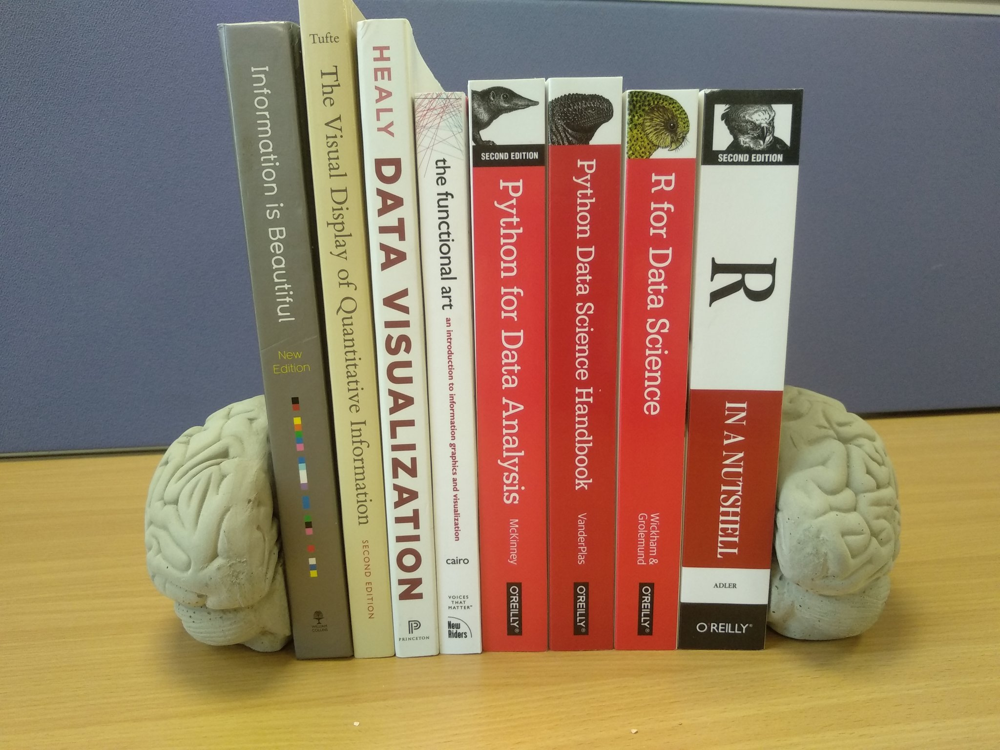

# Extra Reading

Further reading, including books, links, demos and packages. You don't need to read all of this, but you will want to dig around. If I could recommend one book to accompany the course it would be 

:::: {.info}
Healy, K. (2018). [Data visualization: a practical introduction](https://socviz.co/). Princeton University Press.
::::

## Visualisation (theory)

Healy, K. (2018). [Data visualization: a practical introduction](https://socviz.co/). Princeton University Press.

Cairo, A. (2012). The Functional Art: An introduction to information graphics and visualization. New Riders.

Tufte, E. R. (2001). The visual display of quantitative information. Cheshire, CT: Graphics press.

McCandless, D. (2012). Information is beautiful. London: Collins.

Wilke, C.O. (2019). [Fundamentals of Data Visualization](https://clauswilke.com/dataviz/index.html). O'Reilly. [free online]

Rougier, N. P., Droettboom, M., & Bourne, P. E. (2014). Ten simple rules for better figures. PLoS Comput Biol, 10(9), e1003833. https://journals.plos.org/ploscompbiol/article?id=10.1371/journal.pcbi.1003833

Weissgerber, T. L., Milic, N. M., Winham, S. J., & Garovic, V. D. (2015). [Beyond bar and line graphs: time for a new data presentation paradigm](https://journals.plos.org/plosbiology/article?id=10.1371/journal.pbio.1002128). PLoS biology, 13(4).

 * Related: [Visualizing Distributions with Raincloud Plots with ggplot2](https://www.cedricscherer.com/2021/06/06/visualizing-distributions-with-raincloud-plots-with-ggplot2/)

[Nightingale: The Journal of The Data Visualisation Society](https://medium.com/nightingale)

Podcast: [Explore Explain: A Video and Podcast Series](https://www.visualisingdata.com/podcast/)

[Why you sometimes need to break the rules in data viz](https://medium.economist.com/why-you-sometimes-need-to-break-the-rules-in-data-viz-4d8ece284919) by Rosamund Pearce

The Encyclopedia of Human-Computer Interaction, 2nd Ed.: [Data Visualization for Human Perception](https://www.interaction-design.org/literature/book/the-encyclopedia-of-human-computer-interaction-2nd-ed/data-visualization-for-human-perception)

The Economist newsletter: "[Off the Charts](https://www.economist.com/offthecharts/)" is highly recommended. Examples: [better bar charts](https://view.e.economist.com/?qs=56104efe1f008c7741aaecad26fac5ac478021656b5a9180944c48b674116491a6f66c9f3634ba531584569cbf53c8668ce8496cc20515719fb62b40048ac22dd528432bf4149fd74086ba8db6b1b99c), [using log scales](https://view.e.economist.com/?qs=d55c97a1de83b95ad1aa9d756a88fafed0667fd13b0f03f87873b0da100014d793b5daf177867d16839f007b7c64b8febf2834c6517faf9f686782c48696e6b52d21ec363f03f3efb7bf039c6351e781)

[The Do’s and Don’ts of Chart Making](https://towardsdatascience.com/the-dos-and-don-ts-of-chart-making-13c629456027)

Riffe, T., Sander, N., & Kluesener, S. (2021). Editorial to the Special Issue on Demographic Data Visualization: [Getting the point across–Reaching the potential of demographic data visualization](https://www.demographic-research.org/volumes/vol44/36/). Demographic research. Rostock: Max Planck Institute for Demographic Research, 2021, Vol. 44.

Franconeri, S. L., Padilla, L. M., Shah, P., Zacks, J. M., & Hullman, J. (2021). [The science of visual data communication: What works](https://journals.sagepub.com/doi/pdf/10.1177/15291006211051956). Psychological Science in the Public Interest, 22(3), 110-161.

Lisa Charlotte Muth: [What to consider when using text in data visualizations](https://blog.datawrapper.de/text-in-data-visualizations/)

https://blog.datawrapper.de/text-in-data-visualizations/

## The Reproducibility Crisis

Cancer Biology Reproducibility Project
https://www.enago.com/academy/the-reproducibility-project-cancer-biology-to-replicate-only-18-studies-now/

Economics reproducibility
https://www.wired.com/story/econ-statbias-study/

Video: Is Most Published Research Wrong https://www.youtube.com/watch?v=42QuXLucH3Q

Demo: p-hacking https://fivethirtyeight.com/features/science-isnt-broken/#part1

Open Science Collaboration. (2015). Estimating the reproducibility of psychological science. Science, 349(6251), aac4716.

## Better practice

Munafo, M. R., et al. (2017). A manifesto for reproducible science . Nature Human Behaviour, 1, 0021. DOI: 10.0138/s41562-016-0021.

Markowetz, F. (2015). Five selfish reasons to work reproducibly. Genome biology, 16(1), 274. https://genomebiology.biomedcentral.com/articles/10.1186/s13059-015-0850-7

A Guide to Reproducible Code in Ecology and Evolution https://www.britishecologicalsociety.org/wp-content/uploads/2017/12/guide-to-reproducible-code.pdf

Gael Varoquaux: Computational practices for reproducible science https://www.slideshare.net/GaelVaroquaux/computational-practices-for-reproducible-science

Axelrod, V. (2014). [Minimizing bugs in cognitive neuroscience programming](https://www.frontiersin.org/articles/10.3389/fpsyg.2014.01435/full). Frontiers in psychology, 5, 1435.

"our wishlist for what knowledge and skills we'd find in a well-prepared data scientist candidate coming from a masters program." https://github.com/brohrer/academic_advisory/blob/master/curriculum_roadmap.md

Wilson, G., Bryan, J., Cranston, K., Kitzes, J., Nederbragt, L., & Teal, T. K. (2017). [Good enough practices in scientific computing](https://journals.plos.org/ploscompbiol/article?id=10.1371/journal.pcbi.1005510). PLoS computational biology, 13(6), e1005510.

## Project organisation

Mike Frank onboarding guide http://babieslearninglanguage.blogspot.co.uk/2017/01/onboarding.html

Jenny Bryan's advice on filenames: [Naming Things](http://www2.stat.duke.edu/~rcs46/lectures_2015/01-markdown-git/slides/naming-slides/naming-slides.pdf)

Emily Riederer [Column naming contracts](https://emilyriederer.netlify.app/post/column-name-contracts/)

Broman & Woo (2017) Data Organization in Spreadsheets https://www.tandfonline.com/doi/full/10.1080/00031305.2017.1375989

Video: Data Sharing and Management Snafu in 3 Short Acts 
https://www.youtube.com/watch?time_continue=2&v=N2zK3sAtr-4

Hadley Wickham: Tidy Data: http://vita.had.co.nz/papers/tidy-data.pdf

## Coding

Readings in Applied Data Science https://github.com/hadley/stats337#readings

Stack overflow: asking good questions https://stackoverflow.com/help/how-to-ask

Stack overflow: provide a minimal, complete, verifable example https://stackoverflow.com/help/mcve

Our Software Dependency Problem https://research.swtch.com/deps

From Psychologist to Data Scientist https://www.neurotroph.de/2019/01/from-psychologist-to-data-scientist/

Bret Victor: [Learnable Programming: Designing a programming system for understanding programs](http://worrydream.com/LearnableProgramming/)

[Top 10 Coding Mistakes Made by Data Scientists](https://www.kdnuggets.com/2019/04/top-10-coding-mistakes-data-scientists.html)

[Coding error postmortem](http://reproducibility.stanford.edu/coding-error-postmortem/) by Russ Poldrack, McKenzie Hagen, and Patrick Bissett (August 10, 2020)

## R

### Hints

[Prime Hints For Running A Data Project In R](https://kkulma.github.io/2018-03-18-Prime-Hints-for-Running-a-data-project-in-R/)

RStudio Cheat Sheets: https://www.rstudio.com/resources/cheatsheets/

Here::Here https://github.com/jennybc/here_here

[We are R-ladies](https://twitter.com/WeAreRLadies) - Twitter account with a rotating curator featuring discussions, package highlights, and tips

### Courses / books

I recommend you start with swirl: https://swirlstats.com/

Lisa DeBruine, & Dale Barr. (2019). Data Skills for Reproducible Science. Zenodo. doi:10.5281/zenodo.3564348 https://psyteachr.github.io/msc-data-skills/

You may also enjoy:

Chester Ismay and Patrick C. Kennedy: [Getting Used to R, RStudio, and R Markdown](https://rbasics.netlify.com/)

Matt Crump: [Reproducible statistics for psychologists with R](https://crumplab.github.io/rstatsforpsych/)

Danielle Navarro: [Learning Statistics With R](https://learningstatisticswithr.com/)  
* Particularly chapter 3 https://learningstatisticswithr-bookdown.netlify.com/intror

[Data Science with R](http://robust-tools.djnavarro.net/): An introductory course by Danielle Navarro

[Data Science in a Box](https://datasciencebox.org/?s=03)

Adler, J. (2010). R in a nutshell: A desktop quick reference. " O'Reilly Media, Inc.".

Intro to R (Liz Page-Gould): http://www.page-gould.com/r/uoft/

Grolemund, G., & Wickham, H. (2018). R for data science.
* See also https://r4ds.had.co.nz/

## Making graphs (practice)

Graphing in R (Eric-Jan Wagenmakers and Quentin F. Gronau): http://shinyapps.org/apps/RGraphCompendium/index.php

[r-charts.com](https://r-charts.com/): "Over 1100 graphs with reproducible code divided in 8 big categories and over 50 chart types, in addition of tools to choose and create colors and color palettes"

[r-graph-gallery.com/](https://r-graph-gallery.com/): Similar!

Cédric Scherer: [A ggplot2 Tutorial for Beautiful Plotting in R](https://www.cedricscherer.com/2019/08/05/a-ggplot2-tutorial-for-beautiful-plotting-in-r/)

## Presentations

Kieran Healy : [Making Slides](https://kieranhealy.org/blog/archives/2018/03/24/making-slides/)

## Statistics

[Discovering Statistics Using R](https://www.discoveringstatistics.com/books/discovering-statistics-using-r/)

Hox, J. (2010) Multilevel Analysis: Techniques and Applications

[Statistical Rethinking: A Bayesian Course with Examples in R and Stan](https://xcelab.net/rm/statistical-rethinking/)

model checking package: [Performance](https://easystats.github.io/performance/index.html)

## Advanced Reading, Background & Other Recommends

[The Limits of Data](https://issues.org/limits-of-data-nguyen/) C. Thi Nguyen. Issues, XL, 2 (2024) <https://issues.org/limits-of-data-nguyen/>

[Data Feminism](https://data-feminism.mitpress.mit.edu/) by Catherine D'Ignazio and Lauren F. Klein. The MIT Press. 2020

Invisible Women: Exposing Data Bias in a World Designed for Men
by Caroline Criado Perez (2019) <https://carolinecriadoperez.com/book/invisible-women/>

Rachel Thomas's [Applied Data Ethics Syllabus](https://ethics.fast.ai/syllabus)

[Efficient R Programming](https://csgillespie.github.io/efficientR/)

[Data Visualization course](https://datavizm20.classes.andrewheiss.com/lesson/) by Dr. Andrew Heiss of Georgia State University

[www.datascienceglossary.org](https://www.datascienceglossary.org/) - there's lots of new terminology, don't be afraid to ask (or google)

## Pedagogy

Brown, N. C., & Wilson, G. (2018). [Ten quick tips for teaching programming](https://journals.plos.org/ploscompbiol/article?id=10.1371/journal.pcbi.1006023). PLoS computational biology, 14(4), e1006023.

Hudiburgh, L. M., & Garbinsky, D. (2020). [Data Visualization: Bringing Data to Life in an Introductory Statistics Course](https://www.tandfonline.com/doi/full/10.1080/10691898.2020.1796399). Journal of Statistics Education, 28(3), 262-279.
