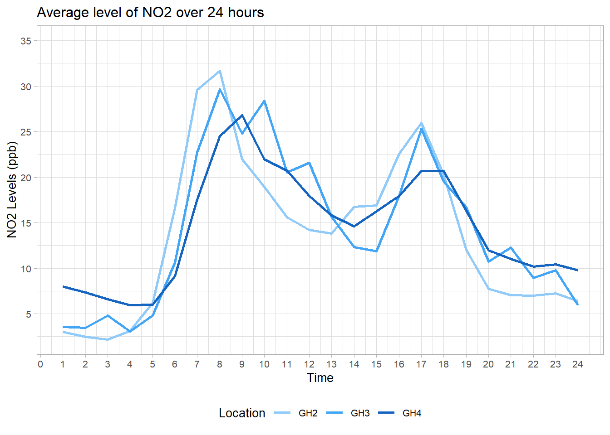
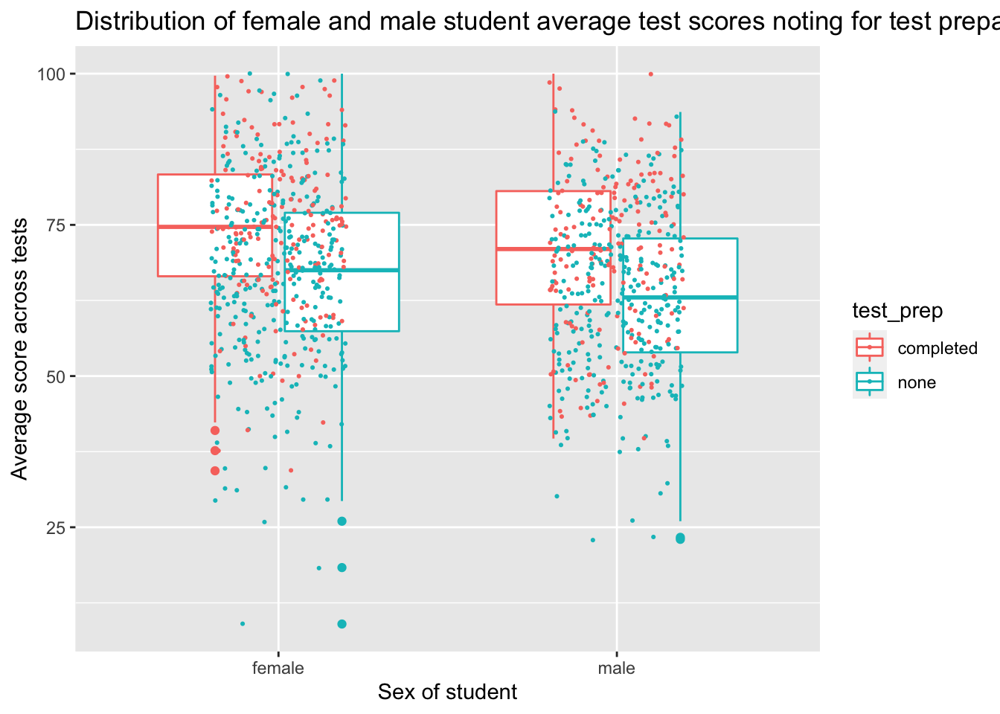
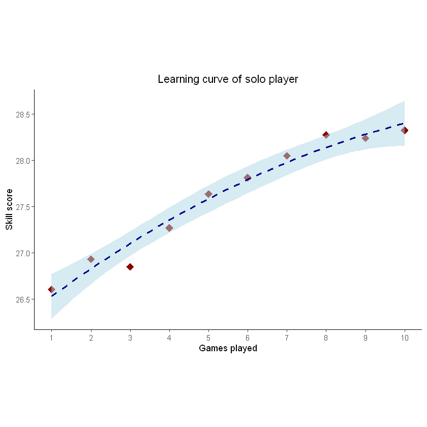
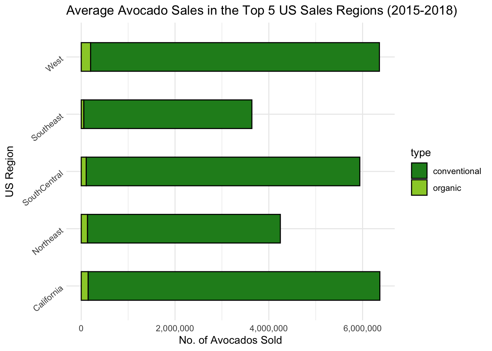
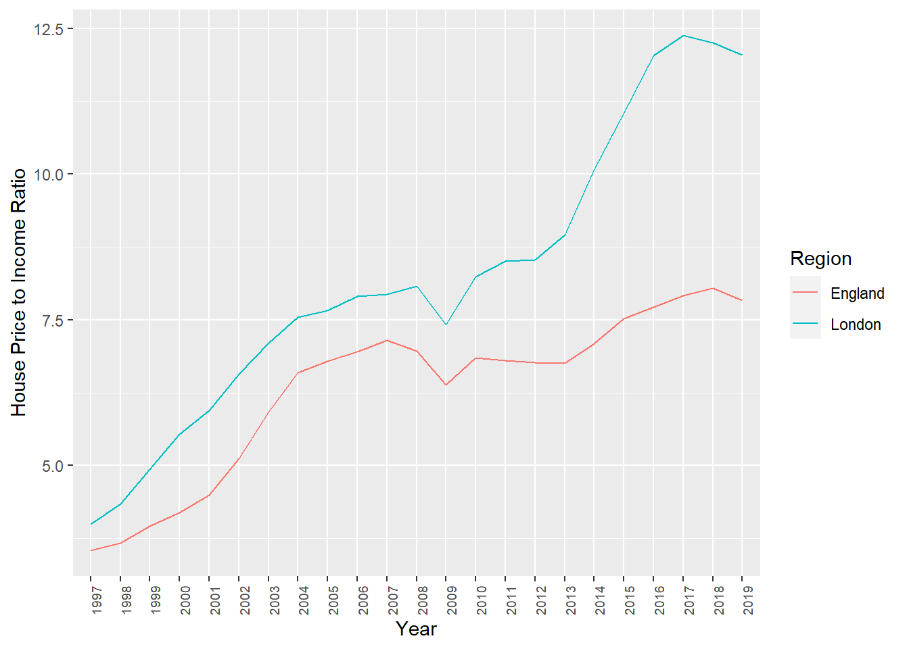

# Class of 2020

This was the first year for the new [MSc in Psychological Research Methods with Data Science](https://www.sheffield.ac.uk/psychology/prospectivepg/masters/data-science). PSY6422 is a key module for this course, and is designed to set students up for their independent data science project, completed over the summer.

Most students came into this module with little or no previous experience of coding. The aim is to share powerful, flexible, computational methods which allow the production of reproducible analyses and useful data visualisations.

The module is taught via workshops, and the end point is to carry out and publish a data analysis and visualisation on a data set which interests you.

Here just a few examples of data visualisations produced by the class for their [final projects](docs/final-project.html). Each project was different, and each student published their data, analysis code and visualisation as an online notebook (so please click the link for more details of each project).

Hala took open data from Sheffield city council and showed [daily cycles in air pollution levels](https://halaaj.github.io/PSY6422/)



Note the spikes in N02 levels during the morning and evening rush hours.

Nabiha looked at [Students' Performance in Exams](https://nabihaahmad.github.io/)



Note that these boxplots with jittered points allow you to see the group average but also the underlying data.

Rachel, looked at [COVID-19 Deaths in England](https://rachelanthony.github.io/) and produced a number of animated and interactive plots which really show off the data visualisation potential of R/ggplot, including this shocking plot of regional rates of death against deprivation, which shows that the death rate in the most deprived areas was twice that of the rate in the least deprived areas. Hover over each bar for details.

```{r echo=FALSE,error=FALSE, message=FALSE}
library(plotly)
Deprivation <- data.frame(Deprivation.Scale = c(1,2,3,4,5,6,7,8,9,10),
                          Death.Rate = c(55.1,57.6,52.4,39.5,34.9,32.1,29.6,30.3,27.0,25.3))

Deprivation.plot <- ggplot(Deprivation, aes(x=Deprivation.Scale, y=Death.Rate, fill=Deprivation.Scale))+geom_bar(stat = 'identity', position='dodge')+
  ggtitle('COVID-19 Death Rate according to Deprivation Scale')+
  labs(x = 'Deprivation Scale', y='Death Rate, per 100,000')+
  scale_x_continuous(breaks = c(1,2,3,4,5,6,7,8,9,10))+
  scale_fill_gradient(low = "blue",high = "red")+
  theme(legend.position='none')
ggplotly(Deprivation.plot)
```


Yidan's project mixed python and R and involved some highly technical work installing and querying an SQL database server. The topic, [Skill acquisition of solo players: a case study
](https://github.com/yidanliu-psy/solo-player-skill/blob/master/visualisation.ipynb) revealed how practice mapped to skill level in players of an online strategy game:



This is the famous learning curve, showing that players improved with practice (but at a deccelerating rate).
	
My unofficial prize for aesthetics in data visualisation went to Katie's project [avocado prices, sales & distribution across the US between 2015-2018](https://katielmoran.github.io/PSY6422) which used a consistent, and avocado-themed, colour scheme throughout:



Adam's project is a good illustration of the power of data visualisation - it can make salient something we might know but had not fully reckoned with. In his case, his project was on [Changes in average house prices and incomes in England 1997-2019](https://adamscott1997.github.io/PSY6422/): 



His graph of the change in the ratio of average house price to average income shows just how unaffordable housing has become.

Several projects looked at topics which interested the students and for which public data was available. For example, Victoria looked at the [World Happiness Report 2019 data](https://victoria1403.github.io/PSY6422-Final-Project/), (another) Katie looked at [Caffeine Intake and Mental Health](https://kamac-sheff.github.io/Caffeine/Caffeine.html), and Eleanor looked at [Professional CS:GO Matches](https://eleanorhyde.github.io/) and in particular at the performance of a professional team based in Sheffield.

Others  projects used open data from published research, replicating and extending the analysis the original authors reproduced ([Bessie](https://bessieo.github.io/Looking-At-Others/), [Esra](https://ekhojah.github.io/Birthwight/), [Sam](https://sam-antrobus.github.io/Final_Project/), [Leah](https://lmcgrath2.github.io/PSY6422project/))

These are just the projects which were completed and published publicly by students on the module this year (and who gave me permission to link to their work). I am immensely proud of all the work students did on this module, which was severely disrupted by the pandemic. However far you get with data analysis and visualisation there is always more you can learn, which can be daunting, but it can also be exciting because there are new things to try, new data to look and new things to find out.

*Tom Stafford, July 2020*


	


