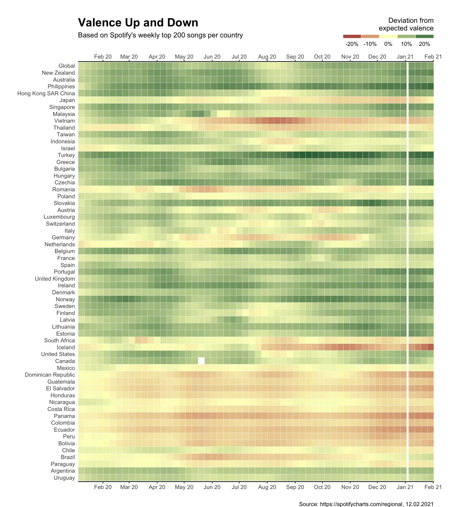
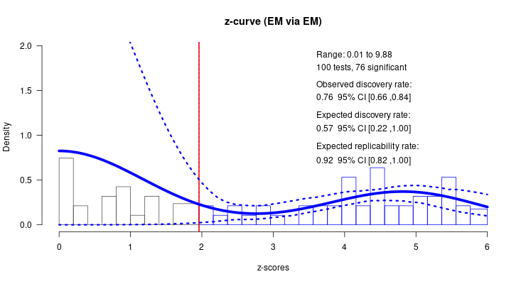
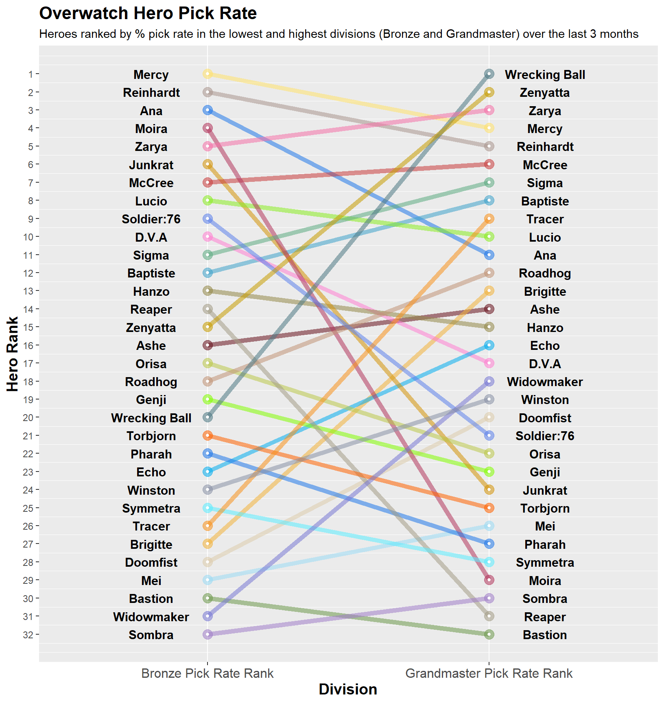

# Class of 2021

This was the second year for the [MSc in Psychological Research Methods with Data Science](https://www.sheffield.ac.uk/postgraduate/taught/courses/2022/psychological-research-methods-data-science-msc). The course ran entirely online, but the intention was the same - to use PSY6422 to set students up for their independent data science project, carried out over the summer, but also to ensure that they left the MSc with a complete data project they could show off as part of a portfolio.

There were too many students on the module this year to show all projects, so here are a few highlights:

Ruri made this ring plot of where doctors migrate to and from:

Full project is here: [Doctors’ Migration in 2018](https://protor23.github.io/doctors-migration-2018/). She argues convincingly that some data visualisations can be valuable when they are **not** intuitive, that ultimately demanding a reader's attention to learn to decode complexity can be rewarding. 

---

Sebastian did a fantastic job using the Spotify API to extract data on the emotional valence of the top 200 songs for 70 countries, across the year 2020. Did the global pandemic affect the mood of the songs we listened to?

Full project is here: [Visualising Valence](https://sebastianplnr.github.io/spotify_audio_feature_analysis/). 

---

Hubert's project on two meta-analytic bias detection techniques is here: [Welcome to the showdown between two
bias detection techniques](https://hubertplisiecki.shinyapps.io/pcurve_vs_zcurve/). I'm not going to explain the visualisation here, but the project is an excellent example of data visualisation in the service of wider scientific purpose.

---

Alex used data from the game Overwatch to visualise how choice of game hero differed between high and low skilled players: [Overwatch Hero Pick Rates](https://alexmontgomery-git.github.io/PSY6422_Project/):

---

Jarod also looked at gamers, use Steam data to show how the pandemic lockdown affected our gaming habits: [How COVID-19 affected gaming habits](https://jarod-wilson.github.io/psy6422/). 

---

A number of people made interactive visualisations, such as James, whose [US State-Wide UFO Sightings from 1970 - 2020](https://jamesshuffley.shinyapps.io/ufo_app/) you really need to visit to explore, but here's a static shot:

---

Other interactive or animated visualisations include Halleyson's [Which Anime Studio Is The Best? An Examination Between 1958~2020](https://halleyson.github.io/psy6422dataproject/), Ollie's visualisation of the game trajectories from [One Hundred Years of Chess](https://olliebray.shinyapps.io/100YearsofChess/) data, and Farzana's analysis of global data on happiness: [The World Happiness Report 2021](https://farz1313.github.io/farzana_patel_psy6422/). Finally, here's an animation from  Juan's [Dementia Diagnosis Rates in England: A Data Story](https://jsgm21.github.io/gonzalezmartinez_psy6422_project/gonzalezmartinez_final_project).

Again, a covid-related project and a clear demonstration of the power of visualisation to surface an important story.

Overall, I was proud of every student who struggled with R and the circumstances of the pandemic to produce a visualisation for this module. My sense from the feedback was that most people enjoyed themselves more than they thought they would, and ended up pleased with what they produced and the new skills they take forward from the module

## Feedback

Here is some selected feedback from the class of 2021.

When first planning this project and working with R, I was convinced that I wouldn’t be able complete the module. I pushed myself to the very best of my ability and I am proud that I was able to carry out my initial plan and complete the task. Starting this module, I had an interest in climate topics, and I am glad that I was able to use my new-found skills to make a sophisticated climate themed visualisation project at master’s level. I will reflect on this module with fondness whilst simultaneously wondering how I managed to reach the end. I’m grateful to have gained my current skills - whilst they still require much improvement, I look forward to further improving as I go forward.

every topic was relevant, interesting and engaging and clearly linked to the overall aims of the course.

"This was one of my favourites modules throughout my undergraduate and postgraduate studies...I am delighted that this is a free platform and I will be able to use it even after finishing"

The magic of data analysis and visualization relies in sharing your data and findings among other scientists and for anyone to access and see. Sharing data allows other people to replicate it, refine it, learn from it or even get inspired by it and create their own. Science should be shared and using these platforms and programs is crucial to achieve so.

"Gaining a coding foundation and an understanding of how to use the statistical programming language of R to create detailed visualisations was extremely useful, and has provided me with another skillset that will enable me to go on to create and develop further in-depth visualisations in any future research projects"

