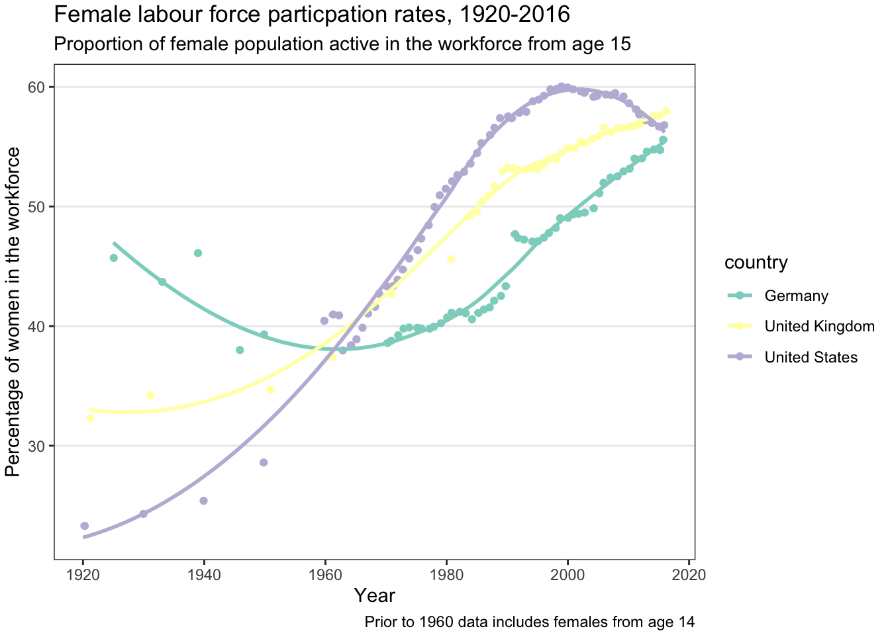
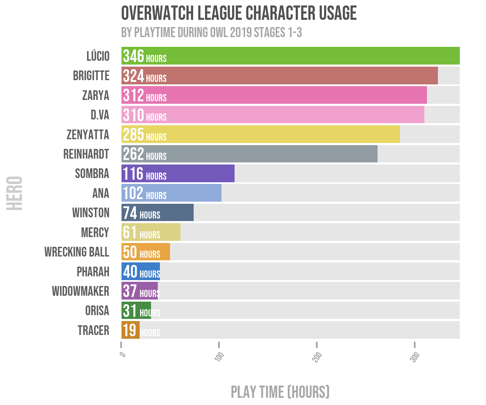
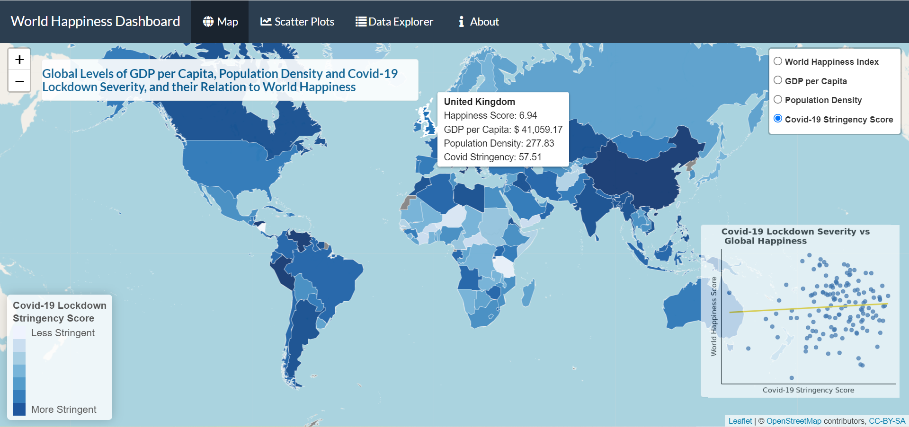
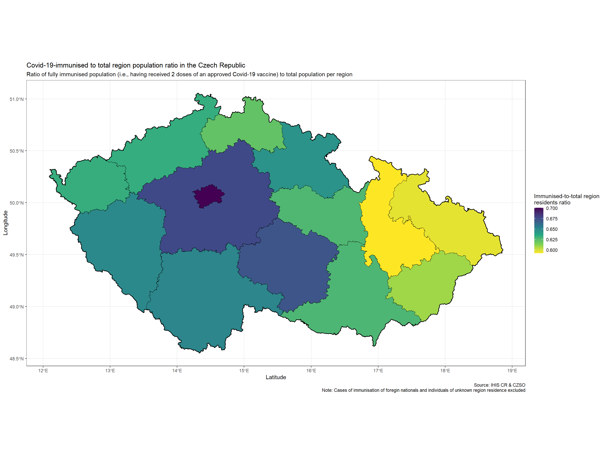
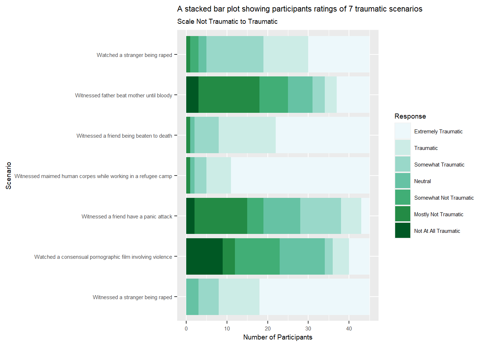

# Class of 2022

This was the third year for the [MSc in Psychological Research Methods with Data Science](https://www.sheffield.ac.uk/postgraduate/taught/courses/2022/psychological-research-methods-data-science-msc). The classes were back in person and we cracked on with the core motivation of PSY6422 - to set students up for their independent data science project, carried out over the summer, but also to ensure that they left the MSc with a complete data project they could show off as part of a portfolio.

There were too many students on the module this year to show all projects, so here are a few highlights:

## Module project showcase

Florence's project looked at [Gender bias in the cover personalities of TIME Magazine (1920-2013)](https://fsgwilliams.github.io/Data-Visualisation/)

[Pages](https://github.com/fsgwilliams/Data-Visualisation)

Gemma's project was "Female labour force participation rates over the Last 100 Years"

[Pages](http://rpubs.com/Gem-Hall/896578)
[Repo](https://github.com/Gem-Hall/PSY6422_project.git)

Yibo looked at [Causes of death in the world](https://yshi81.github.io/Causes-of-death-in-the-world.github.io/), [Pages](https://github.com/Yshi81/Causes-of-death-in-the-world.github.io)

Peter's project shows character preference for the Overwatch League 2019

[Pages](https://peterbeech.github.io/PSY6422_project/)
[Repo](https://github.com/PeterBeech/PSY6422_project)

Luke's project is an interactive visualisation which allows you to explore "Global Levels of GDP per Capita, Population Density and Covid-19 Lockdown Severity, and their Relation to World Happiness" 

[Pages](https://c6gp2m-luke-jenner.shinyapps.io/PSY6422_Project/)	[Repo](https://github.com/lukejenner6/PSY6422_Project)

This project looked at "Covid-19-immunised to total region population ratio in the Czech Republic"

[Pages](https://yorkshireorange.github.io/PSY6422/)
[Pages](https://github.com/yorkshireorange/PSY6422)

Ben looked at [Efficacy of Self Testing - comparing two Covid 19 prevalence metrics across stages of the pandemic in England](https://ben-pw.github.io/PSY6422_Project/), [Pages](https://github.com/Ben-PW/PSY6422_Project)

[A stacked bar plot showing likert scale responses to imagined traumatic scenarios](https://natasharobinson2603.github.io/PSY6422_finalproject/), [Pages](https://github.com/NatashaRobinson2603/PSY6422_finalproject)

Other projects looked [at the income of UK doctors compared to inflation over the last 12 years](https://hvlabat.shinyapps.io/nhs_income_vs_inflation/), [Pages](https://github.com/hvlabat/nhs_income_vs_inflation); a [A History of Pitchfork Reviews](https://meicalowen.github.io/PSY6422-Data-Visualisation/), [Pages](https://github.com/meicalowen/PSY6422-Data-Visualisation); Kieran's project looked at the effect of losing crowds on football scores: [Home Advantage and Covid-19: Football's Natural Experiment](https://kietag.shinyapps.io/home-advantage-covid-19-app/), [Pages](https://github.com/Kietag/Home-Advantage-Covid-19-App)

https://210155316.github.io/final_project_210155316/	https://github.com/210155316/final_project_210155316

## Advice for future students

As part of the module assessment I asked those who took the module "what advice would you give someone starting this course?". Here's what they said:

its not as hard as you think it will be, you learn pretty quick, google helps a lot, start work on it early.

I would definitely say choose a project topic that you are interested in. I have (quite tragically) loved every minute of developing my project since I am quite interested in the topic and found myself very invested in the outcome of the project.

Try not to get frustrated! I didn’t have any coding experience before starting this course, and you will be surprised at how far you can push yourself. If you told me I would be making an interactive plot at the start of this module I would’ve laughed.

Coding is less about technical skill, and more about mentality. It requires a great deal of patience to manage errors, and even greater patience to Google and self teach the code required to attain your goal. Mastering coding is less about knowing syntax off by heart, but having an effective procedure for accessing resources and managing problems when they arise.

The one advice I would give to someone starting this course is to not be afraid to ask questions. I initially felt out of place and that I should not ask questions as it would expose the fact that I am a beginner at coding. However, there are many people that are beginners in this course, and it is better to ask questions than not understand, especially when doing the final project.

Google will solve many of your problems (such as when trying to write code, or fix technical issues and errors). Keep everything organised (including code, and files. This will make it far more manageable). Don’t get frustrated if something doesn’t work at first (either look for help online, or ask someone).

I would say to attend every class and make the most of them by asking for help if needed. I have a habit of giving up straight away if I do not understand anything so struggled a lot in class, which made it harder when it came to the final project. However, after a lot of hard work I have managed to create something I am proud of and never thought I’d be able to accomplish, so if I can do it anyone can!

The course stimulates independent learning, so I would advise everyone to be curious and go after things they find interesting. I would advise future students to ask about everything they are interested in during the workshops - looking things up and troubleshooting takes much longer when one needs to do it alone. Finally, I would encourage everyone to meet up with their peers to discuss their work - they can get a lot of good ideas from the others, and their perspective, too.

Working with a partner from the beginning is also really nice because it makes it so much more enjoyable, and you don’t feel like you’re being left behind if there’s two of you at the same level.

It is helpful to find a friend to code with, especially one who might have more experience than you who can guide you when you are stuck.

 

First and foremost, I would say not to panic and get discouraged, especially when had some coding in the past and did not necessarily like it. The learning process takes time, just like with any language, you need to understand its rules. In the end, you will code and visualise what you want, even exceeding your initial expectations. 

Firstly, don’t be afraid to write code and think positively about the meaning of each statement. Secondly, talk to Tom and Luke a lot as that is a very helpful thing to do. Finally, mastering the content of this course will help a lot in whatever industry you enter in the future.

 

Be patient and don’t panic. When I first started coding, I would get hung up on every small error and get really frustrated. As I started to code for my final project, I realised that errors aren’t always big problems, it could be something as small as a comma in the wrong place. In my opinion, coding is as much about patience and detail detection as it is about skill. I would also suggest to someone starting the course to not expect the skills to develop immediately. It was only once I began to put together the skills that I learned throughout the course that everything began to piece together and slowly make sense.

It will be very challenging and sometimes quite stressful, but the outcome is something you’ll really be proud of if you stick with and push through. Overall, I really enjoyed this module and I now understand the thrill coders get when they’ve been stuck on a problem for a while and finally get their code to work.

Get involved. Coding can be really scary at first, but you will get as much out of it that you put into it. Plus, there is a genuine feeling of accomplishment once you get your head around some of the concepts involved in coding!

Google is your friend! There are endless help forums online offering advice and snippets of code that can help fix/create code to produce amazing plots. A lot of forums often give alternative work rounds for code that may not be parsing or rendering correctly, with explanations, offering an alternate route if you are stuck. If you can imagine it, there’s generally a code for that somewhere online!

I would recommend, especially if this is the student’s first experience with the data visualisation process, to study regularly instead of just a few days before the submission of the final project. It can be helpful to break up extensive thematic sections into smaller chapters. For example, instead of learning all the functions of ggplot2, it would be better to learn how to use a specific layer, such as “geom_bar()”, at a time.

Yes it’s daunting, and yes it’s challenging especially if you have no experience, but don’t let it stop you. Once you start engaging properly in this module you’ll learn it quickly and start to love it

## "one thing you have read and enjoyed or found useful"

I also asked the students for recommended reading:

### General Visualisation

Video: [How to avoid death By PowerPoint](https://www.youtube.com/watch?v=Iwpi1Lm6dFo) | David JP Phillips | TEDxStockholmSalon

Schwabish, J. (2021, Feb 8). [Five Charts You’ve Never Used but Should](https://policyviz. com/2021/02/08/five-charts-youve-never-used-but-should/ ). PolicyViz.

"Data to Viz leads you to the most appropriate graph for your data. It links to the code to build it and lists common caveats you should avoid" [data-to-viz.com/](https://www.data-to-viz.com/)

Visual Vocabulary: Designing with data [ft-interactive.github.io/visual-vocabulary/](https://ft-interactive.github.io/visual-vocabulary/)

Economist.com [Mistakes, we’ve drawn a few: Learning from our errors in data visualisation](https://medium.economist.com/mistakes-weve-drawn-a-few-8cdd8a42d368)

Cairo, A (2012). [The functional art: an introduction to information graphics and visualisation](http://www.thefunctionalart.com/) (1 st ed.). New Riders.

IBM.com: [Learn how data visualization can improve understanding and analyses, enabling better and faster decision making.](https://ibm.com/cloud/learn/data-visualization)

### R specific advice

Ruggeri, G. (2021, January 29). Better data communication with {GGPLOT2}](https://giulia-ruggeri.medium.com/better-data-communication-with-ggplot2-92fbcfea2c6e). Medium.

Datanovia: “[TOP R COLOR PALETTES TO KNOW FOR GREAT DATA VISUALIZATION](https://www.datanovia.com/en/blog/top-r-color-palettes-to-know-for-great-data- visualization/)” extremely useful for the choice of the most appropriate colour palette for my final project ().

DeBruine, L. & Barr, D. (2019). [Data Skills for Reproducible Science](https://psyteachr.github.io/msc-data-skills/) (1.0.0). Zenodo. https://doi.org/ 10.5281/zenodo.3564555

PDF: RStudio: [Data Wrangling Cheatsheet](https://www.rstudio.com/wp-content/uploads/2015/02/data-wrangling-cheatsheet.pdf)

r-statistics.co by Selva Prabhakaran [Top 50 ggplot2 Visualizations](http://r-statistics.co/Top50-Ggplot2-Visualizations-MasterList-R-Code.html)

Wickham, H. (2016). [ggplot2: Elegant Graphics for Data Analysis](https://ggplot2-book.org/). (2 nd ed.). Springer.

Holtz, Y. (2022). [The R Graph Gallery – Help and inspiration for R charts](https://r-graph-gallery.com)

[Chinese R language forum](https://bbs.pinggu.org/forum-69-1.html)

discovr: a package of interactive tutorials [https://www.discovr.rocks/discovr/](discovr.rocks/discovr/)

### Markdown

dataquest.io: [R Markdown cheatsheet](https://www.dataquest.io/blog/r-markdown-guide-cheatsheet/)

[bookdown.org/yihui/rmarkdown/](https://bookdown.org/yihui/rmarkdown/)

### Advanced R packages

Paldhous, (2016). [‘From R to interactive charts and maps’](https://paldhous.github.io/ucb/2016/dataviz/week13.html.)

[Creating a SQLite database for use with R](https://data.library.virginia.edu/creating-a-sqlite-database-for-use-with-r/)

Hailperin, K. (2019). [Animate ggplots with gganimate:: CHEAT SHEET](https://ugoproto.github.io/ugo_r_doc/pdf/gganimate.pdf)

[Shiny Tutorials](https://psyteachr.gith ub.io/shiny-tutorials/01-first-app.html.). Psyteachr.github.io.

R Studio: [Learn Shiny](https://shiny.rstudio.com/tutorial/)

Mastering Shiny: [mastering-shiny.org/index.html](https://mastering-shiny.org/index.html)
 * Particularly [mastering-shiny.org/reactivity-objects.html ](https://mastering-shiny.org/reactivity-objects.html)

### General coding / projects / reproducibility

[https://www.geeksforgeeks.org](https://www.geeksforgeeks.org)

PDF: Jenny Bryan’s "[Naming Things](www2.stat.duke.edu/~rcs46/lectures_2015/01-markdown-git/slides/naming-slides/naming-slides.pdf)" produced for a ‘Reproducible Science Workshop’.

[stackoverflow.com](https://stackoverflow.com/) (“any errors that I had somebody else most likely had the same and there was always a few different solutions provided.”)

 * e.g Krabel, T. (2018). [Make plotly annotation font bold](https://stackoverflow. com/questions/50067301/make-plotly-annotation-font-bold)
 * e.g [Formatting mouse over labels in plotly when using ggplotly](https://stackoverflow.com/questions/34605919/formatting-mouse-over-labels-in-plotly-when-using-ggplotly)

Broman, K. W., & Woo, K. H. (2018). [Data organization in spreadsheets.](https://kbroman.org/dataorg/) The American Statistician, 72(1), 2-10.

​                

## Feedback on the module

Here is some selected feedback from the class of 2022.

I went from not knowing how to code to creating my own data-wrangling script in the span of a few months, and I owe it to the teaching style employed during our sessions

I really enjoyed the freedom to self direct on this course. Spending hours trying to learn how to properly implement a function correctly became a lot more satisfying when I was working on a project of my own design.

For the first time in my life, I really liked the ‘homework’ exercises. The mini projects such as the anscombe one really helped me work with R because there was a goal and something tangible to work with. I find it quite challenging to ‘think’ about how to code something, but having hands on experience with data really helps contextualize it for me so I was able to translate those skills to my own project!

I have enjoyed this course and feel it will be beneficial for my career in the future. The lab classes helped my learning but it was also crucial that I had access to video run-throughs of some sections like publishing as these aided me when I was struggling. I was very pleased with how clear the expectations were throughout the course; the distinct parts of the coursework were broken down clearly and explained giving me a good understanding of how I needed to approach the task.

This course gave me a great understanding of the impact visualizations can have within your research.

Tom and Luke’s help was invaluable. Having two people within the class that could guide us made all the difference when facing certain problems.

I really enjoyed the final project. During classes I struggled a lot with the content but the final project I was able to go over everything we had learnt in my own time and understand it fully. This gave me a massive sense of accomplishment

I strongly believe that showing live demonstrations of the coding was a very beneficial way of learning. This is because it allowed us to go back and watch the recording if we were stuck; listening to the explanations of the code, and why some things are done in certain ways, allowed me to further my understanding in this field a lot faster as I did not find myself stuck on the basic things. Furthermore, I also found it beneficial that there was some room for self-teaching, in terms of the more advanced topics. This is because it allowed us to set a threshold as to how much coding we could take on and understand, without being overwhelming. It allowed me to push myself only if I thought I could handle it, and then produce a visualisation that I was proud to show friends and family. This is extremely advantageous as it also demonstrates my ability to take on new challenges.

Specifically, I appreciated the opportunity to ask Tom and Luke questions in-person when I was confused, as they helped me understand the philosophy behind how one should approach coding issues; they didn’t just tell me the answer – which would have crippled me in the long term – they gave me hints on how I could solve it myself.

