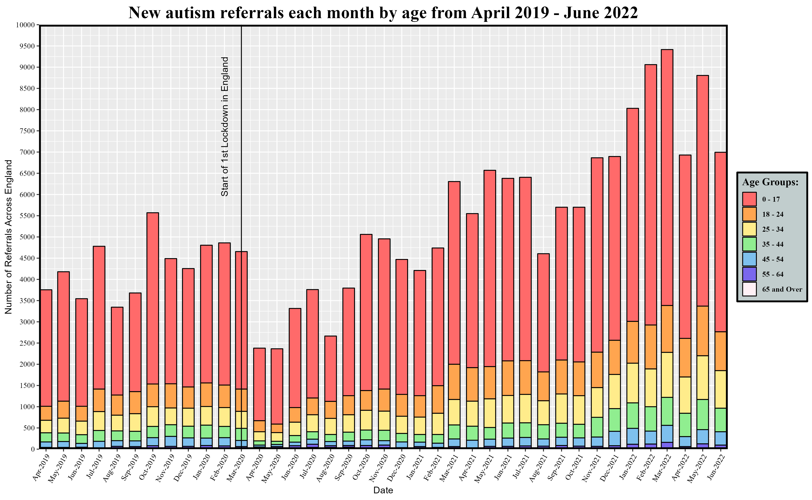
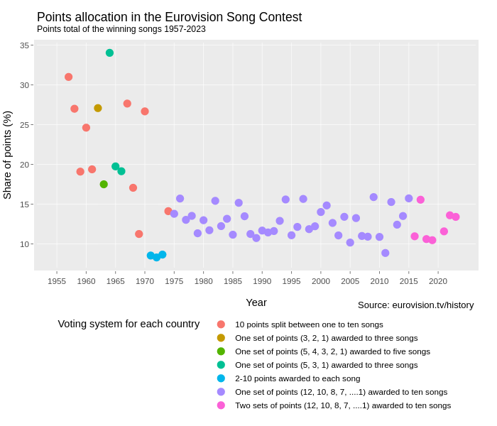
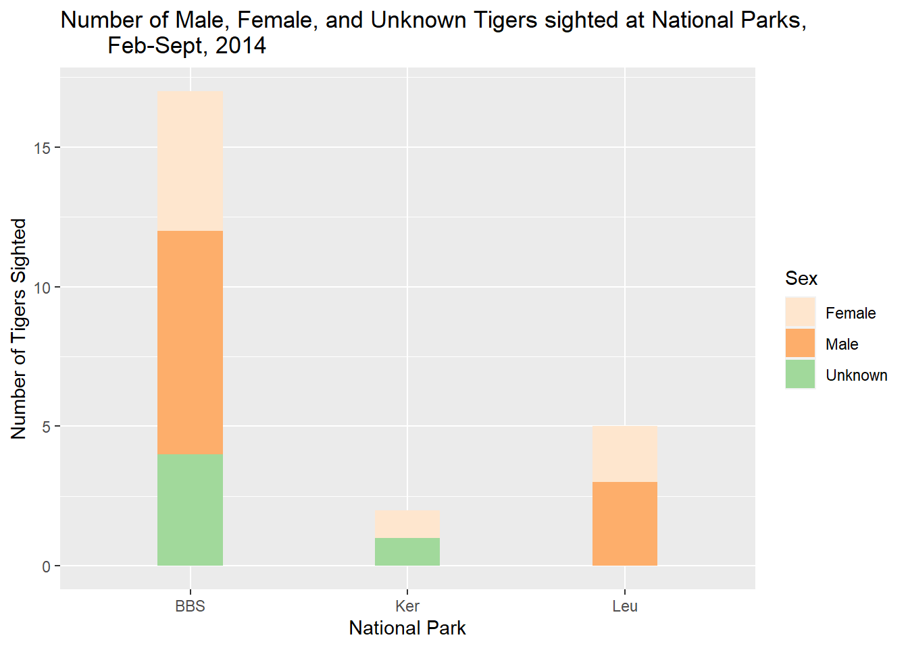
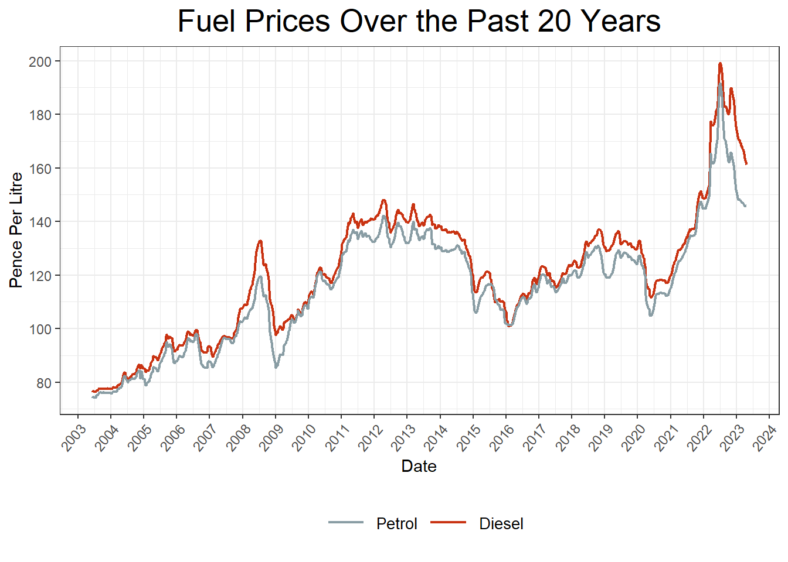

# Class of 2023

A showcase of some projects from the class of 2022-23. 

There were too many students on the module this year to show all projects, so here are a few highlights. Many creative, fun, interesting, challenging visualisation projects were produced but aren't shown here, but these few give a flavour of what student's got up to:

Gabriel's project looked at [the number of Autism referrals in England before, during, and after lockdown](https://gabrieltld.github.io/psy6422-modproj/)

[Repo](https://github.com/gabrieltld/psy6422-modproj/)

There is vitally important information in Mathilde's visualisation of [the amount of caffeine in different highstreet coffee brands](https://mathildedenmark.github.io/DAAV-Project/)

[Repo](https://github.com/MathildeDenmark/DAAV-Project)

I found Grace's plot of [A Decade of Demand on the National Grid"](https://graceesh.github.io/psy6422_energy_demand/) really informative - spot the lockdown months!

[Repo](https://github.com/GraceESH/psy6422_energy_demand)

Jennifer's project [Freddos Afforded With The Minimum Wage: From 2000 to 2023](https://jstandeven.github.io/PSY6422_Project/) is relevant to the state of the nation, and illustrates [Simpson's Paradox](https://en.wikipedia.org/wiki/Simpson%27s_paradox) for across different points of time.

[Repo](https://github.com/jstandeven/PSY6422_Project)

Tanvi Ravi's project was [World Happiness: Resilience in the face of the COVID-19 Pandemic](https://tanvi-r.github.io/PSY6422_Module_Project/)

[Repo](https://github.com/tanvi-r/PSY6422_Module_Project)

Paul did a deep dive into the historical data on the [Eurovision song content winners](https://paulgering.github.io/PSY6422_project/).

[Repo](https://github.com/paulgering/PSY6422_project)

Jade looked at [Sumatran Tigers](https://jholley23.github.io/Sumatran-Tiger-Project/)

[Repo](https://github.com/Jholley23/Sumatran-Tiger-Project)

Anna's interactive visualisation looked at [https://annskama.shinyapps.io/p_values/](reporting errors in psychology journals) ([Repo](https://github.com/annskama/p_values))

Emma's visualisation of [Fuel Prices From 2003 to 2023](https://starsk1.github.io/Fuel_Prices/) is elgantly simple yet effective

[Repo](https://github.com/Starsk1/Fuel_Prices)

## Reflection

This year we said goodbye to Luke Cleland, who is in his final PhD year and so won't be helping with the course next year. The comments from those taking the course make clear how much of a contribution he made - thank you Luke!

Below, a (very biased) selection of student feedback

"I really enjoyed the data wrangling process. I would never have expected to say this at the beginning of the project but summarising, reordering and tidying the data was really satisfying and I even ended up helping a couple friends with their tidying of the data as well"

"what advice would you give someone starting this course?"

Trust all of the other advice saying you will love it by the end of it! It’s so satisfying! It’s the type of work where you lose track of time because you are just fighting one error after the other, but every time you manage to get a line of code to work you just want to go and tell someone immediately and celebrate."

The topics covered in this module as well as its hands-on approach helped me develop highly transferable skills. The workshop style teaching, live coding demos and collaboration with others in class were the aspects I found most helpful and effective for learning. It is also great that the module page and material will remain accessible even after the course so we can refer to it whenever we need in the future.

"I particularly enjoyed the independence that was involved in the course. Students were not expected to learn how to use R by sitting in front of a lecture screen listen to the lecturer. Students were taught from the offset how to use R software practically and were able to go through the material at their own pace. This is the best way to teach R software and to ensure that the students will be able to continue to use it once the course is finished. I found the peer work especially useful, because it helped me address mistakes that I was making and support students around me. I felt less alone in my struggles when coding R with other people. I also enjoyed the live coding demonstrations and I would recommend that there are more of these for future students."

Both Tom and Luke have also been absolutely amazing teachers and it’s been such a nice atmosphere to learn in which made the entire course more enjoyable.

"I think openly communicating with my classmates helped me with my learning! It is something that could be copied by other courses."

What aspects of the course (topics, learning methods) did you enjoy? What about the course helped your learning and are things we should do more of, or could be copied by other courses?

R itself. I had never done any coding before and considered myself entirely incapabale of doing it. I not only wrote code but also understood other people’s code. Felt intelligent. The course page on GitHub, plenty of examples, the regular exercises that were set, live coding, and Luke’s incredible assistance + discussions. The structured approach. Makes things much easier to navigate and keep track of. Also have enjoyed creating my own webpages. Very basic atm but very satisfying none-the-less.

I really enjoyed the live coding session. That was the single most useful workshop in my opinion. When I could see errors come up and then also see how Tom and Luke would tackle thinking about them. If coding is a language, it really helps to listen to fluent speakers have a conversation in it. This really helped with my project as it showed me the mindset I needed to have.

I found this doing this project really satisfying and am now thinking more seriously about data analysis as a potential career"

"Having never coded before, I thoroughly enjoyed this course, and I found that the classes and teaching have massively increased my confidence and ability in coding. The teaching from Tom and Luke was always very clear and thorough which made learning how to code more enjoyable."

