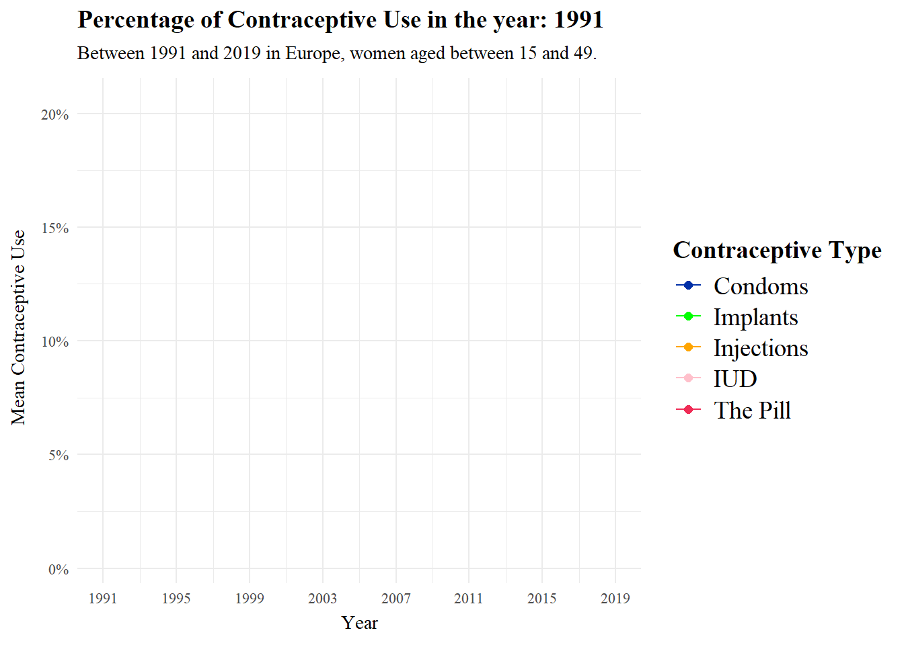
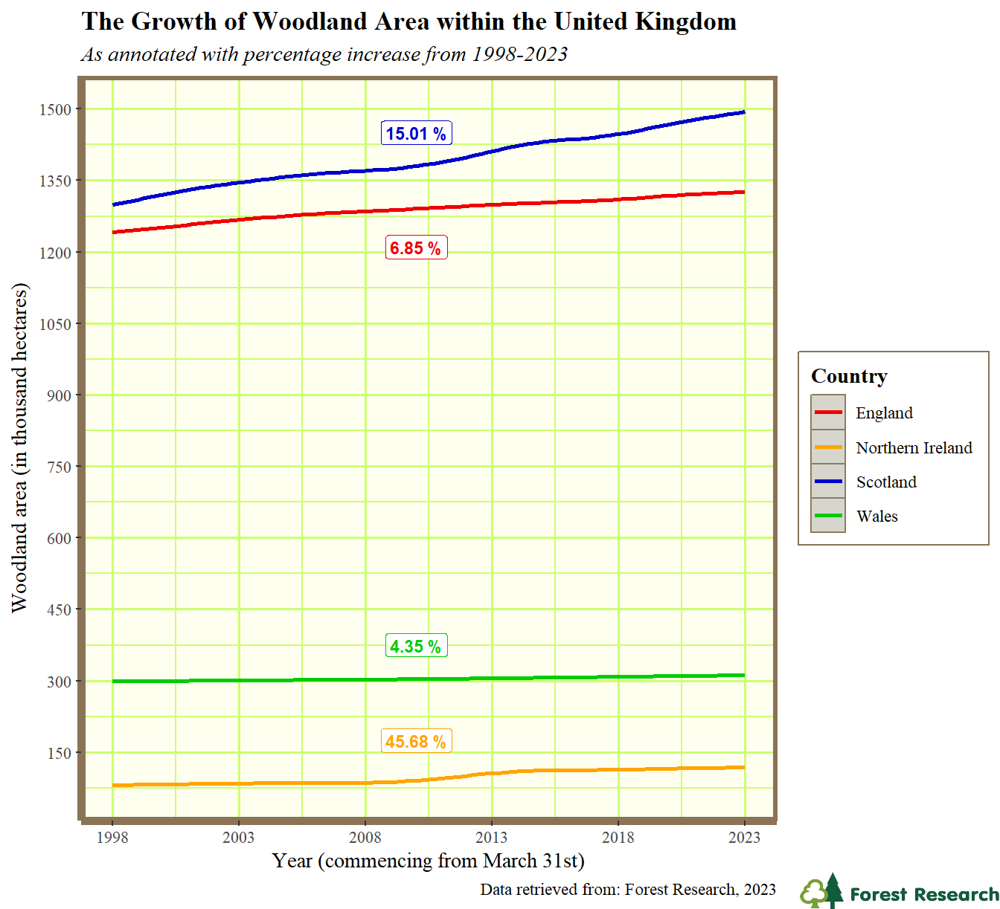
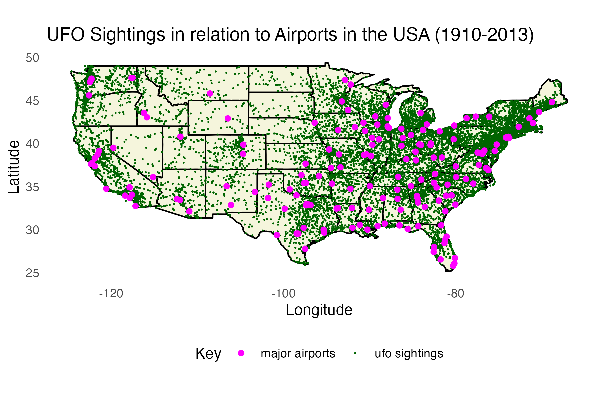

# Class of 2024

A showcase of some projects from the class of 2023-24. 

There were too many students on the module this year to show all projects, so here are a few highlights. Many creative, fun, interesting, challenging visualisation projects were produced but aren't shown here, but these few give a flavour of what student's got up to:

Rachel (looked at Contraception use since the 90s](https://rgatley.github.io/Contraception/). ([Repo](https://github.com/rgatley/Contraception)):

---

More trees! [The Growth of Woodland Area within the United Kingdom (1998-2023)](https://jacobmoorcroft.github.io/moorcroft_230170656/) ([Repo](https://github.com/JacobMoorcroft/moorcroft_230170656))

---

Tom looked at [the Relationship Between Major Airport Locations and UFO Sightings in Mainland USA](https://tomhbird.github.io/PSY6422_UFO_AIRPORTS/) ([Repo](https://github.com/tomhbird/PSY6422_UFO_AIRPORTS/)))

---

Max asked [Can national football results really have an impact on UK stock market values?](https://rpubs.com/MaxEspley/PSY6422_Project). tl;dr - if they do, it isn't a large effect (which is why attending to the y-axis range is important in interpreting visualisations) ([Repo](https://github.com/MaxEspley/PSY6422_Project)):

---

One of the more sophisticated projects we've ever seen, which really showcases what is possible with when advanced data scraping, managemetn and visualisation are combined in a dashboard. Justin's project [How do the perspectives of UK university students, as expressed on Reddit, evolve over time?](https://uniuk.pythonanywhere.com/) is beyond what we teach on this course, but we're happy we can support students to do more advanced work as part of the module. ([Repo](https://github.com/sgjustino/UniUK))

--- 

Carlos showed off R's capacity for scientific data visualisation, re-visualising his undergraduate project data on [The effects of calcium modulators on TDP-43 function and development of a new co-localization protocol in ALS cellular models](https://carlospzhz.github.io/PSY6422_Project/) ([Repo](https://github.com/carlospzhz/PSY6422_Project))

## Reflection

This year we welcomed Hazel Gordon as GTA on the course.The comments from those taking the course make clear how much of a contribution she made - thank you Hazel!

## Feedback from those taking the course

### Tom's reflection

Feedback was mostly positive, and - as always - we continue to work on the course to improve it based on how it is experienced by each year of students. 

This year we had a number of comments on what else could be included in the course: SQL, more on interactive and animated plots, and python. We'll keep these in mind for future iterations of the course. As in previous years, the part which students found hardest was github. As in previous years, I'm going to keep teaching it because it is still vital infrastructure for data science.

## Student feedback

Below, a (very biased) selection of student feedback

"I believe that the hands-on, project-based approach, emphasis on reproducibility and open-
source tools, and inclusion of advanced topics in this course all make for a really rich and
engaging learning experience for students. I truly believe that these elements can be served
as a model for other courses, helping to enhance student engagement and skill development
in the field of data science and research methods."

I’ve always really loved the problem solving element of coding and the way that this course is set up you really
get a chance to explore that side of things playing around with each new technique in the class environment
with help at hand. The live coding was really useful and having the course materials all available on GitHub
was super useful when building the project.

I enjoyed the classes, I thought that they were really well taught and Tom was very helpful and enthusiastic
about the topic which definitely helped build my confidence when doing something completely new to me. I
found the workshop style of the classes the most useful, this could definitely be applied to other courses as
it’s much better to do active/hands-on learning than passive listening.

I really enjoyed the freedom of being able to choose a project that interested me. It really motivated me to
stick to it when i was struggling with things.

something about the course that really helped my understanding was having set exercices to go through during the
class, as well as the opportunity to ask the course leaders about anything we’re unsure on.

I really enjoyed how hands-on and practical the course was. By learning both the principles and
techniques involved in coding, I understood how important it was to consider the intent of your message
and how it influenced design choices, statistical tools and output formation in my projects. I especially
enjoyed the class where students submitted interesting visualizations and we discussed its merits and
demerits, giving me the confidence to share my opinions while listening and learning from my peers.

I found that the live coding was helpful especially the session where Tom created a project from scratch from downloading the data to uploading it on Github.

I liked the encouragement to use chat GPT, this
is a skill I will use alot in the future, I think this could be shown more in class, specifically how to ask chat
GPT the right questions and when to use other online resources.

The most important factor that helped my learning was the lecturer’s enthusiastic approach to coding. As a
computer science undergraduate who despised coding, I surprisingly really enjoyed coding this assignment,
due to the simplified, clear lecture material and the encouragement to keep trying to find solutions from the
teaching staff. Other courses should utilise this approach to ensure students remain engaged and confident
in their work.

# Useful links

I asked students what resources they found useful. Here's a partial list:

## Videos

* dataslice YouTube tutorials [youtube.com/@dataslice](https://www.youtube.com/@dataslice)

* R Programming 101 - YouTube. (n.d.). Www.youtube.com. https://www.youtube.com/ @RProgramming101

* Youtube Playlist: “Where are your eyes drawn? Makeover series” Where are your eyes drawn?
makeover series - YouTube https://www.youtube.com/playlist?list=PLwEff2aXpeWsdvonP3voif0acubN3XKmA

## Pages

* The Anatomy of a Shiny Application https://www.r-bloggers.com/2021/04/the-anatomy-of-a-shiny-application/

* Luna, J.C. (2023). 11 Data Visualization Techniques for Every Use-Case with Examples. Data
Visualization. https://www.datacamp.com/blog/data-visualization-techniques

* Dwi Cahyaningtyas, R. (2023, May 28). RPubs - R Markdown Themes Guide: Unleash Your Creativity
with Captivating Document Styles. Rpubs.com. https://rpubs.com/ranydc/rmarkdown_themes

* Holtz, Y. (2018). The R Graph Gallery – Help and inspiration for R charts. The R Graph Gallery. https:
//r-graph-gallery.com/

## Books & articles

* Healy, K. (2018). Data Visualization: A Practical Introduction. Princeton University Press.

* Wickham, H., & Grolemund, G. (2017). R for data science [electronic resource]: import, tidy, trans-
form, visualize, and model data. O’Reilly. Retrieved from https:// r4ds.hadley.nz/

* Wickham, H. (2014). Tidy data. Journal of Statistical Software, 59(10), 1-23. DOI: 10.18637/jss.v059.i10

* Li Q. (2020). Overview of Data Visualization. Embodying Data: Chinese Aesthetics, Interactive Visualiza-
tion and Gaming Technologies, 17-47. https://doi.org/10.1007/978-981-15-5069-0_:

* Midway, S. R. (2020). Principles of effective data visualization. Patterns, 1 (9). https://doi.org/10.1016/j.patter.2020.100141

* McCosker, A., & Wilken, R. (2014). Rethinking ‘big data’ as visual knowledge: The sublime and the
diagrammatic in data visualisation. Visual Studies, 29(2), 155–164. https://doi.org/10.1080/1472586X.
2014.887268

# "what advice would you give someone starting this course?"

I also asked for advice worth giving to future students:

My advice for anybody who does not like computers: Get stuck into your assessment. You’ll learn along the way. Overthinking R its self got me nowhere. Starting on my project did.

Definitely come to class and actively participate. It makes such a difference when you can ask questions in person and see on the board what is happening. I would advise that you start like a code “cheat shect” so you have a place to write down any codes that may be helpful in the future. It makes it a lot easier when you're trying to remember how do write a code out correctly.

Attend every single session and make sure you complete each exercise thats given. This helps your under-
standing so much and will be extremely useful for when it comes to completing your own project.
Also don’t be afraid to ask questions if there is something you genuinely don’t understand or can’t figure
out how to do.

Don’t be intimidated at the start - as someone with no coding experience the amount of progress that can
be made is great. Take the time to understand the fundamentals of R at the start and things further down
the line will be a lot easier.

don’t be afraid to experiment and make mistakes.

Use chat GPT!! Ask it anything, your error codes, how to make code more sophisticated etc. . . you can
always ask chat GPT to explain the code and break it down fo you so you fully understand its function. It
will use placeholders for lots of stuff so you will learn where to put your file names etc. . . Dont be scared,
try to have fun with the code, you can always comment out your previous code for new stuff. Oh, and to
undo its Ctrl + z.

Divide the work for the final project early on, make sure you do something every week (during the teaching
weeks) & something everyday (during the break). Tom has made sure we have excellent resources for every
aspect of the course, make sure you make use of it!

Don’t be scared to try things! If it doesn’t work out, there’s always another way. Remember, it’s all a matter
of trial and error, so the only thing you really need for this course is patience!

Do start on your project as early as the instructions were given. Once you have your data and a simple
graph ready, you will be able to improve your visualisation as you are being introduced to more advanced
coding. In addition, you will have more time to solve any existing errors and perfect your graphs if you start
early. Choose data that you are really interested in to produce a visually pleasing graph.

