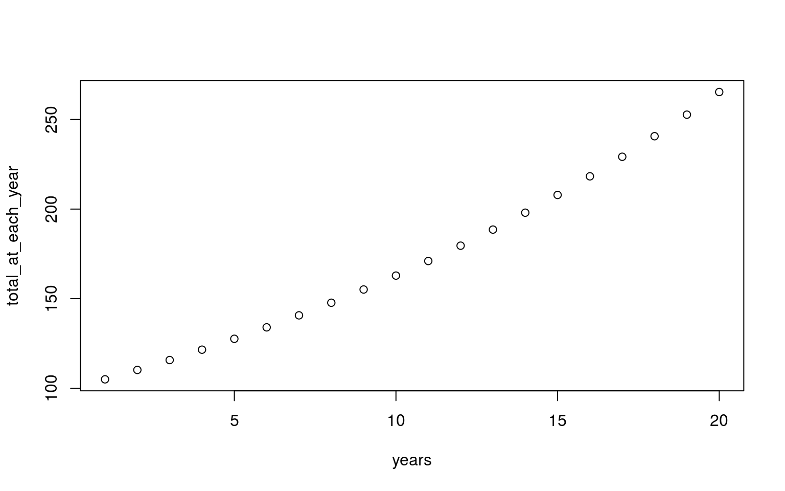
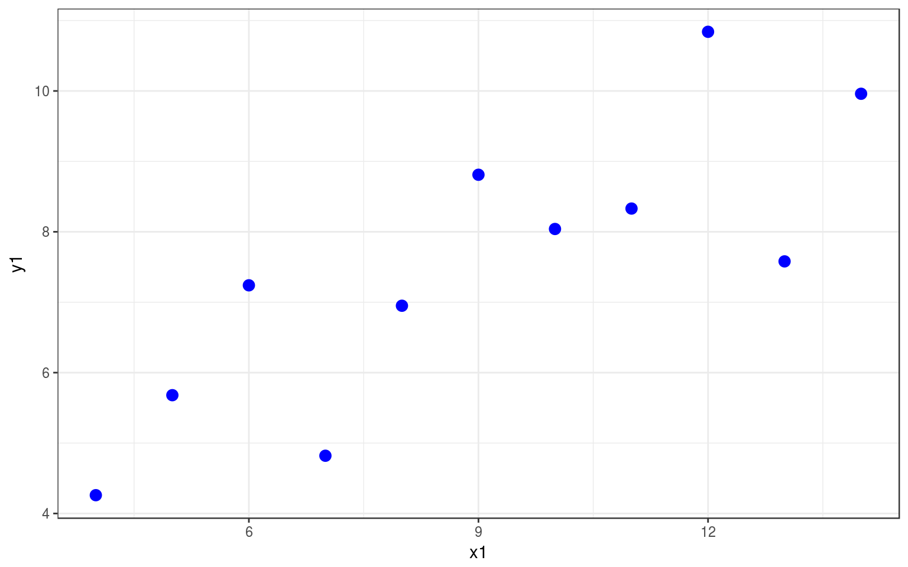
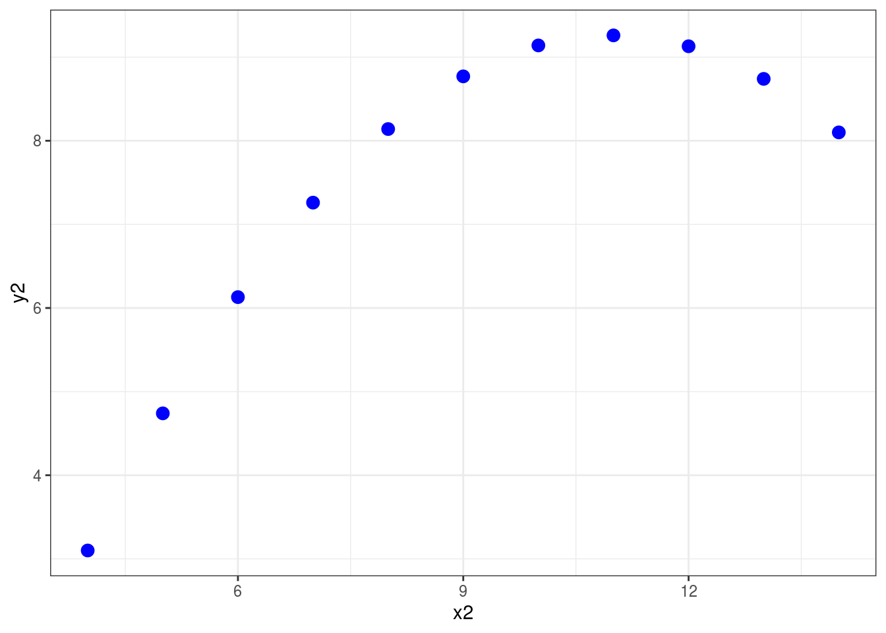
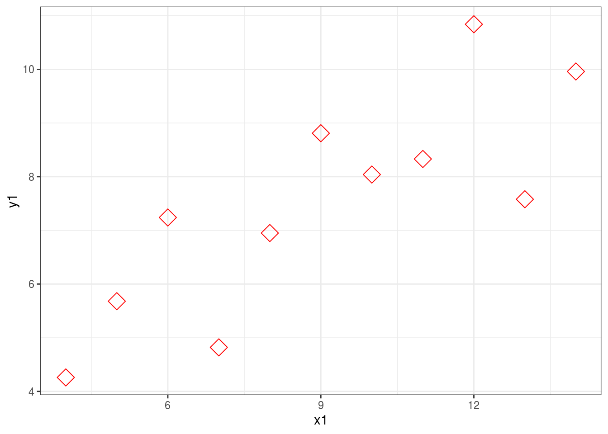
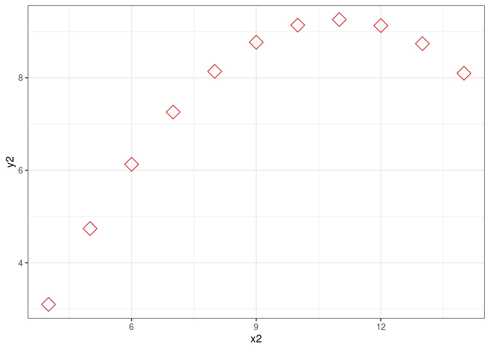

# Coding Principles


This class is about two kinds of fundamental principles of coding. The first is fundamental methods of making code do what you want - if statement, loops, functions. The second is fundamental principles of good code. Although we are using R, all programming languages use similar methods (although the exact syntax differs), and the principles of good code will also apply across languages.

As well demonstrating these fundamentals, these pages also introduce the vocabulary used to discuss them. Knowing the vocabulary helps because it means you know what terms to use when searching for solutions to problems you have.

## Fundamental methods

1. [if statements](#if)
2. [loops](#loops)
3. [functions](#functions)


### If statements {#if}

So far we have written simple scripts that do things in order, top to bottom


```r
a <- 1 # define a variable
a <- a + 1 #add 1
print(a) # output the result
```

```
## [1] 2
```

The first block above is the code, the second block (the lines which start with `##`) is the output.

Changing which statements are run is called "flow control". An "If statement" is a fundamental way of doing this. It allows us to specify one set statements to run if a certain conditions is met. For example


```r
a <- 1 # define a variable
a <- a + 1 #add 1
if(a>4) # this is the condition which has to be met, the 'test expression'
{print(a)} # this statement runs if the test expression is true
```

Notice there is no output. Copy the code to your own computer and run it. Now change the first line to `a <- 9` and run it again.

An If statement defines a branch in the flow of a script. The default can be nothing happening, but sometimes you want to define two alternatives. You can do this with an "If...else...statement"


```r
a <- 1 # define a variable
a <- a + 1 #add 1
if(a>4){ # this is the condition which has to be met, the 'test expression'
  print(paste(a," is more than 4")) # this statement runs if the test expression is true
} else {
  {print(paste(a," is equal or less than 4"))} # this statement runs if the test expression is false
}
```

```
## [1] "2  is equal or less than 4"
```

You can actually have as many branches as you like, defining a series of test_expressions, like this


```r
type_of_thing='' 
print("Is four a lot?")
if (type_of_thing=='Murders'){
  print("yes")
} else if (type_of_thing=='Dollars'){
  print("no")
} else {
  print("Depends on the context")
}
```

```
## [1] "Is four a lot?"
## [1] "Depends on the context"
```


### Loops {#loops}

Loops repeat, either iterating over a set values, like this:


```r
for (i in 1:5){
  print(i)
}
```

```
## [1] 1
## [1] 2
## [1] 3
## [1] 4
## [1] 5
```

Or until some condition is met


```r
i <- 1 #need to initialise a starting value
while(i<6){
  print(i)
  i <- i + 1 # increment the value of the counter
}
```

```
## [1] 1
## [1] 2
## [1] 3
## [1] 4
## [1] 5
```
Note that this second version, a "while loop" uses a test expression just like an if statement

Loops are useful wherever you might want to repeat some operation.


```r
years <- 10 #how many years since you started saving
savings <-100 #how much you start with
interest <- 1.05 #rate of interest, ie 5% interest
#Calculate using a loop
for (years in 1:years){
  savings<-savings*interest
}
print(paste("After", years, "years you will have £", round(savings,2))) #save more, kids
```

```
## [1] "After 10 years you will have £ 162.89"
```

Lots of people advise against using loops because they are can be slow and it isn't always obvious what they are doing. Alternatives often exist, like vectorisation:


```r
years <- 20 #how many years since you started saving
savings <-100 #how much you start with
interest <- 1.05 #rate of interest, ie 5% interest
#Calculate using a vector
total_at_each_year=savings*interest**(1:years) #rather than a loop all the answer values are stored in a single vector
plot(total_at_each_year,xlab="years") #bonus! We can plot, since we now have all the intervening values saved
```



The problem is, loops are the natural way to think about some problems. Often I first write my code with loops then, when I know what I really want to do I try and work out a way to do it with vectorisation. 


### Functions {#functions}

Functions take in values (called "arguments"), do something with them, and give a value or values back in return. You have already used functions, for example the mean function


```r
my_nums=c(78,12,32,24,03,89) #just a vector of some numbers
mean(my_nums) #use the mean function to find the average
```

```
## [1] 39.66667
```

Functions always do the same thing, but give different results depending on the inputs (depending on the "arguments you pass to the function").

You can write your own functions, and then use them again and again ("call them again and again"). Here is the general form of a function


```r
myfunctionname <- function(input_value) {
# comment line helpfully explaining what the function does
output_value <- input_value #lines of code which do something to the input to produce the output
return(output_value)
}
```

Note a couple of things: when you run this code it does not produce any output, but a new object appears in the "global environment" window, top right. Like a variable, your function is now stored in the memory of the current R session.

You can call this function now. If you close R you'll need to define the function again by running the above code again (other functions are inbuilt, like `mean` and are loaded at startup, or when you use the `library` command to load a set of functions).

Now, when we call the function, we pass actual values. 


```r
print(myfunctionname(3))
```

```
## [1] 3
```

Let's make our a slightly more complicated


```r
outcheck <- function(val,threshold) {
# outlier checker
if(val<threshold){
  output_value <- val #if value is below theshold return that value
} else {
  output_value <- NA #otherwise, return NaN
}
return(output_value)
}
```

This function takes two input values, and returns a single value which depends on the relation between the two


```r
outcheck(3,5)
```

```
## [1] 3
```


```r
outcheck(7,5)
```

```
## [1] NA
```


#### A note about scope

Variables within functions are kept 'inside' the functions (within the "scope" of the function). Once you pass a value to a function is acquires the label set in the function definition. Variables defined within the function don't persist outside of it (they don't affect the "global environment")

So, for example, it doesn't matter if you have another variable called `threshold`, the threshold within the function is set by the second value passed it. Like this:


```r
threshold <- 100
outcheck(7,5) #returns NA because 7 is higher than 5
```

```
## [1] NA
```


### Exercises

* Write an if...else statement that prints "ODD" if the number is odd, "EVEN" if the number is even
  * hint: you might use the remainder function %% (try 4%%2 to see how much is left when you divide 4 by 2)
* Write a loop which goes from 10 to 20 in steps of 3
* Write a function which prints "FIZZ" if a number is divisible by 3, and "BUZZ" if it is divisible by 5 and "FIZZBUZZ" if it is divisble by 3 *and* 5
* Write a loop which counts from 1 to 100 and applies the fizzbuzz function to each number


### More

Lisa DeBruine, & Dale Barr. (2019, December 5). Data Skills for Reproducible Science (Version 1.0.0). Zenodo. http://doi.org/10.5281/zenodo.3564555: [Iterations & Functions](https://psyteachr.github.io/msc-data-skills/func.html)

[datamentor.io on Flow control](https://www.datamentor.io/r-programming/if-else-statement/)

## Fundamental principles of good code

### Readability Matters

Your most important collaborator is you from six months ago, and they don't answer email.

Good code doesn't just work, it is easy to understand. This supports the code being checked for errors, modified and improved (by you as well as by other people).

To support this you should make your code readable. This means commenting your code, but also laying it out nicely, and using sensible names for variables and function. The aim is to make the code explain itself, as well as doing something. Someone who reads your code - a future you maybe, or a collaborator - needs to be able to run the code, yes, but they also need to know what you are doing and why you are doing. 

Look at this function, it hard to understand, right?


```r
pf <- function(n){ p=1 ; if (n>1){ i = 2; while( (i<(n/2+1)) & (p==1) ) {if (n%%i ==0) p=0; i=i+1 }  } else {p=0 }; return(p) }
```

This kind of code is very compressed. You can fit a lot in a few lines, but it is useless because nobody else will understanding, and probably the person who wrote it won't understand it when they come back to it (and that means they will miss any bugs, or will find it hard to improve or repurpose).

Readability is improved a lot by adding some spacing and tabs. Have another go at figuring out what the code does:


```r
pf <- function(n){
  p=1
  if (n>1){ 
    i = 2 
      while( (i<(n/2+1)) & (p==1) ) {
        if (n%%i ==0) {
          p=0
        }
        i=i+1
      }
  } else {
    p=0
  }
  return(p)
}
```

Now we make the variable and function names sensible:


```r
primecheck <- function(num){
  isprime=TRUE
  if (num>1){ 
    i = 2 
      while( (i<(num/2+1)) & (isprime==TRUE) ) {
        if (num%%i ==0) {
          isprime=FALSE
        }
        i=i+1
      }
  } else {
    isprime=FALSE
  }
  return(isprime)
}
```


Can you tell what it does yet? 

Now fully commented


```r
primecheck <- function(num){
  #check if a number is prime
  ## assumes the number provided is an integer
  ## works by working through all possible divisors up to half the test number, checking if the remainer is 0
  #
  isprime=TRUE # a flag, which tracks if we think the number is prime. We start out assuming our number *is* prime
  # first we only need to do the complicated method for numbers great than 1
  if (num>1){ 
    i = 2 #a counter, starting at 2 (because all numbers divide by 1)
      #use while loop to check all divisors until we've done them all or we find one (and confirm the number is not prime)
      while( (i<(num/2+1)) & (isprime==TRUE) ) {
        if (num%%i ==0) {
          #if the number divides by another number with no remainder it can't be prime, so we change the flag
          isprime=FALSE
        }
        i=i+1 # increment the counter, so we work through all possible divisors
      }
      
  } else {
    # if the number is 1 or lower it can't be prime, so we change the flag
    isprime=FALSE
  }
  return(isprime) #return the flag as the output of the function, 0 -> not prime, 1 -> prime
}
```

It is possible to comment too much. The code above I commented so someone who wasn't an experienced programmer could read the comments and it would help them understand how the code worked (you can tell me if I succeeded). Usually a few fewer comments might make the code easier to read, with the assumption that anyone reading it has a bit of experience with the coding language. Like this


```r
primecheck <- function(num){
  #check if a number is prime
  # - assumes input is integer
  # - work by testing all possible divisors
  isprime=TRUE # a flag, start assuming our number *is* prime 
  # only check numbers > 1
  if (num>1){ 
    i = 2 #a counter
      #check all divisors until we've done them all or we find one 
      while( (i<(num/2+1)) & (isprime==TRUE) ) {
        if (num%%i ==0) {
          #no remainder -> number isn't prime
          isprime=FALSE
        }
        i=i+1 # increment the counter
      }
      
  } else {
    # if the number is 1 or lower it can't be prime
    isprime=FALSE
  }
  return(isprime)
}
```

This version is 22 lines rather than 1, but I hope you agree it is easier to work with. There's no shortage of space in R scripts, so if I doubt, put some effort in to laying things out nicely. You'll thank yourself when you come back to your code (which you will always have to)

### Avoid hard coded values

Say you were going to load some data, you could do this


```r
mydata = read.csv('/home/tom/Desktop/psy6422/mydatafile.csv')
```

Now this happens to work on my computer, but it won't on yours. The reason it won't work isn't because there is a bug in how i'm loading data, just that you don't have a file in the same place as I do. Far better, for both readability and debugging if you seperate out values that might change from the commands that use them

Like this


```r
datafile = '/home/tom/Desktop/psy6422/mydatafile.csv'
mydata = read.csv(datafile)
```

Now the second line is easier to read, and you also have a variable which you can reuse 

Another example


```r
graph1 <- ggplot(data = anscombe, mapping = aes(x = x1, y=y1))
graph1 + geom_point(color='blue',size=3)
```

<div class="figure" style="text-align: center">

<p class="caption">(\#fig:unnamed-chunk-25)Example Graph 1, hardcoded parameters</p>
</div>


```r
graph2 <- ggplot(data = anscombe, mapping = aes(x = x2, y=y2))
graph2 + geom_point(color='blue',size=3)
```

<div class="figure" style="text-align: center">

<p class="caption">(\#fig:unnamed-chunk-26)Example Graph 2, hardcoded parameters</p>
</div>

Adding variables means you only need to edit one line to change the look of both plots


```r
pointcolour='red'; pointsize=5

graph1 <- ggplot(data = anscombe, mapping = aes(x = x1, y=y1))
graph1 + geom_point(color=pointcolour,size=pointsize)
```



```r
graph2 <- ggplot(data = anscombe, mapping = aes(x = x2, y=y2))
graph2 + geom_point(color=pointcolour,size=pointsize)
```



This may seem minor, but as your code gets longer developing habits like this will save you time, and make your code easier to work with

### Functionalise & Generalise

If you ever find yourself using very similar lines of code, you should think about making a function. Functions make your code shorter and easier to read (and write), and they make it *way* easier to update (because when you catch a bug you can just update the code in the function, rather than every time you repeated those lines).

Functions are also an opportunity to think to yourself "what is the most general purpose way of doing what I'm doing". Thinking like this will help you develop powerful, flexible, code which you can use to do multiple things

Let's look at an example:


```r
graphtitles = c('Plot of something hard to explain but really worth it promise', 'Plot of super complicated stuff I need to show you', 'Not so sure about this plot what do you think?')

#insert a line break so plot titles fit above the plots
graphtitles[1] <- 'Harry'


print(names)
```

```
## function (x)  .Primitive("names")
```


### Ask for help


### More

* [Program better, for fun and for profit](https://inattentionalcoffee.wordpress.com/2017/01/13/program-better-for-fun-and-for-profit/)
* Axelrod, V. (2014). [Minimizing bugs in cognitive neuroscience programming](https://www.frontiersin.org/articles/10.3389/fpsyg.2014.01435/full). Frontiers in psychology, 5, 1435.
* Wilson, G., Aruliah, D. A., Brown, C. T., Hong, N. P. C., Davis, M., Guy, R. T., ... & Waugh, B. (2014). [Best practices for scientific computing](http://journals.plos.org/plosbiology/article?id=10.1371/journal.pbio.1001745). PLoS biology] 12(1), e1001745.
* [Prime Hints For Running A Data Project In R](https://kkulma.github.io/2018-03-18-Prime-Hints-for-Running-a-data-project-in-R/)
* Software Carpentry: [Best Practices for Writing R Code](https://swcarpentry.github.io/r-novice-inflammation/06-best-practices-R/)
* Nice R code: [bad habits](https://nicercode.github.io/intro/bad-habits.html)
* Writing a complete example
* Your code is good enough to share
