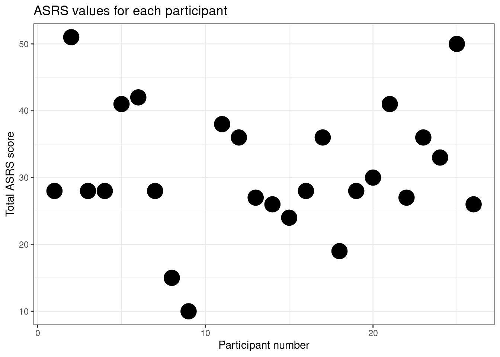
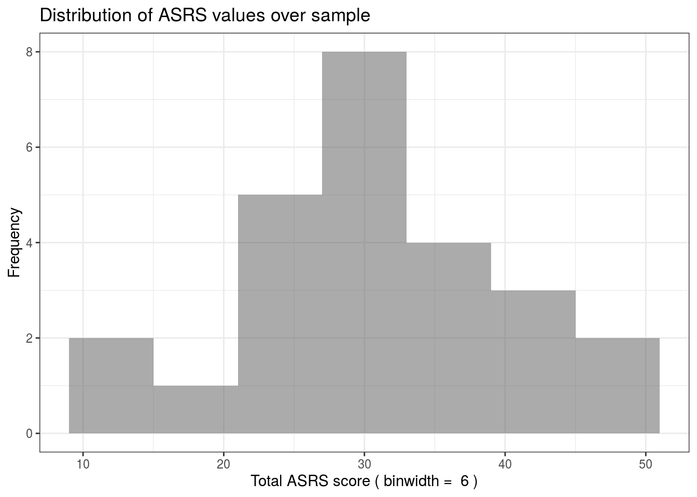

# Rmarkdown

You need to be able to share your analysis. Comments are good for making code readable, but often you will want longer sections of text, mixed in with both the code you are running and the outputs of the code (e.g. the plots you are making with it). Do this with Rmarkdown.

A Rmarkdown file is a plain text file, like a R script, but with the extension ``.Rmd`` rather than ``.R``. You can make one now in RStudio by clicking File >  New File > R Markdown. Or by saving an existing .R script as ``filename.Rmd``.

RMarkdown is the system which marks how text should look after it has been converted into a webpage, or PDF, or some other kind of document. The name RMarkdown is kind of a joke, since RMarkdown is a version of a "markup langauge". Markups are the opposite of the [WYSIWYG](https://en.wikipedia.org/wiki/WYSIWYG) systems (like MS word or Google Docs) which you are used to.

These pages are written in Rmarkdown. You can see this individual file [here in the online repositry](https://github.com/tomstafford/psy6422/blob/master/008-rmarkdown.Rmd). It will really help if you read the webpage alongside the file, so you can compare the file which generates the text, using the markdown, and the output (the webpage).

Rstudio magic (called "rendering" or "knitting") turns this file in to the webpage.

<div class="info">
<p>Before you can turn your <code>.Rmd</code> files into PDF you need to install TeX on your machine: <a href="https://miktex.org/download">use this download link</a></p>
</div>


Compare the [file](https://github.com/tomstafford/psy6422/blob/master/008-rmarkdown.Rmd) and the [webpage](https://tomstafford.github.io/psy6422/rmarkdown.html). 

**In the webpage this line is in bold. Why?**

*In the webpage this line is in italic. Why?*

## And this line is a heading

Try now creating your own Rmarkdown file by clicking File > New File > Rmarkdown in RStudio. 

RMarkdown files have three components.

## First a header

Aka "header material". It looks like this, at the top of the file:


This is called YAML and it is stuff meant to be read by the computer when the file is converted into a document to be read by humans. You can see that this is meant to be an "HTML" document (that's the kind on a webpage), so let's make it now. Click "knit" in RStudio (or "knit to HTML" if you are exploring the options menu).

(you'll be prompted to give your ``.Rmd`` file a name first, if you haven't done this already).

After a brief pause you should get a new window open, containing something that has some of the same words as your document. Notice how the YAML stuff has disappeared, and the new document now contains formatting (bold, italics, headings, etc).

Part of the benefit of markdown is that you write the document once, and can convert it to a webpage, or a PDF, or a MS Word document. Try now. Click "Knit" and select "Knit to PDF". You get a nice PDF document, looking almost, but not entirely, like the webspage you made moments before. 


## Second, text

If you just write stuff in a ``.Rmd`` document you get text. This is the second kind of thing in a ``.Rmd`` document, like this.

It can contain formatting - *italics*, **bold**, etc - as well as stuff like lists and hyperlinks:

* See the formatting options in this [cheatsheet](https://rstudio.com/wp-content/uploads/2015/02/rmarkdown-cheatsheet.pdf)
* This line just to demonstrate that this is a list

But the real strength of Rmarkdown is you can mix text and code

## Third, code

This is the third ingredient, code and any output it produces. Like this:


```r
print("Here is some R code")
a <- 6
b <- 2.3
print(a/b)
print("And the output it produces")
```

```
## [1] "Here is some R code"
## [1] 2.608696
## [1] "And the output it produces"
```

Here is another example


```r
#Code to make an example graph
library(tidyverse)

#load some data
filename <- '/home/tom/Desktop/psy6422/mydatafile.csv'
df <- read.csv(filename)

#rename columns for easy labelling
df <- df %>% rename(ppt = Participant.Number,asrs = Total.ASRS.Score)

#plot parameters
plottitle  <-  'ASRS values for each participant'
xlab  <-  'Participant number'
ylab  <-  'Total ASRS score'
pointsize  <-  7

#make plot
p1 <- ggplot(data=df,aes(x=ppt,y=asrs))
p1 + geom_point(size=pointsize) +
  ggtitle(plottitle) +
  xlab(xlab) +
  ylab(ylab)
```



You don't need to show the r code, but can still include it in the document and use it to generate figures etc. 


The scatterplot above uses participant number as one of the axes, which doesn't really make any sense. A histogram is a better way of visualising the spread of scores on a single variable, so here is one:



The code to make this plot is contained in the same ``.Rmd`` file as this text, but I've hidden it so only the output is shown. To do this I set ``echo = FALSE`` for the r chunk in the ``.Rmd`` file. You'll have to look at the [source file](https://github.com/tomstafford/psy6422/blob/master/008-rmarkdown.Rmd) to see this, because - obviously! - in the webpage you don't see any code.

You can also put single values in ongoing text using Rmarkdown

Imagine you have some data


```r
data = c(10,42,2,2,34,63)
```

You can then refer to it in the text. Like this: the mean of the data is 25.5

If you are viewing on the webpage you see the answer, but the file contains an instruction to calculate ``mean(data)``.

Neat, eh?


## Conclusion

Rmarkdown documents give you a powerful way to combine text, code and code outputs in one file. That means you don't lose track of how graphs are generated, or statistics are calculated. With RMarkdown your workflow is reproducible, so if you add new data you can update the final report with just one click. RMarkdown documents also encourage you to document fully and explain your code. You can export to different formats depending on your audience, all from the same file.

## Exercises

* Create a new RMarkdown document
* Describe in text the data you are thinking of using for your assignment. 
  * Use some highlights: bold, italics
  * Use headings
* Include an R chunk importing the data and showing the first few lines of the data
* Include some more text describing the key variables you are interested in
* Show a graph of something (either a scatterplot, or a histogram perhaps)
* Include some inline text, reporting a mean value (as my last example above)
* Make PDF and a Word file by clicking "knit"
* ~~Email~~ Send the .Rmd file *and the PDF to me via a Slack direct message

## Resources

* [RStudio intro to Rmarkdown](https://rmarkdown.rstudio.com/)
* [RStudio RMarkdown cheatsheet](https://github.com/rstudio/cheatsheets/raw/master/rmarkdown-2.0.pdf)
* Helps with learning Markdown conventions: [markdownlivepreview.com](https://markdownlivepreview.com/)
* Making Word documents: [Happy collaboration with Rmd to docx](https://rmarkdown.rstudio.com/articles_docx.html)
* Install this to make PDFs work: [Getting MiKTeX](https://miktex.org/download)


