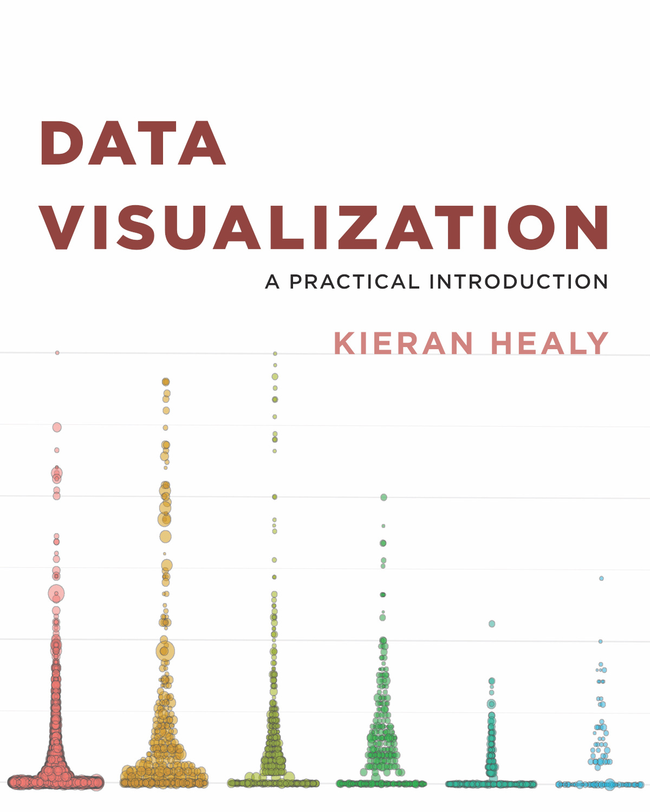

# Making Graphs

<em>Note this is a placeholder page. This material hasn’t been taught yet. I am adding notes online as I can, so these pages in particular may evolve quickly</em>

## Class material

Videos from the class are in the PSY6422 [Google Drive](https://drive.google.com/drive/folders/1IbnGAO2Gn4u9T_qze5zhZyU9E8qNmdHh?usp=sharing) (UoS login required to access). Note: most of this class talk in workshop style, so the recordings are short and the slides are brief

Slides : [slides format](https://docs.google.com/presentation/d/1DbStojATmr9ZH4_23-F24uqZZ_9M9LkenGLFlwWZBig/edit?usp=sharing), [pdf format](https://drive.google.com/file/d/1A1ZtzJdDjYH7kqmdlTwSfKqVrYXo_lJ0/view?usp=sharing).

The live-coding demo used these files: [class3a.R](static/class3a.R) and [class3b.R](static/class3b.R). These are based on Healy (2018) chapters 2 and 3 respectively.
  
## Resources

This book is recommended for the course, and for this lecture in particular:

Healy, K. (2018). [Data visualization: a practical introduction](https://socviz.co/). Princeton University Press. 

* The whole book is available online via the link  
* There are supporting materials here: https://github.com/kjhealy/socviz  
 
 
### Other resources 

* We are going to be using the ggplot package for our visualisations: [ggplot2](https://ggplot2.tidyverse.org/)
* [Five Charts You’ve Never Used but Should](https://policyviz.com/2021/02/08/five-charts-youve-never-used-but-should/)
* guru99: [Scatter Plot in R using ggplot2 (with Example)](https://www.guru99.com/r-scatter-plot-ggplot2.html)
* ggplot2: Elegant Graphics for Data Analysis, the chapter on [Themes](https://ggplot2-book.org/polishing.html)

## Exercises

Review the [introduction](https://socviz.co) and [Chapter 1 'Look At Data'](https://socviz.co/lookatdata.html) of Healy (2018)

Work through [Chapter 2 'Get Started'](https://socviz.co/gettingstarted.html) from 2.3 onwards ("Things to know about R"), we are ignoring the material on RMarkdown for now (we'll get there, see [here](https://tomstafford.github.io/psy6422/rmarkdown.html)).

Work through [Chapter 3 'Make a plot'](https://socviz.co/makeplot.html)

## Checklist

Completed the exercises  

 * especially section 3.8 'Where to go next' in [Chapter 3 'Make a plot'](https://socviz.co/makeplot.html)

Key concepts (chapter 2):  

* variables and functions
* variables are typed (e.g. can be numeric or character)
 * and how you detect what type a variable is
* indexing for variables and data frames

In the console, understood  

  * the shortcut keys for the assignment operator <- 
  * the use of tab for autocomplete
  * the use up arrow to cycle through previous commands

Key concepts (chapter 3):  

* Tidydata
  * [long vs wide data](https://en.wikipedia.org/wiki/Wide_and_narrow_data)
  * values and keys
  * data variables can be continuous or factors 
* plots have data, aesthetic mappings ('aes', 'mappings') and layers
* adding mappings, adding geoms, geom properties, other layers (e.g. labs)
* mappings are inherited by geom layers
