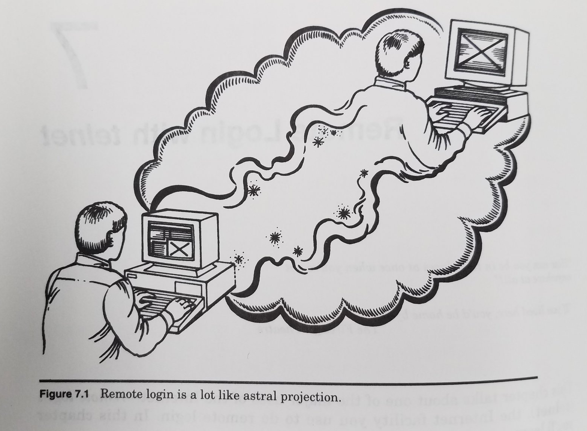

# ssh and the command line

<em>Note this is a placeholder page. This material hasn’t been taught yet. I am adding notes online as I can, so these pages in particular may evolve quickly</em>

For Tomorrow's class it is essential that you install the Sheffield VPN and confirm that it is working before hand  [estimated time: 5-10 minutes]

Before this class please install the <a href="https://www.sheffield.ac.uk/it-services/vpn">University VPN</a> and confirm it works [estimated time: 5-10 minutes]

## Resources

[Five reasons why researchers should learn to love the command line](https://www.nature.com/articles/d41586-021-00263-0)
