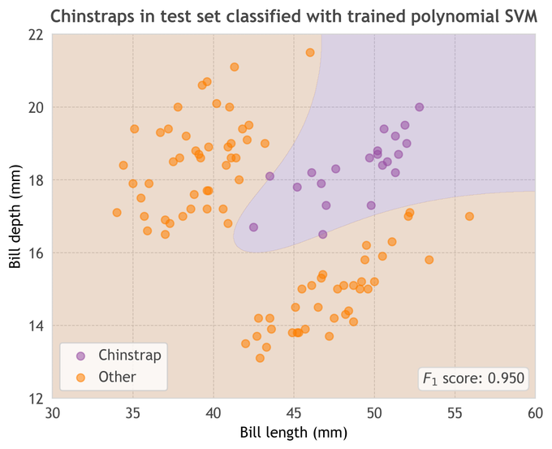

# - Python {-}

This course teaches general principles of coding and computation, and specific skills for data management and visualisation in R. Lots of people in the data science world, particularly in areas which align with computer science / machine learning, use Python.

I decided to teach this course in R because the community around a language is as important as the language. You can do anything in any language, and most things as easily in Python as in R, but Psychologists, biologists and scholars from across the social sciences tend to use R, so I'm teaching this course in R.

## Motivation

In my very prejudiced opinion, there are three reasons to prefer Python to R. These are

* [Conda](https://docs.conda.io/en/latest/), for package, dependency and environment management
* [Pandas](https://pandas.pydata.org/), the data wrangling toolkit
* Machine Learning tools. Computer Scientists tend to use Python, so the latest in ML, Deep Learning etc is more accessible if you use Python (e.g. [PyTorth](https://pytorch.org/), [scikit-learn](https://scikit-learn.org/stable/)

I'd probably also do anything involving an API, web-scraping or bulk text processing in Python, but this may just be prejudice.

## A worked example

To showcase python, we'll be trying to reproduce an analysis by Oli Hawkins, showing of a [support-vector machine classification of Penguin data](https://twitter.com/olihawkins/status/1285664698201972736)

repo: [github.com/olihawkins/penguin-models](https://github.com/olihawkins/penguin-models)

## Preparation

Before the class, please 

* install [Python](https://www.python.org/downloads/)
* install [miniconda](https://docs.conda.io/en/latest/miniconda.html)
  * You MAY have installed python and conda already, when you installed R, if you did this via the [Anaconda](https://www.anaconda.com/) distribution.
* clone [the penguin-model repo](https://github.com/olihawkins/penguin-models)
* create a conda environment, following the instructions in the README.md

  `conda env create -f environment.yml`
  

## In class

We will run the models, and explore the data and code

We will use the Spyder IDE

  `conda install spyder`
  
We will do some basic data wrangling with pandas

## After class

Oli strongly recommends Aurelien Geron's 2019 book [Hands-on Machine Learning with Scikit-Learn, Keras, and TensorFlow](https://www.oreilly.com/library/view/hands-on-machine-learning/9781492032632/)

If you want to learn Python, I recommend:

* Resource list: [Python for Non-Programmers](https://wiki.python.org/moin/BeginnersGuide/NonProgrammers)
* Pages [RealPython: Learn Python Programming, By Example](https://realpython.com/start-here/)
* Book: [Python Data Science Handbook](https://jakevdp.github.io/PythonDataScienceHandbook/) by Jake VanderPlas
* Book: [Python for Data Analysis](https://wesmckinney.com/pages/book.html) by Wes McKinney
* Pages: [chrisalbon.com](https://chrisalbon.com/)
* Pages: [TowardsDataScience](https://towardsdatascience.com), for example this one [A Quick Introduction to the “Pandas” Python Library](https://towardsdatascience.com/a-quick-introduction-to-the-pandas-python-library-f1b678f34673)
* Book: [Python for Experimental Psychologists](http://www.pygaze.org/pep/) by Edwin Dalmaijer
* Pages: [w3Schools](https://www.w3schools.com/python/default.asp)

Other resources

* Nicolas P. Rougier: [Matplotlib tutorial](https://github.com/rougier/matplotlib-tutorial)
