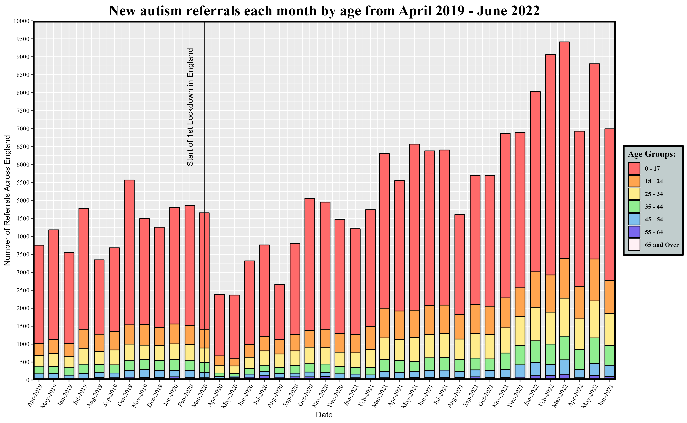
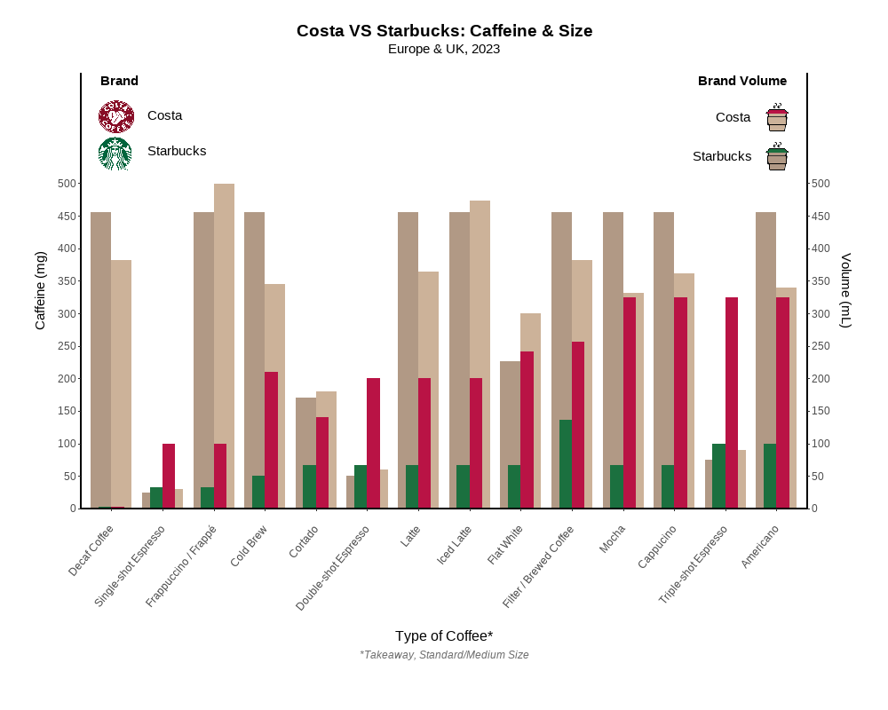
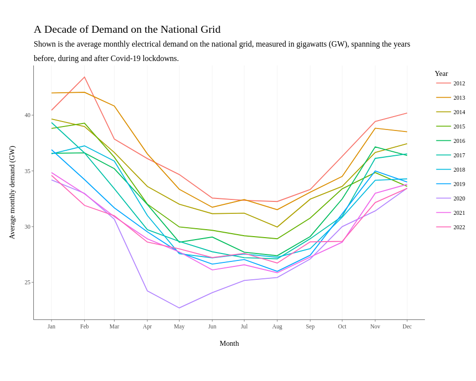
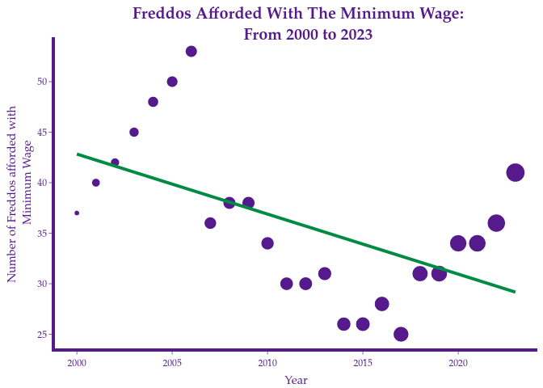
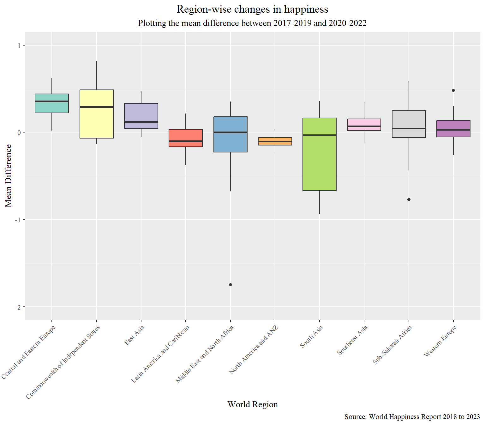
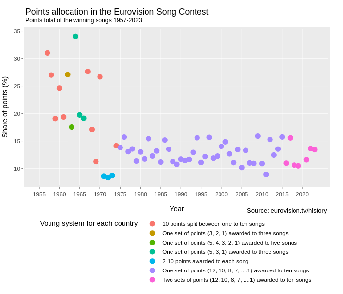
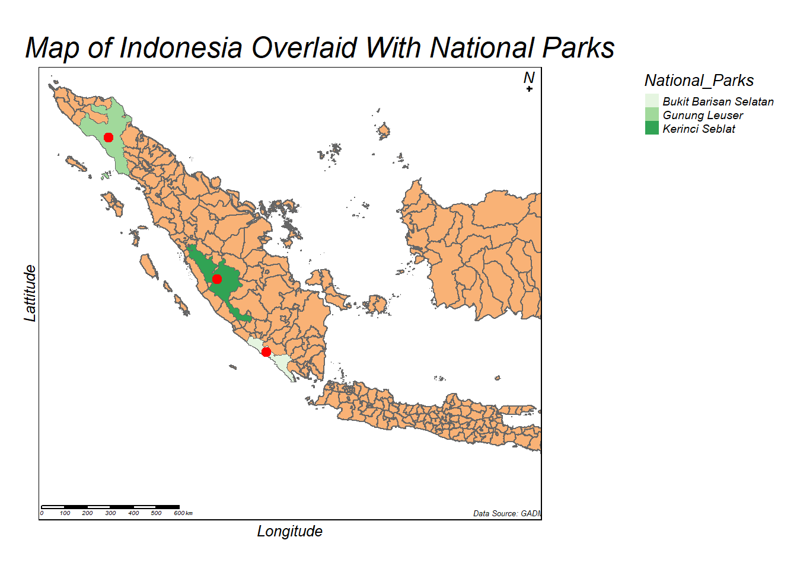
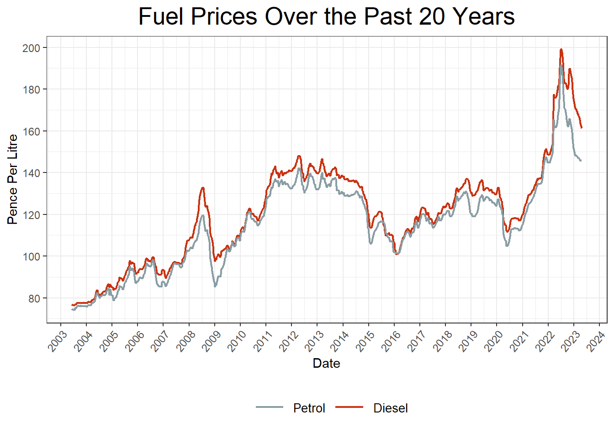

# Class of 2023

A showcase of some projects from the class of 2022-23. 

There were too many students on the module this year to show all projects, so here are a few highlights. Many creative, fun, interesting, challenging visualisation projects were produced but aren't shown here, but these few give a flavour of what student's got up to:

Gabriel's project looked at [the number of Autism referrals in England before, during, and after lockdown](https://gabrieltld.github.io/psy6422-modproj/)

[Repo](https://github.com/gabrieltld/psy6422-modproj/)

Vitally important information in Mathilde's visualisation of [the ammount of caffeine in different highstreet coffee brands](https://mathildedenmark.github.io/DAAV-Project/)

[Repo](https://github.com/MathildeDenmark/DAAV-Project)

I found Grace's plot of [A Decade of Demand on the National Grid"](https://graceesh.github.io/psy6422_energy_demand/) really informative - spot the lockdown months!

[Repo](https://github.com/GraceESH/psy6422_energy_demand)

Jennifer's project on the number of [Freddos Afforded With The Minimum Wage: From 2000 to 2023](https://jstandeven.github.io/PSY6422_Project/]) seems very relevant to the state of society, as well as illustrating [Simpson's Paradox](https://en.wikipedia.org/wiki/Simpson%27s_paradox) for across different points of time.

[Repo](https://github.com/jstandeven/PSY6422_Project)

Tanvi Ravi's project was [World Happiness: Resilience in the face of the COVID-19 Pandemic](https://tanvi-r.github.io/PSY6422_Module_Project/)

[Repo](https://github.com/tanvi-r/PSY6422_Module_Project)

Paul did a deep dive into the historical data on the [Eurovision song content winners](https://paulgering.github.io/PSY6422_project/).

 [Repo](https://github.com/paulgering/PSY6422_project)

Jade looked at [Sumatran Tigers](https://jholley23.github.io/Sumatran-Tiger-Project/)

[Repo](https://github.com/Jholley23/Sumatran-Tiger-Project)

Anna's interactive visualisation looked at [https://annskama.shinyapps.io/p_values/](reporting errors in psychology journals) ([Repo](https://github.com/annskama/p_values))

Emma's visualisation of [Fuel Prices From 2003 to 2023](https://starsk1.github.io/Fuel_Prices/) is elgantly simple yet effective

[Repo](https://github.com/Starsk1/Fuel_Prices)
