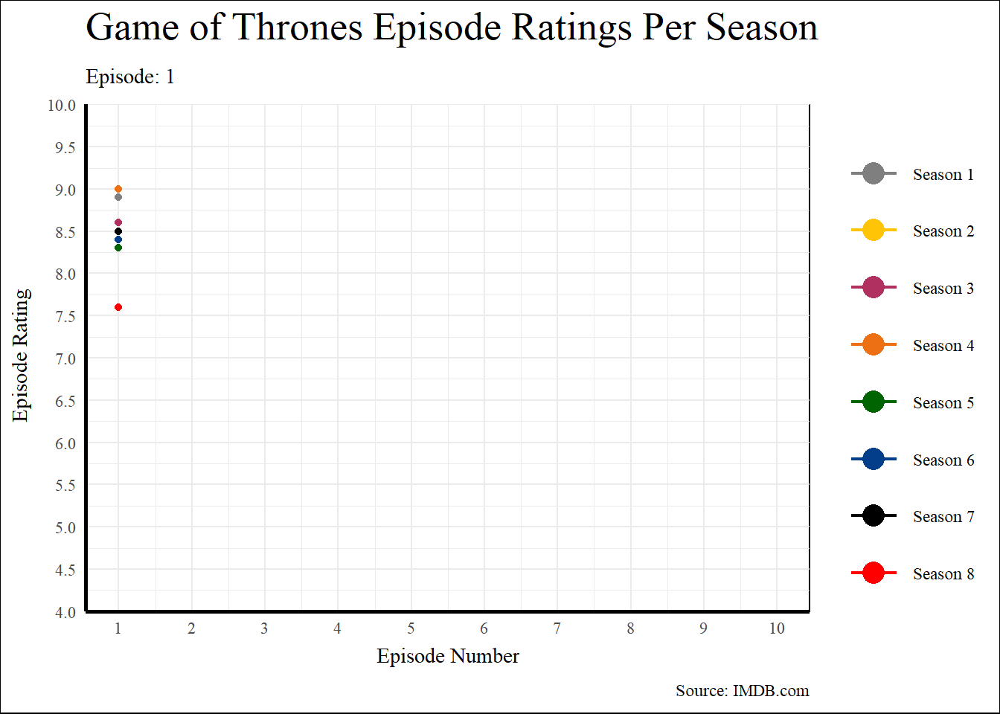
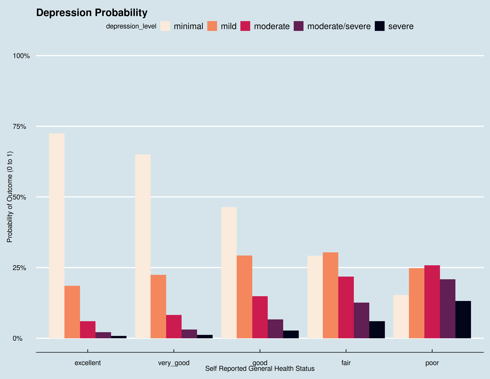
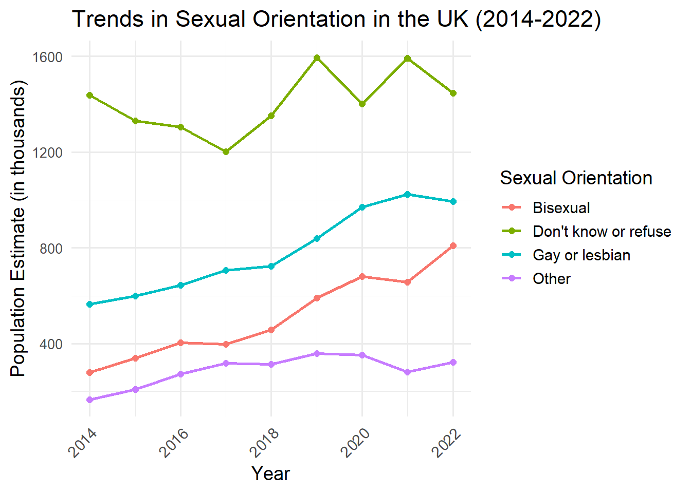
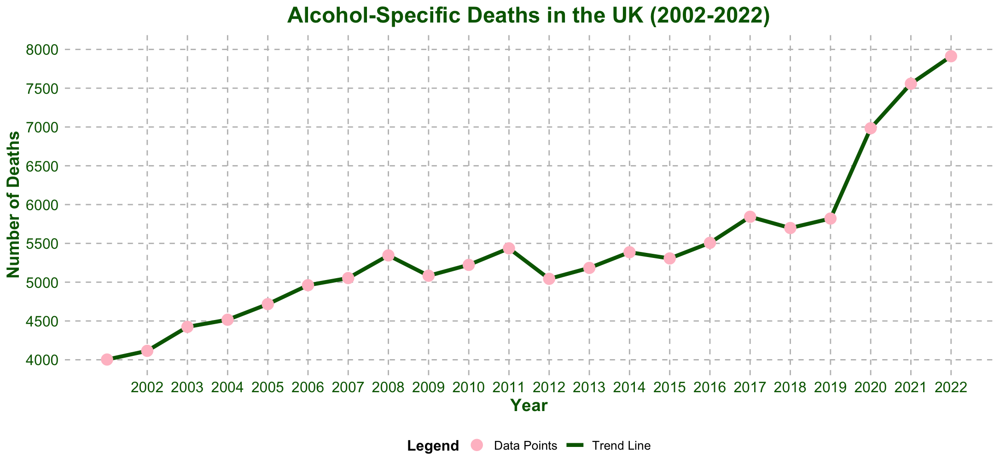
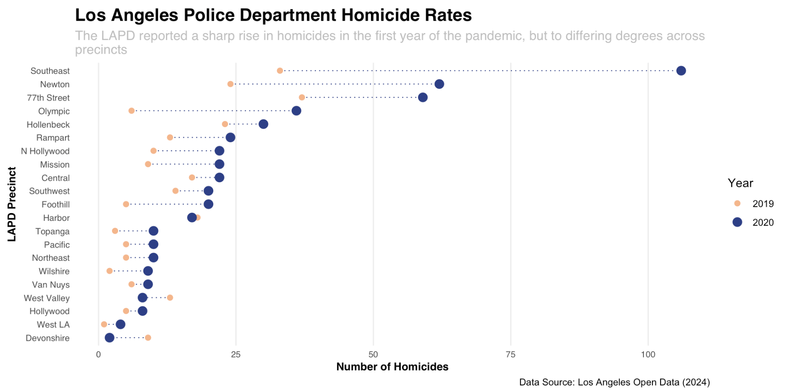

# Class of 2025

A showcase of some projects from the class of 2024-25. 

Again, there were too many students to show all projects, so here are a few highlights. Many creative, fun, interesting, challenging visualisation projects were produced but aren't shown here, but these few give a flavour of what student's got up to:

Kim was inspired by his commute to visualise [seasonal patterns in British rail cancellations](https://giskler.github.io/psy6422_project). ([Repo](https://github.com/giskler/psy6422_project)):

---

Emma used animation to make her graph of the [Game of Thrones season] ratings(https://emwalker01.github.io/GoT_Ratings/) something of a visual gag. See if you can spot the odd season out. ([repo](https://github.com/emwalker01/GoT_Ratings))

---

Shawn's used data from the US (CDC) to ask ["To what extend do different medical statuses, including availability and visitations, affect depression with respect to perceived physical wellbeing?"](https://shawnadvani.github.io/UoS_data_analysis_project/) visualisation was ([Repo](https://github.com/ShawnAdvani/UoS_data_analysis_project))

---

Izzie's project was [Visualising Queer Sexualities in the UK Population 2014-2022](https://izziecomber.github.io/iz_PSY6422_project/) ([Repo](https://github.com/izziecomber/iz_PSY6422_project/))

---

Sophie's project visualising ONS data on [Analysis of Alcohol-Specific Deaths in England](https://sophie406.github.io/Connell_PSY64222/) ([Repo](https://github.com/sophie406/Connell_PSY64222)) is sobering:

---

Paulo visualised [Homicide Trends in Los Angeles Police Department Precincts](https://paulo-mp.github.io/project_6422/) ([Repo](https://github.com/paulo-mp/project_6422))

